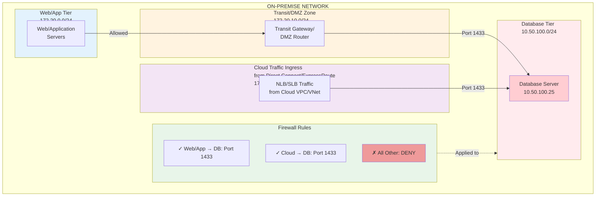

## Chapter 2: Architectural Pattern

This Chapter establishes the foundational concepts and the logical flow of a request from an SPCS container to an on-premise SQL Server. This is not a single connection but a precisely orchestrated chain of interconnected private endpoints, gateways, and DNS resolution mechanisms that must function in concert.

### Glossary: Core Networking and Connectivity Terms

This glossary defines fundamental networking concepts used throughout this document. Each term includes an explanation of **why** it is necessary for this architecture.

#### Core Networking Terms

**Virtual Private Cloud (VPC) / Virtual Network (VNet)**
- **Definition**: An isolated, logically separated network environment within a cloud provider's infrastructure. AWS uses the term "VPC"; Azure uses "VNet".
- **WHY**: Provides network isolation and a security boundary, preventing unauthorized access from other cloud customers. Enables customer control over IP addressing, routing policies, and security rules. Acts as the foundational layer for all network communication in the cloud.

**Subnet**
- **Definition**: A logical subdivision of a VPC/VNet, representing a range of IP addresses within the broader VPC/VNet CIDR block. Subnets are typically associated with a single availability zone or datacenter.
- **WHY**: Enables network organization (e.g., separate subnets for web, app, and data tiers), security isolation (different security rules per subnet), and routing control (different route tables per subnet). Helps limit the "blast radius" of security incidents by segregating resources.

**Domain Name System (DNS)**
- **Definition**: A hierarchical system that translates human-readable hostnames (e.g., `sql-prod.corp.local`) into machine-readable IP addresses (e.g., `10.50.100.25`).
- **WHY**: Applications and humans use memorable names, but networks route packets using IP addresses. DNS bridges this gap. Without DNS, you would need to hardcode IP addresses in application code, making systems brittle and difficult to maintain when IPs change.

**Firewall**
- **Definition**: A network security device (hardware or software) that monitors and filters network traffic based on predefined security rules, allowing or blocking packets based on source, destination, port, and protocol.
- **WHY**: Provides a critical security boundary and enforces the principle of least privilege. Acts as the gatekeeper preventing unauthorized network access, a fundamental defense-in-depth security control.

**Route Table**
- **Definition**: A set of rules (routes) that determine where network traffic is directed. Each route specifies a destination CIDR block and a "next hop" target (e.g., a gateway, network interface, or peer connection).
- **WHY**: Controls the flow of packets between networks. Without route tables explicitly directing traffic to the Transit Gateway and then to Direct Connect/ExpressRoute, packets destined for on-premise networks would be dropped or routed incorrectly.

**Classless Inter-Domain Routing (CIDR) Notation**
- **Definition**: A method for specifying IP address ranges using a format like `172.16.0.0/16`, where the number after the slash represents how many bits are used for the network portion of the address.
- **WHY**: Provides an efficient, concise way to specify ranges of IP addresses. `172.16.0.0/16` represents 65,536 IP addresses (172.16.0.0 through 172.16.255.255), which is far more practical than listing each individual address.

**Network Segmentation**
- **Definition**: The practice of dividing a network into multiple smaller, isolated zones or segments, each with its own security controls and access policies.
- **WHY**: Implements a defense-in-depth security strategy. If one segment is compromised, segmentation prevents or limits lateral movement to other segments. Critical for protecting sensitive resources like database servers from less-trusted zones.

**Database Listener**
- **Definition**: A network component of a database management system that accepts incoming network connection requests and authenticates clients. Examples: SQL Server's TCP/IP endpoint, Oracle's TNS listener, MySQL/PostgreSQL's TCP listener.
- **WHY**: Serves as the database's network entry point. The listener must be configured to accept connections on the correct network interface and port, or connections will fail even if all network routes and firewall rules are correct.

**Principle of Least Privilege**
- **Definition**: A security principle stating that users, processes, and systems should be granted only the minimum level of access (permissions, network access, etc.) necessary to perform their intended function.
- **WHY**: Reduces the attack surface and limits the potential damage from compromised accounts, systems, or misconfigurations. In networking, this translates to opening only specific required ports from specific source IPs, never using overly broad rules like "allow all from anywhere."

#### PrivateLink and Hybrid Connectivity Terms

**AWS PrivateLink / Azure Private Link**
- **Definition**: A cloud provider service that enables private, secure connectivity between VPCs/VNets across different AWS/Azure accounts without traversing the public internet. AWS calls this "PrivateLink"; Azure calls it "Private Link" or "Private Link Service."
- **WHY**: Provides private IP connectivity without the complexity and overhead of VPNs. Eliminates the need for public IP addresses, simplifies security (no need to manage Snowflake's dynamically changing IP ranges in firewall rules), and offers higher reliability than internet-based connections. Critical for secure, scalable cloud-to-cloud connectivity.

**Azure Private Link Service**
- **Definition**: The Azure equivalent of AWS's VPC Endpoint Service. It exposes an Azure Standard Load Balancer as a service that can be accessed privately by other Azure tenants (like Snowflake) via Azure Private Link.
- **WHY**: Enables private connectivity from Snowflake's Azure tenant to your Azure VNet without internet exposure.

**VPC Endpoint / Azure Private Endpoint**
- **Definition**: A network interface in the customer's VPC/VNet that serves as the entry point for traffic from a PrivateLink connection. It has a private IP address from the customer's VPC/VNet CIDR range.
- **WHY**: Provides the private IP address within your VPC/VNet that Snowflake connects to via PrivateLink. This endpoint is the secure "front door" through which Snowflake traffic enters your network environment.

**VPC Endpoint Service / Azure Private Link Service**
- **Definition**: A cloud provider resource that exposes a Network Load Balancer (AWS) or Standard Load Balancer (Azure) as a service accessible via PrivateLink to other accounts/tenants.
- **WHY**: Enables private connectivity from external accounts (Snowflake) to your internal resources (on-premise database via load balancer proxy). Allows you to control who can connect via an approval workflow.

**AWS Transit Gateway**
- **Definition**: A cloud router that acts as a central hub for connecting multiple VPCs, VPNs, and Direct Connect circuits in AWS. It uses Border Gateway Protocol (BGP) for dynamic routing.
- **WHY**: Provides scalability and centralized routing management. Without Transit Gateway, you would need a complex mesh of VPC peering connections or VPN tunnels. Transit Gateway simplifies hybrid networking by acting as a single aggregation point, making it the backbone of hub-and-spoke network architectures.

**Azure Virtual Network Gateway**
- **Definition**: An Azure resource that provides hybrid connectivity, acting as a gateway between Azure VNets and on-premise networks via ExpressRoute or site-to-site VPN connections.
- **WHY**: Enables connectivity between Azure VNets and on-premise networks. Acts as the termination point for ExpressRoute circuits within Azure, routing traffic between the cloud and on-premise environments.

**AWS Direct Connect**
- **Definition**: A dedicated, private network connection between your on-premise data center and AWS. It bypasses the public internet, providing a consistent, high-bandwidth, low-latency link.
- **WHY**: Offers better performance (predictable latency, higher available bandwidth), enhanced security (private connection, though not encrypted by default), and cost savings (reduced data transfer costs) compared to internet-based VPN connections. Critical for production workloads requiring reliable, high-throughput connectivity.

**Azure ExpressRoute**
- **Definition**: Azure's equivalent to AWS Direct Connect. A dedicated, private connection between your on-premise network and Azure via a connectivity provider, bypassing the public internet.
- **WHY**: Same benefits as Direct Connect: consistent performance, higher bandwidth, lower latency, and enhanced security compared to internet-based connections. Essential for enterprise-grade hybrid cloud architectures.

#### AWS-Specific Terms

**Elastic Network Interface (ENI)**
- **Definition**: A virtual network interface that can be attached to an EC2 instance or other AWS resource in a VPC. An ENI has attributes including a private IP address, elastic IP address, MAC address, security groups, and source/dest check flag.
- **WHY**: Provides the network interface for AWS resources to communicate within a VPC. Route 53 Resolver Outbound Endpoints, VPC Interface Endpoints, and NLBs all use ENIs to connect to VPC subnets.

**Security Groups (SG)**
- **Definition**: AWS's **stateful** firewall that controls inbound and outbound traffic at the instance/ENI level. Security groups allow rules only (no deny rules); if traffic is allowed inbound, return traffic is automatically allowed outbound.
- **WHY**: First layer of defense for network resources. Stateful operation simplifies rule management—you only need to specify inbound allow rules, and responses are automatically permitted.

**Network Access Control Lists (NACLs)**
- **Definition**: AWS's **stateless** firewall that operates at the subnet level. NACLs evaluate rules in numerical order and require explicit allow rules for both inbound and outbound traffic (including ephemeral port responses).
- **WHY**: Provides subnet-level protection as a second layer of defense. Stateless operation requires careful configuration of both inbound and outbound rules, including ephemeral port ranges (1024-65535) for response traffic.

**Direct Connect Gateway (DXGW)**
- **Definition**: An AWS global resource that enables a single Direct Connect connection to access multiple AWS regions (except GovCloud and China).
- **WHY**: Provides multi-region connectivity without requiring separate Direct Connect circuits for each region. Simplifies hybrid network architecture and reduces costs.

**Transit Virtual Interface (Transit VIF)**
- **Definition**: A logical interface on a Direct Connect connection used to connect to a Transit Gateway. Requires VLAN tagging and BGP configuration.
- **WHY**: Enables Direct Connect to connect to Transit Gateway (rather than individual VPCs), providing scalable hub-and-spoke architecture.

**Autonomous System Number (ASN)**
- **Definition**: A unique identifier for a network in BGP routing. ASNs can be public (globally unique, assigned by registries) or private (16-bit: 64512-65534, 32-bit: 4200000000-4294967294).
- **WHY**: BGP uses ASNs to identify routers and prevent routing loops. Each side of a BGP peering session must have a unique ASN.

**Virtual Local Area Network Identifier (VLAN ID)**
- **Definition**: A number (1-4094) that tags Ethernet frames to logically separate traffic on a shared physical connection. Direct Connect uses VLANs to support multiple virtual interfaces on a single physical circuit.
- **WHY**: Enables multiplexing multiple logical connections over a single physical Direct Connect port, allowing separate VIFs for different purposes (e.g., one for Transit Gateway, another for VPN).

**Network Load Balancer (NLB)**
- **Definition**: AWS's Layer 4 (TCP/UDP) load balancer that operates at the connection level, routing traffic based on IP protocol data. Capable of handling millions of requests per second with ultra-low latencies.
- **WHY**: Required for PrivateLink service endpoints. Provides high-performance load balancing for TCP connections without inspecting application-level data. Supports static IPs and preserves source IP addresses.

**Target Group**
- **Definition**: A logical grouping of targets (EC2 instances, IP addresses, Lambda functions, or Application Load Balancers) that receive traffic from a load balancer. Includes health check configuration.
- **WHY**: Defines the backend destinations for load balancer traffic. For on-premise connectivity, target groups contain on-premise database IP addresses that are routable via Direct Connect/Transit Gateway.

#### Azure-Specific Terms

**Network Security Groups (NSGs)**
- **Definition**: Azure's **stateful** firewall that filters network traffic to and from Azure resources within a VNet. NSGs contain security rules that allow or deny traffic based on source, destination, port, and protocol.
- **WHY**: Provides network-level protection for Azure resources. Stateful operation means return traffic is automatically allowed. Can be associated with subnets or individual network interfaces.

**GatewaySubnet**
- **Definition**: A specially named subnet (/27 or larger) required in Azure VNets for deploying Virtual Network Gateway resources (VPN Gateway or ExpressRoute Gateway).
- **WHY**: Azure platform requirement. The subnet must be named exactly "GatewaySubnet" (case-sensitive) and cannot contain other resources. Used exclusively by Azure for deploying gateway infrastructure.

**Microsoft Enterprise Edge (MSEE) Routers**
- **Definition**: Microsoft-managed routers that form the edge of Microsoft's network for ExpressRoute connections. MSEE routers establish BGP peering with customer edge routers.
- **WHY**: Serve as the Microsoft-side termination point for ExpressRoute circuits. Handle BGP route exchange and traffic forwarding between customer networks and Azure.

**Azure Private Peering**
- **Definition**: A peering configuration for ExpressRoute that enables private connectivity between on-premise networks and Azure VNets. Uses BGP to exchange routes for RFC 1918 private IP addresses.
- **WHY**: Enables hybrid connectivity for private workloads. Unlike "Microsoft Peering" (for public Azure services), Private Peering is for VNet-to-on-premise connectivity using private IP addresses only.

**Standard Load Balancer (SLB)**
- **Definition**: Azure's Layer 4 load balancer that supports private and public load balancing, zone redundancy, and outbound connections. Required for Azure Private Link Service scenarios.
- **WHY**: Provides the necessary features for Private Link Service (Basic Load Balancer not supported). Offers zone redundancy for high availability and supports health probes for backend pool members.

**Backend Pool**
- **Definition**: Azure's equivalent of AWS Target Group. A collection of backend resources (virtual machine NICs, IP addresses, or scale sets) that receive traffic from a load balancer.
- **WHY**: Defines the destination targets for load-balanced traffic. For on-premise connectivity, backend pools contain on-premise database IP addresses routable via ExpressRoute/Virtual Network Gateway.

**Frontend IP Configuration**
- **Definition**: The IP address and port that a load balancer listens on for incoming traffic. Can be a private IP (from VNet subnet) or public IP.
- **WHY**: Defines the entry point for traffic into the load balancer. For Private Link Service scenarios, the frontend IP becomes accessible to other Azure tenants via Private Endpoint.

#### DNS and Routing Terms

**DNS Resolver**
- **Definition**: A system component that performs DNS queries on behalf of applications, translating hostnames to IP addresses. Resolvers query authoritative nameservers and cache results.
- **WHY**: Applications don't typically perform DNS queries themselves; they rely on configured DNS resolvers. Understanding resolver behavior is critical for troubleshooting name resolution issues.

**VPC .2 DNS Address**
- **Definition**: AWS's default DNS resolver available at the .2 address of a VPC's CIDR block (e.g., `172.16.0.2` for VPC CIDR `172.16.0.0/16`). Automatically configured via DHCP for all VPC resources.
- **WHY**: Provides automatic DNS resolution for resources within a VPC, resolving public DNS names, Route 53 private hosted zones, and (with configuration) forwarding queries for on-premise domains.

**Private Hosted Zone**
- **Definition**: An Amazon Route 53 hosted zone that is associated with one or more VPCs and responds to DNS queries only from within those VPCs (not publicly accessible).
- **WHY**: Enables private DNS namespaces within VPCs without exposing records to the public internet. Commonly used for internal service discovery within AWS environments.

**Authoritative Nameserver**
- **Definition**: A DNS server that has the definitive records for a domain and provides answers to queries (as opposed to recursive resolvers that query on behalf of clients).
- **WHY**: Only authoritative nameservers can provide definitive answers for a domain. For on-premise domains like `corp.local`, the on-premise DNS servers are authoritative—no other DNS server has these records.

**Outbound Endpoint (Route 53 Resolver / Azure DNS Resolver)**
- **Definition**: A network component that enables DNS queries from a VPC/VNet to be forwarded to external DNS servers (typically on-premise servers). Consists of ENIs/network interfaces in VPC/VNet subnets.
- **WHY**: Bridges the gap between cloud VPC/VNet DNS and on-premise DNS. Without an outbound endpoint, VPC/VNet DNS cannot forward queries over hybrid connections like Direct Connect/ExpressRoute.

**DNS Forwarding Rule / Forwarding Ruleset**
- **Definition**: Configuration that specifies which DNS queries should be forwarded to which target DNS servers. Rules match based on domain name patterns (e.g., `*.corp.local`) and specify target DNS server IP addresses.
- **WHY**: Enables conditional forwarding—queries for specific domains go to specific DNS servers. Critical for hybrid DNS where on-premise domains must resolve via on-premise DNS servers.

**DNS Forwarding**
- **Definition**: The process of one DNS resolver forwarding a query to another DNS resolver or authoritative server, rather than resolving it locally.
- **WHY**: Enables hierarchical DNS resolution. Cloud DNS resolvers forward queries for on-premise domains to on-premise DNS servers, which have the authoritative records.

#### Snowflake-Specific Terms

**Snowpark Container Services (SPCS)**
- **Definition**: A Snowflake feature that enables customers to run containerized applications (Docker containers) directly within Snowflake's secure environment, with access to Snowflake data and compute resources.
- **WHY**: Enables running custom applications, machine learning models, APIs, and long-running services on Snowflake infrastructure, bringing compute to the data rather than moving data to external compute environments. Reduces data movement, improves security, and simplifies architecture.

**External Access Integration (EAI)**
- **Definition**: A Snowflake account-level object that bundles network rules and secrets to govern outbound connectivity from Snowpark Container Services, UDFs, and stored procedures. Controls which external endpoints can be accessed and with what credentials.
- **WHY**: Implements Snowflake's "deny-by-default, allow-by-exception" security model for outbound network access. Provides centralized, auditable control over external connections, preventing unauthorized data exfiltration and ensuring all outbound traffic is intentional and approved.

**Compute Pool**
- **Definition**: A collection of virtual machine nodes in Snowflake that provides the underlying compute resources for running Snowpark Container Services. Similar to a Kubernetes node pool, it defines the size, number, and configuration of instances.
- **WHY**: Separates compute resource allocation from application logic. Allows administrators to scale compute resources independently and control costs by right-sizing pools for workload requirements.

**Network Rules**
- **Definition**: Snowflake schema-level objects created with CREATE NETWORK RULE that specify allowed network destinations for outbound traffic. Rules define the protocol, destination type (PUBLIC_HOST_PORT or PRIVATE_HOST_PORT), and list of allowed endpoints.
- **WHY**: Provides granular control over which external endpoints SPCS containers and UDFs can access. Enables network-level allowlisting that complements firewall rules, preventing accidental or malicious connections to unauthorized destinations.

**Secrets**
- **Definition**: Snowflake schema-level objects created with CREATE SECRET that securely store sensitive information (usernames, passwords, API keys, certificates). Secrets are encrypted at rest and can be referenced by name in code without exposing credentials.
- **WHY**: Decouples authentication credentials from application code and service definitions. Prevents credentials from being exposed in logs, configuration files, or version control. Enables credential rotation without code changes.

---

**Terminology Convention in This Document**: Terms defined above will be introduced with their acronym on first use (e.g., "Virtual Private Cloud (VPC)"). Subsequent uses will employ the acronym or short form. When a "WHY" explanation is particularly relevant to understanding a specific architectural decision, it will be reiterated inline.

---

### 2.1. The Connectivity Chain

The flow of a network packet from a Snowpark container to an on-premise database follows a distinct sequence of logical hops across multiple network boundaries. Understanding this end-to-end path is critical for successful implementation and troubleshooting.

1. **Initiation**: A request, such as a SQL query, originates from application code running within a container. This container is hosted on a virtual machine node within a Snowflake Compute Pool, which provides the underlying resources for Snowpark Container Services (SPCS)[^1]
2. **Snowflake Egress**: The outbound network request is intercepted by the SPCS runtime. Its permission to exit the secure Snowflake environment is governed by a Snowflake External Access Integration (EAI) that has been explicitly associated with the container's service definition. This EAI must be configured for private connectivity[^3]  
   **WHY EAI IS NECESSARY**: Snowflake implements an explicit egress control security model. SPCS containers have **no outbound network access by default**. The EAI grants specific, auditable permissions, preventing data exfiltration and ensuring all external connections are intentional and authorized. This "deny-by-default, allow-by-exception" approach is a fundamental security best practice.
3. **Cloud Provider Handoff**: The EAI leverages the underlying cloud provider's private link technology. Snowflake provides a private endpoint within its own managed Virtual Network (VNet) / Virtual Private Cloud (VPC). This endpoint then initiates a connection request to a corresponding private endpoint service in the customer's own VNet/VPC. This step represents the critical, consent-based handoff from the Snowflake-managed environment to the customer-managed environment[^3]. The customer's cloud administrator must explicitly approve this connection request, ensuring that the customer retains ultimate control over access to their private network.  
   **WHY PRIVATELINK VS VPN**: PrivateLink provides private IP connectivity **without the complexity and overhead of VPNs**. It eliminates the need for public IP addresses, simplifies security (no need to constantly update firewall rules for Snowflake's dynamically changing IP ranges), offers higher reliability than internet-based connections, and scales more easily than VPN tunnels. PrivateLink is the preferred method for cloud-to-cloud private connectivity in enterprise architectures.
4. **Cloud-to-On-Premise Transit**: Once traffic enters the customer's VNet/VPC via the private endpoint, it is subject to the customer's network routing rules. These rules direct the traffic to a central cloud routing hub, such as an AWS Transit Gateway or an Azure Virtual Network Gateway. This gateway, in turn, routes the traffic over a dedicated, private connection—either an AWS Direct Connect or Azure ExpressRoute circuit—that physically links the cloud environment to the on-premise data center[^8]
5. **Final Destination**: Upon arrival at the on-premise network edge router, the packet is routed through the internal corporate network to the final destination: the private IP address of the target SQL Server. See Section 2.4 for the detailed on-premise ingress path.

### 2.2. The Parallel DNS Resolution Chain

For the connectivity chain to function, the application code must be able to resolve the hostname of the on-premise SQL Server (e.g., sql-prod.corp.local) to its private IP address. This requires a parallel DNS resolution path that mirrors the network connectivity path.

1. The container code issues a DNS query for the on-premise hostname.
2. This query is first handled by the cloud provider's internal DNS infrastructure available to the Snowflake environment.
3. Because the domain (e.g., corp.local) is not public, the query must be forwarded to the customer's network for resolution. This is achieved through a hybrid DNS service.  
   **WHY HYBRID DNS IS NECESSARY**: On-premise domain names (like `.corp.local`) are **not registered in public DNS systems** and therefore not resolvable by cloud-based DNS resolvers. Only the on-premise DNS servers have the authoritative records for these private domains. Without hybrid DNS forwarding, Snowflake applications would be unable to resolve on-premise hostnames, even if a valid network route exists.
4. In AWS, an Amazon Route 53 Resolver Outbound Endpoint, configured with a forwarding rule for the corp.local domain, sends the query across the private network path (via the Transit Gateway and Direct Connect) to the on-premise DNS servers[^12]
5. In Azure, an Azure Private DNS Resolver Outbound Endpoint uses a DNS forwarding ruleset to achieve the same outcome, sending the query over the ExpressRoute connection to the on-premise DNS servers[^15]
6. The on-premises DNS server resolves the hostname to its private IP address, and the response travels back along the same path to the SPCS container. The container can then initiate the TCP connection to the resolved IP address.

The architecture is equally dependent on a correctly configured hybrid DNS strategy as it is on network packet routing. A failure in DNS resolution will prevent the connection from ever being initiated, even if a valid IP route exists.

#### 2.2.1. DNS Query Path Through PrivateLink: The Missing Link Explained

A critical but often misunderstood aspect of this architecture is **how DNS queries from Snowflake's environment reach the customer's VPC/VNet DNS resolver**. This section clarifies the complete DNS resolution flow, including the pivotal role of PrivateLink in enabling cross-account DNS forwarding.

**The Complete 15-Step DNS Resolution Flow:**

1. **Container Initiates Query**: Application code within the SPCS container issues a DNS query for `sql-prod.corp.local`
2. **SPCS DNS Resolver**: The query first goes to the Snowflake-managed DNS resolver within the Snowflake VNet/VPC
3. **Snowflake DNS Evaluation**: Snowflake's DNS determines the query is for a private, non-public domain
4. **PrivateLink DNS Forwarding**: Here's the critical step: The Snowflake VNet DNS **leverages the PrivateLink connection** to forward DNS queries to the customer's VPC/VNet
5. **Customer VPC DNS Receives Query**: The DNS query arrives at the customer's VPC default DNS resolver (the `.2` address, e.g., `172.16.0.2` for VPC CIDR `172.16.0.0/16`)
6. **VPC DNS Evaluation**: The customer VPC DNS evaluates the query domain (`corp.local`)
7. **Forwarding Rule Match**: The VPC DNS identifies a matching DNS forwarding rule for `*.corp.local` domains
8. **Route 53 Resolver Outbound / Azure DNS Resolver Outbound**: The query is sent to the outbound DNS resolver endpoint (AWS Route 53 Resolver or Azure Private DNS Resolver)
9. **Transit to Hybrid Connection**: The outbound resolver forwards the query across the Transit Gateway (AWS) or Virtual Network Gateway (Azure)
10. **Direct Connect / ExpressRoute Traversal**: The DNS query traverses the Direct Connect or ExpressRoute circuit to the on-premise network
11. **On-Premise Edge Router**: The query arrives at the on-premise edge router
12. **Corporate Network Routing**: The query is routed through the corporate network to the on-premise DNS server
13. **On-Premise DNS Resolution**: The on-premise DNS server (authoritative for `corp.local`) resolves `sql-prod.corp.local` to its private IP (e.g., `10.50.100.25`)
14. **Response Path**: The DNS response travels back through the same path: on-premise network → Direct Connect/ExpressRoute → Transit Gateway → Outbound Resolver → VPC DNS → PrivateLink → Snowflake DNS → SPCS Container
15. **Connection Initiation**: The container now has the IP address and initiates a TCP connection to `10.50.100.25:1433`

**Why PrivateLink Enables This DNS Path:**

The PrivateLink connection doesn't just provide a network path for SQL queries—it also creates the network path for DNS queries between Snowflake's VNet and the customer's VPC/VNet. Without PrivateLink:
- Snowflake's DNS would have no route to forward queries to the customer's VPC DNS
- The customer's private domain would remain unresolvable from Snowflake's environment
- Even with a valid IP route for data, DNS failures would prevent connection establishment

**Critical DNS Configuration Requirements:**

1. **PrivateLink Must Be Established First**: The DNS forwarding path depends on the PrivateLink connection being active
2. **VPC DNS Must Have Forwarding Rules**: Without Route 53 Resolver (AWS) or Azure DNS Resolver (Azure) forwarding rules, queries for private domains won't reach on-premise DNS servers
3. **Outbound Resolver Must Have Network Path**: The outbound resolver must be able to reach on-premise DNS servers via Transit Gateway/Direct Connect
4. **On-Premise DNS Must Be Authoritative**: The on-premise DNS servers must have authoritative records for the private domain
5. **Return Path Must Be Open**: Firewall rules must permit DNS response traffic (UDP/TCP port 53) in both directions

**DNS Troubleshooting Quick Reference:**

| Symptom | Most Likely Cause | Diagnostic Step |
|---------|-------------------|-----------------|
| `getaddrinfo failed` error | DNS query not reaching VPC DNS | Verify PrivateLink connection is "Available" |
| `NXDOMAIN` response | Forwarding rule misconfigured | Check Route 53/Azure DNS Resolver forwarding rule domain matches query |
| DNS query timeout | Outbound resolver can't reach on-premise DNS | Verify Transit Gateway routes and Direct Connect/ExpressRoute BGP |
| Intermittent resolution | DNS TTL too short or DNS server unavailability | Check on-premise DNS server health and increase TTL |
| Wrong IP returned | Query reaching wrong DNS server | Verify forwarding rule target IP addresses match on-premise DNS servers |

**Protocol Details:**

- DNS queries start as UDP port 53 (lightweight, fast)
- If response exceeds 512 bytes, DNS automatically retries over TCP port 53
- Zone transfers (AXFR/IXFR) always use TCP port 53
- Both UDP and TCP port 53 must be permitted in firewall rules and security groups

This DNS resolution mechanism is as critical to the architecture's success as the data plane routing itself. A failure at any step in this 15-step flow will prevent the application from resolving the database hostname, even if all network routes for the data connection are correctly configured.

### 2.3. Snowflake External Access Integrations (EAI)

Outbound connectivity from SPCS is built upon the External Access Integration framework, which comprises three interconnected Snowflake objects. These objects collectively ensure secure and governable access to external endpoints. For detailed information on controlling network traffic with network policies in Snowpark Container Services[^49].

* **Secrets**: The CREATE SECRET command is used to create a secure object within Snowflake that stores sensitive information, such as the username and password for the on-premise SQL Server. The code within the SPCS container can then reference this secret by a logical name, retrieving the credentials at runtime without them ever being exposed in code, logs, or service definitions. This is a fundamental security best practice that decouples authentication from application logic[^17]. For additional security guidance: Configuring Snowflake and Azure Private Link[^50], Snowflake Security Best Practices[^51], and Snowflake Security Overview[^52].
* **Network Rules**: The CREATE NETWORK RULE command defines a schema-level object that specifies the allowed network destinations. For this private connectivity architecture, the rule must be configured with MODE \= EGRESS to permit outbound traffic. The most critical parameter is TYPE \= PRIVATE\_HOST\_PORT, which explicitly instructs Snowflake to utilize the outbound private link feature. The VALUE\_LIST for this rule must contain the fully qualified domain name (FQDN) of the target endpoint that is resolvable within the customer's private network. By specifying port 0, we whitelist using any port number, allowing additional ports to later map to additional databases. Other network controls on the cloud provider side will provide limits on port numbers anyways.[^3]
* **Integration Object**: The CREATE EXTERNAL ACCESS INTEGRATION command creates an account-level object that bundles one or more network rules and secrets. It specifies the ALLOWED\_NETWORK\_RULES and ALLOWED\_AUTHENTICATION\_SECRETS that can be used by any function, procedure, or service that references it. This integration object is the entity to which privileges are granted, allowing administrators to control which roles can create services that access specific external endpoints.[^5]

### 2.4. On-Premise Network Ingress: The Final Mile

While the cloud-to-on-premise connection (Direct Connect/ExpressRoute) delivers the packet to the on-premise network edge, the journey is far from complete. The packet must traverse multiple security and network layers within the corporate data center before reaching the database server. This "final mile" is often the most heavily secured and tightly controlled segment of the entire path.

**The 7-Hop On-Premise Ingress Path:**

1. **Edge Router Entry**: The packet arrives at the on-premise edge router from the Direct Connect/ExpressRoute circuit. The router's routing table determines the next hop based on the destination IP address (the database server's IP).

2. **Perimeter Firewall Inspection**: The packet reaches the perimeter firewall (or next-generation firewall/NGFW), which enforces the organization's security policies. This is the **critical security chokepoint** where most unauthorized traffic is blocked.

3. **DMZ or Transit Network (Optional)**: In many enterprise architectures, traffic passes through a Demilitarized Zone (DMZ) or transit network segment before entering the internal production network. This provides an additional security boundary.

4. **Internal Firewall / Network Segmentation**: The packet may traverse one or more internal firewalls that enforce network segmentation policies, separating the database tier from other network zones (e.g., web tier, application tier).

5. **Database Network Segment**: The packet enters the specific network segment or VLAN where the database servers reside. This segment typically has the most restrictive access controls.

6. **Database Server Network Interface Card (NIC)**: The packet reaches the NIC of the physical or virtual database server. The server's operating system-level firewall (e.g., Windows Firewall, iptables) performs host-based filtering.

7. **Database Listener Process**: Finally, the packet is delivered to the database listener process (SQL Server's TCP/IP endpoint, Oracle's TNS listener, MySQL/PostgreSQL's TCP listener), which accepts the connection request and begins the authentication and session establishment process.

**Required Firewall Rule Configuration:**

At a minimum, the following firewall rules must be configured to permit this traffic flow:

| Firewall Location | Rule Type | Source | Destination | Protocol | Port(s) | Purpose |
|-------------------|-----------|--------|-------------|----------|---------|---------|
| **Perimeter Firewall** | ALLOW | VPC/VNet CIDR blocks (e.g., `172.16.0.0/16`) | Database Server IP (e.g., `10.50.100.25`) | TCP | SQL Server: 1433 Oracle: 1521 MySQL: 3306 PostgreSQL: 5432 | Permit inbound SQL connections from cloud |
| **Internal Firewall(s)** | ALLOW | Same as above | Database Server IP | TCP | Same as above | Permit traffic to database tier |
| **Database Server OS Firewall** | ALLOW | VPC/VNet CIDR blocks | Server's local IP | TCP | Same as above | Host-based filtering |
| **Return Traffic** | ALLOW (Implicit for stateful) | Database Server IP | VPC/VNet CIDR blocks | TCP | Ephemeral ports (1024-65535) | Allow response packets back to cloud |

**Security Best Practices for Firewall Rules:**

1. **Source IP Restriction**: Use the most specific source CIDR blocks possible (the customer VPC/VNet subnets where the NLB/SLB and private endpoint reside). Avoid `0.0.0.0/0` or overly broad ranges.

2. **Principle of Least Privilege**: Only open the specific database port required. Do not allow "Any" port.

3. **Logging and Monitoring**: Enable firewall logging for all rules related to this traffic flow. Monitor for unauthorized access attempts.

4. **Deny by Default**: Ensure your firewall policy is "deny all, allow by exception." Only the specific rules above should permit this traffic.

5. **Bi-Directional Validation**: While return traffic is typically handled automatically by stateful firewalls, verify that no egress rules block response packets.

**Database Listener Configuration Requirements:**

For the database to accept connections from the cloud, the listener must be properly configured:

**SQL Server (TCP/IP Listener):**
- **IP Address Binding**: Listener must be bound to `0.0.0.0` (all interfaces) or the specific NIC IP address of the server
- **TCP Port**: Default 1433, or custom port specified in firewall rules
- **Protocol**: TCP/IP protocol must be enabled in SQL Server Configuration Manager
- **Authentication**: SQL Server Authentication or Windows Authentication (if using domain accounts accessible from Snowflake)
- **TLS/SSL**: Strongly recommended to enable "Force Encryption" for connections, especially if Direct Connect/ExpressRoute is not encrypted

**Oracle (TNS Listener):**
- **listener.ora Configuration**: Listener must have a `LISTENING ENDPOINT` for `(PROTOCOL=TCP)(HOST=<server-ip>)(PORT=1521)`
- **SID or SERVICE_NAME**: Database service name must be defined and accessible
- **Network Configuration**: `sqlnet.ora` and `tnsnames.ora` may need updates depending on authentication method
- **TLS/SSL**: Configure SSL/TLS in `listener.ora` and `sqlnet.ora` for encrypted connections

**MySQL / MariaDB:**
- **bind-address**: Set `bind-address = 0.0.0.0` in `my.cnf` or `my.ini` (or specific NIC IP)
- **Port**: Default 3306
- **Authentication Plugin**: Ensure authentication plugin is compatible (e.g., `mysql_native_password` or `caching_sha2_password`)
- **TLS/SSL**: Configure `ssl-ca`, `ssl-cert`, and `ssl-key` in `my.cnf` and require SSL connections

**PostgreSQL:**
- **listen_addresses**: Set `listen_addresses = '*'` or specific IP in `postgresql.conf`
- **Port**: Default 5432
- **pg_hba.conf**: Add entry: `host all all <vpc-cidr> md5` (or `scram-sha-256` for newer versions)
- **TLS/SSL**: Set `ssl = on` in `postgresql.conf` and configure certificate files

**Network Segmentation Strategy:**

For defense-in-depth, database servers should be isolated in a dedicated network segment with restricted access:

**Security Hardening Checklist for On-Premise Ingress:**

- [ ] Database server is in a dedicated, isolated network segment (not shared with web/app servers)
- [ ] Firewall rules follow least privilege (specific source IPs, specific ports only)
- [ ] Database listener is configured to accept connections only on required interfaces
- [ ] TLS/SSL encryption is enabled for database connections (especially if DC/ER not encrypted)
- [ ] Database authentication uses strong passwords or certificate-based auth
- [ ] Firewall logging is enabled for all rules permitting this traffic
- [ ] Security monitoring/SIEM is configured to alert on suspicious connection patterns
- [ ] Network segmentation prevents lateral movement if cloud account is compromised
- [ ] Regular security audits of firewall rules and database access logs
- [ ] Disaster recovery procedures account for both cloud and on-premise failures

**Common On-Premise Ingress Failure Modes:**

| Issue | Symptom | Resolution |
|-------|---------|------------|
| **Firewall Blocking** | Connection timeout | Check perimeter and internal firewall logs, verify source IP and port in rules |
| **Database Listener Not Running** | Connection refused | Verify database service is running, listener is started, correct port |
| **Wrong NIC Binding** | Connection refused despite firewall rules OK | Check database listener is bound to correct IP or 0.0.0.0 |
| **Host Firewall Blocking** | Connection timeout after firewall allows | Check OS-level firewall (Windows Firewall, iptables) on database server |
| **Authentication Failure** | "Login failed" error | Verify credentials in Snowflake secret match database user, check authentication method |
| **TLS/SSL Mismatch** | Connection error or encryption error | Verify TLS version compatibility, certificate validity, encryption requirements match |

This final on-premise segment is where cloud architects often encounter unexpected delays during implementation, as it requires coordination with on-premise network and database teams who may have different security practices and change management processes than cloud teams.

### Table 2.1: Comparison of Core Services in AWS and Azure Solutions

For architects, the table below offers a comparative overview of key cloud service solutions, translating concepts to illustrate the parallel nature of the two architectures.

| Function | AWS Service | Azure Service | Key Role in Architecture |
| :---: | :---: | :---: | :---- |
| **Dedicated On-Premise Link** | AWS Direct Connect | Azure ExpressRoute | Provides the secure, private, high-bandwidth physical or logical connection between the on-premise data center and the cloud provider's network backbone[^8] |
| **Cloud Network Hub/Router** | AWS Transit Gateway | Azure Virtual Network Gateway | Acts as the central routing hub in the cloud, connecting the customer's VPC/VNet to the Direct Connect/ExpressRoute circuit and enabling scalable routing[^9] |
| **Hybrid DNS Resolution** | Amazon Route 53 Resolver | Azure Private DNS Resolver | Forwards DNS queries for on-premise hostnames from the cloud environment to the on-premise DNS servers, enabling private name resolution across the hybrid network[^13] |
| **Cloud Network Proxy** | Network Load Balancer | Azure Standard Load Balancer | The load balancer proxies traffic based on the port to cloud or on-premise databases and is attached to the private endpoint. |
| **Cloud-Side Private Endpoint** | VPC Interface Endpoint | Azure Private Endpoint | Provides a network interface with a private IP address in the customer's VPC/VNet that serves as the secure entry point for traffic originating from Snowflake[^22] |
| **Snowflake-to-Cloud Connection** | AWS PrivateLink | Azure Private Link / Azure Private Link Service | The underlying technology that enables the secure, private, unidirectional connection between the Snowflake-managed VNet/VPC and the customer's VNet/VPC[^22] |
| **Network Traffic Filtering** | Security Groups & Network ACLs | Network Security Groups (NSGs) | Provide stateful (Security Groups/NSGs) and stateless (NACLs) packet filtering to control traffic flow to and from the private endpoint and other network interfaces, forming a critical security layer[^22] |

---

## 2.5. Frequently Asked Questions (FAQ)

**Q1: Why can't I use a public endpoint instead of PrivateLink?**

**A:** Public endpoints expose your infrastructure to the public internet, requiring you to manage Snowflake's dynamically changing IP ranges in firewall rules. PrivateLink provides private IP connectivity over AWS/Azure's backbone without internet exposure, eliminating IP whitelist management and reducing attack surface. For production workloads, PrivateLink offers superior security, reliability, and operational simplicity.

**Q2: Do I need Direct Connect/ExpressRoute, or can I use a VPN?**

**A:** For production workloads requiring consistent performance and high throughput, Direct Connect (AWS) or ExpressRoute (Azure) is strongly recommended. VPNs are suitable for test/development environments or as backup paths, but they traverse the public internet with variable latency and lower bandwidth limits.

**Q3: Can I use IP addresses instead of DNS for the database connection?**

**A:** Yes. If you configure Snowflake's network rules with the database server's IP address instead of a hostname, you can skip the hybrid DNS resolution setup (Route 53 Resolver or Azure DNS Resolver). However, using DNS is recommended for production environments as it allows database IP changes without reconfiguring Snowflake objects.

**Q4: How do I test end-to-end connectivity before deploying SPCS workloads?**

**A:** Test systematically from the cloud side:
1. Launch an EC2 instance (AWS) or VM (Azure) in the same VPC/VNet as the PrivateLink endpoint
2. Test DNS resolution: `nslookup database.corp.local` (should resolve to on-premise IP)
3. Test TCP connectivity: `telnet database.corp.local 1433` or `nc -zv database.corp.local 1433`
4. Test database authentication: Use database client tools to connect with credentials
5. Review troubleshooting chapters (6 & 7) for common issues and diagnostic commands

**Q5: What happens if my on-premise database goes down?**

**A:** The load balancer's health checks will detect the failure and mark the target as unhealthy. For AWS NLB, this takes approximately 90 seconds (3 failed checks at 30-second intervals). For Azure SLB, approximately 30 seconds (2 failed checks at 15-second intervals). Once unhealthy, the load balancer stops routing traffic to that target. If you have multiple database instances in the target group/backend pool, traffic automatically fails over to healthy targets. If all targets are unhealthy, connections fail immediately with no healthy targets available.

**Q6: What if my on-premise firewall blocks traffic from the cloud?**

**A:** Firewall blocking is one of the most common issues. Required firewall rules:
- **Source**: VPC/VNet CIDR ranges (where NLB/SLB and PrivateLink endpoint reside)
- **Destination**: On-premise database server IP address
- **Port**: Database port (1433 for SQL Server, 1521 for Oracle, 3306 for MySQL, 5432 for PostgreSQL)
- **Protocol**: TCP
- **Action**: ALLOW

Configure rules at all firewall layers: perimeter firewall, internal zone firewalls, and host-based firewall on the database server. See Section 2.4 and troubleshooting chapters for detailed guidance.

**Q7: How long does the complete setup take?**

**A:** Timeline varies significantly based on existing infrastructure:
- **If Direct Connect/ExpressRoute already exists**: 1-2 days (PrivateLink setup, DNS configuration, testing)
- **If hybrid connectivity must be provisioned**: 2-6 weeks (circuit provisioning by provider is the bottleneck)
- **Administrative approval delays**: Variable (PrivateLink connection approval, firewall change requests)

Plan for Direct Connect/ExpressRoute provisioning well in advance for new deployments.

**Q8: Can this architecture support multiple on-premise databases?**

**A:** Yes. Add multiple targets to the NLB target group (AWS) or SLB backend pool (Azure), each with different IP addresses and ports. The load balancer can proxy connections to different databases based on the listener port configuration. Alternatively, create multiple NLB/SLB instances with separate PrivateLink endpoints for complete isolation between database connections. Each approach has trade-offs in terms of management complexity and cost.

## References

[^1]: Snowpark Container Services - Snowflake Documentation, https://docs.snowflake.com/en/developer-guide/snowpark-container-services/overview
[^3]: Secure Connections with New Outbound Private Link with Snowflake Support in Preview, https://www.snowflake.com/en/engineering-blog/secure-communications-outbound-private-link/
[^5]: Creating and using an external access integration | Snowflake Documentation, https://docs.snowflake.com/en/developer-guide/external-network-access/creating-using-external-network-access
[^8]: AWS Direct Connect - Building a Scalable and Secure Multi-VPC AWS Network Infrastructure, https://docs.aws.amazon.com/whitepapers/latest/building-scalable-secure-multi-vpc-network-infrastructure/direct-connect.html
[^9]: How AWS Transit Gateway works - Amazon VPC, https://docs.aws.amazon.com/vpc/latest/tgw/how-transit-gateways-work.html
[^12]: Streamline hybrid DNS management using Amazon Route 53 Resolver endpoints delegation, https://aws.amazon.com/blogs/networking-and-content-delivery/streamline-hybrid-dns-management-using-amazon-route-53-resolver-endpoints-delegation/
[^13]: How to achieve DNS high availability with Route 53 Resolver endpoints, https://aws.amazon.com/blogs/networking-and-content-delivery/how-to-achieve-dns-high-availability-with-route-53-resolver-endpoints/
[^15]: What is Azure DNS Private Resolver?, https://learn.microsoft.com/en-us/azure/dns/dns-private-resolver-overview
[^17]: Configure external access for services in an app with containers - Snowflake Documentation, https://docs.snowflake.com/en/developer-guide/native-apps/container-eai-example
[^22]: AWS PrivateLink and Snowflake, https://docs.snowflake.com/en/user-guide/admin-security-privatelink

