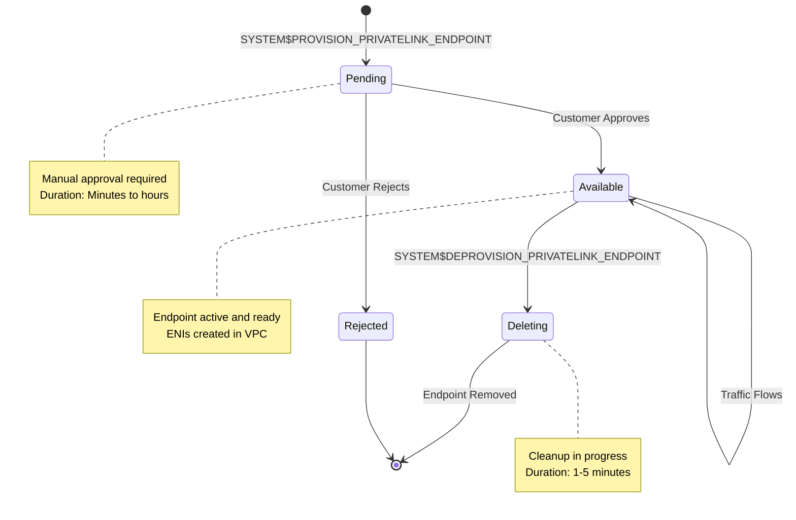

## Chapter 3: Solution Implementation for Snowflake on AWS

This guide details the sequential steps for implementing an end-to-end solution for Snowflake customers on AWS who need to connect to an on-premise data center using AWS networking services. The implementation involves three main phases: establishing the hybrid network foundation, configuring Snowflake and the private link connection, and integrating components with routing and security rules.

### Part 3.1: Establishing the AWS Hybrid Network Foundation

This initial phase establishes a private network connection, akin to a highway, between the customer's AWS Virtual Private Cloud (VPC) and their on-premise data center. This infrastructure is a prerequisite and must be fully operational before the Snowflake integration can be implemented. The architectural design is based on a "hub-and-spoke" model, which centralizes connectivity management within a dedicated networking VPC.

#### 3.1.1. Step-by-Step: Configuring AWS Direct Connect if not already in place

AWS Direct Connect provides the dedicated, private network connection between the on-premise data center and AWS[^8]. For comprehensive guidance on AWS and on-premise network integrations, see reference [^25]. These are the high level steps to create these connections.

1. **Provision a Direct Connect Connection**: In the [AWS Console](https://console.aws.amazon.com/), navigate to the [Direct Connect service](https://console.aws.amazon.com/directconnect/v2/home) and create a new connection. This involves selecting a Direct Connect location (a colocation facility), a port speed, and a connectivity provider. The provider will work with you to establish the physical cross-connect from your on-premise router to the AWS router[^26]. There is also the option to use a VPN connection back to your network if you are not using Direct Connect.
2. **Create a Direct Connect Gateway (DXGW)**: A DXGW is a global resource that allows you to connect to any AWS Region (except AWS GovCloud and China regions) from your Direct Connect connection. Create a DXGW in the AWS console, providing a name and an Autonomous System Number (ASN) for the Amazon side of the Border Gateway Protocol (BGP) session[^27]
3. **Create a Transit Virtual Interface (VIF)**: A VIF is a logical interface on the Direct Connect connection. To connect to a Transit Gateway, a **Transit VIF** must be created. During VIF creation, specify the Direct Connect connection, the DXGW you created, a Virtual Local Area Network Identifier (VLAN ID), and the BGP peering information (your router's peer IP, Amazon's router peer IP, and a BGP authentication key)[^8]
4. **Configure On-Premise Router**: Configure the corresponding BGP session on your on-premise edge router. This session should be configured to advertise the CIDR block(s) of your on-premise network (e.g., the network where the SQL Server resides) to AWS via the Transit VIF[^29]. Once the BGP session is established, the VIF state will change to "available."

**WHY BGP IS USED**: Border Gateway Protocol (BGP) is a **dynamic routing protocol** that automatically exchanges route information between networks. This provides several critical benefits:
- **Automatic Failover**: If a primary route fails, BGP automatically advertises alternate paths, providing resilience
- **Simplified Route Management**: Routes are learned dynamically rather than configured manually as static routes, reducing operational overhead
- **Route Aggregation**: BGP can summarize multiple routes, reducing routing table size
- **Multi-Path Support**: BGP supports multiple equal-cost paths for load distribution and redundancy
Without BGP, you would need to manually configure static routes on both the on-premise and AWS sides and manually update them whenever network topology changes—an error-prone and unscalable approach.

#### 3.1.2. Step-by-Step: Deploying and Configuring AWS Transit Gateway (TGW) if not already configured

The AWS Transit Gateway acts as a scalable cloud router between VPCs and on-premise networks[^9]. For detailed guidance on Transit Gateway integration patterns, see: Direct Connect gateways and TGW associations[^28], AWS Direct Connect + Transit Gateway architecture[^30], Transit Gateway tutorials[^31], and VPC-to-VPC connectivity via Direct Connect[^32].
1. **Create a Transit Gateway**: In the VPC console, create a new Transit Gateway. Configure its options, such as providing a private ASN for its BGP sessions and disabling default route table association and propagation to allow for manual, explicit routing control[^29]
2. **Create TGW Attachments**:
   * **VPC Attachment**: Create an attachment from the TGW to the customer's "hub" VPC (the VPC where the Snowflake private endpoint will eventually be created). Select one or more subnets (for high availability, choose subnets in different Availability Zones) for the TGW to place its network interfaces in[^9]
   * **Direct Connect Gateway Attachment**: Create an attachment from the TGW to the DXGW created in the previous step. This links the TGW to the on-premise network via the Direct Connect connection[^27]
3. **Configure TGW Route Tables**: A precise routing configuration is essential.
   * Create a dedicated TGW route table for the VPC attachment. In this route table, create a static route for your on-premise CIDR block, with the target set to the Direct Connect Gateway attachment. Associate this route table with the VPC attachment[^26]
   * Create a dedicated TGW route table for the Direct Connect attachment. Configure this route table to propagate routes from the VPC attachment. This will automatically advertise the VPC's CIDR block to the on-premise network via BGP. Associate this route table with the DXGW attachment[^29]

#### 3.1.3. Step-by-Step: Setting Up Hybrid DNS with Amazon Route 53 Resolver

Amazon Route 53 Resolver[^60] enables DNS resolution between VPCs and on-premise networks. This component is responsible for forwarding DNS queries for on-premise resources from the VPC to the on-premise DNS servers. This step can be skipped if you want to use the IP address of the database[^13]. For a visual reference of hybrid DNS architecture, see the AWS hybrid DNS resolution diagram[^14].

**WHY ROUTE 53 RESOLVER OUTBOUND ENDPOINT IS NECESSARY**: The VPC's default DNS resolver (at the `.2` address, e.g., `172.16.0.2` for a VPC with CIDR `172.16.0.0/16`) **cannot directly forward queries to external IPs** over the hybrid connection. It only resolves public DNS names and Route 53 private hosted zones. The Route 53 Resolver Outbound Endpoint provides the **network path** for DNS queries to traverse the Transit Gateway and Direct Connect to reach on-premise DNS servers. Without it, the VPC DNS would respond with "NXDOMAIN" (domain not found) for any on-premise hostname queries.

**WHY BOTH UDP AND TCP PORT 53**: DNS primarily uses **UDP** for standard queries because it's faster and requires less overhead (no connection setup). However, DNS **falls back to TCP** when:
- Response size exceeds 512 bytes (common with DNSSEC or many records)
- Zone transfers are performed (AXFR/IXFR operations)
- Client explicitly requests TCP
Both protocols must be allowed or DNS queries may intermittently fail when responses are large or when zone transfers are needed.

##### DNS Resolution Flow

Understanding the complete DNS resolution path helps troubleshoot connectivity issues:

1. **Query Initiation**: An EC2 instance or Snowflake SPCS container initiates a DNS query for an on-premise hostname (e.g., `db-server.corp.local`)
2. **VPC DNS Resolver**: Query reaches the VPC's DNS resolver (at VPC CIDR .2 address, e.g., `172.16.0.2`)
3. **Rule Matching**: The VPC DNS resolver checks configured forwarding rules to find a match for the domain pattern
4. **Forward to Endpoint**: If a FORWARD rule matches (e.g., `.corp.local`), Route 53 Resolver forwards the query to the outbound endpoint
5. **ENI Transmission**: The outbound endpoint's ENI (in the private subnet) sends the DNS query to the configured on-premise DNS server target IPs
6. **On-Premise Resolution**: The on-premise DNS server resolves the hostname and returns the response
7. **Response Path**: The response travels back through the same path (endpoint → VPC DNS → requesting resource)

##### Prerequisites

Before creating Route 53 Resolver resources, ensure:

- [ ] VPC created with private subnets in at least 2 Availability Zones
- [ ] Subnets sized appropriately (minimum /28, recommended /27 per subnet for resolver ENIs)
- [ ] Transit Gateway or VPN connection operational to on-premise network
- [ ] Route tables configured with routes to on-premise CIDR
- [ ] On-premise DNS server IP addresses documented (minimum 2 for redundancy)
- [ ] On-premise firewall allows DNS traffic (UDP/TCP port 53) from VPC CIDR
- [ ] Security group created for outbound endpoint with egress rules for DNS traffic

##### Step 1: Create a Route 53 Resolver Outbound Endpoint

**What This Does**: Creates an outbound endpoint with ENIs in your VPC subnets that forward DNS queries to on-premise DNS servers.

**Subnet Requirements**:
- **Minimum**: 2 subnets in 2 different Availability Zones (required for high availability)
- **Subnet Size**: Minimum /28 CIDR (16 addresses), recommended /27 (32 addresses)
- **Subnet Type**: Private subnets recommended
- **IP Addresses**: Each ENI consumes 1 IP address from the subnet
- **Routing**: Subnets must have route to on-premise CIDR via Transit Gateway/VPN

**ENI Requirements**:
- **Minimum**: 2 ENIs (hard AWS requirement)
- **Maximum**: 6 ENIs per endpoint
- **Recommended**: 2-3 ENIs for typical production workloads
- **Placement**: At least one ENI per Availability Zone for fault tolerance

**Using AWS Console**:
1. Navigate to Route 53 console → Resolver → Outbound endpoints
2. Click "Create outbound endpoint"
3. Enter endpoint name (e.g., `snowflake-outbound-resolver`)
4. Select your VPC
5. Select security group (must allow egress UDP/TCP 53 to on-premise DNS servers)
6. Add IP addresses:
   - Select first subnet (e.g., private subnet in us-east-1a)
   - Optionally specify IP address or let AWS auto-assign
   - Select second subnet (e.g., private subnet in us-east-1b)
   - Optionally specify IP address or let AWS auto-assign
7. Add tags as needed
8. Click "Create"

**Using AWS CLI**:

```bash
# Create outbound endpoint with 2 ENIs across 2 AZs
aws route53resolver create-resolver-endpoint \
  --name "snowflake-outbound-resolver" \
  --creator-request-id "resolver-endpoint-$(date +%s)" \
  --security-group-ids "sg-xxxxxxxxxxxxx" \
  --direction "OUTBOUND" \
  --ip-addresses \
    SubnetId=subnet-xxxxxxxxxxxxx \
    SubnetId=subnet-yyyyyyyyyyyyy \
  --tags \
    Key=Environment,Value=Production \
    Key=Purpose,Value=HybridDNS \
  --region us-east-1
```

**Expected Output**:
```json
{
  "ResolverEndpoint": {
    "Id": "rslvr-out-xxxxxxxxxxxxx",
    "Status": "CREATING",
    "Direction": "OUTBOUND",
    "IpAddressCount": 2,
    "HostVPCId": "vpc-xxxxxxxxxxxxx",
    "SecurityGroupIds": ["sg-xxxxxxxxxxxxx"]
  }
}
```

**Verify Endpoint Creation**:
```bash
# Check endpoint status (wait for OPERATIONAL status)
aws route53resolver get-resolver-endpoint \
  --resolver-endpoint-id rslvr-out-xxxxxxxxxxxxx \
  --region us-east-1

# List ENI IP addresses created
aws route53resolver list-resolver-endpoint-ip-addresses \
  --resolver-endpoint-id rslvr-out-xxxxxxxxxxxxx \
  --region us-east-1
```

##### Step 2: Create a Resolver Forwarding Rule

**What This Does**: Defines which domain patterns should be forwarded to on-premise DNS servers.

**Domain Pattern Syntax**:
- **Exact Domain**: `corp.local` - matches only `corp.local`, NOT subdomains
- **Wildcard Subdomains**: `.corp.local` - matches all subdomains (e.g., `db.corp.local`, `app.corp.local`) but NOT the apex domain
- **Specific Subdomain**: `db.corp.local` - matches only that specific subdomain

**Rule Types**:
- **FORWARD**: Send queries to on-premise DNS servers (requires target IPs)
- **SYSTEM**: Use Route 53 default resolution (useful for overriding broader FORWARD rules)

**Target IP Requirements**:
- **Format**: IPv4 dotted-decimal notation only (e.g., `10.0.1.10`)
- **Minimum**: 1 target IP required
- **Recommended**: 2+ target IPs for redundancy
- **Maximum**: 6 target IPs per rule
- **Port**: Always port 53 (cannot be customized)
- **Reachability**: Must be accessible from outbound endpoint subnets on UDP/TCP port 53

**Using AWS Console**:
1. Navigate to Route 53 console → Resolver → Rules
2. Click "Create rule"
3. Enter rule name (e.g., `forward-to-onprem-corp`)
4. Select "Forward" as rule type
5. Enter domain name pattern (e.g., `.corp.local` for all subdomains)
6. Select the outbound endpoint created in Step 1
7. Add target IP addresses:
   - IP address 1: `10.0.1.10` (primary on-premise DNS server)
   - IP address 2: `10.0.1.11` (secondary on-premise DNS server)
8. Add tags as needed
9. Click "Create"

**Using AWS CLI**:

```bash
# Create forwarding rule with 2 target DNS servers
aws route53resolver create-resolver-rule \
  --creator-request-id "resolver-rule-$(date +%s)" \
  --rule-type FORWARD \
  --domain-name .corp.local \
  --name "forward-to-onprem-corp" \
  --resolver-endpoint-id rslvr-out-xxxxxxxxxxxxx \
  --target-ips \
    Ip=10.0.1.10 \
    Ip=10.0.1.11 \
  --tags \
    Key=Environment,Value=Production \
    Key=Domain,Value=Corporate \
  --region us-east-1
```

**Expected Output**:
```json
{
  "ResolverRule": {
    "Id": "rslvr-rr-xxxxxxxxxxxxx",
    "Status": "COMPLETE",
    "DomainName": ".corp.local",
    "RuleType": "FORWARD",
    "TargetIps": [
      {"Ip": "10.0.1.10", "Port": 53},
      {"Ip": "10.0.1.11", "Port": 53}
    ],
    "ResolverEndpointId": "rslvr-out-xxxxxxxxxxxxx"
  }
}
```

**Verify Rule Creation**:
```bash
# List all resolver rules
aws route53resolver list-resolver-rules \
  --region us-east-1 \
  --query 'ResolverRules[*].[Id,Name,DomainName,RuleType,Status]' \
  --output table

# Get detailed rule information
aws route53resolver get-resolver-rule \
  --resolver-rule-id rslvr-rr-xxxxxxxxxxxxx \
  --region us-east-1
```

##### Step 3: Associate the Rule with the VPC

**What This Does**: Activates the forwarding rule within your VPC, enabling DNS query forwarding for resources in that VPC.

**Using AWS Console**:
1. Navigate to Route 53 console → Resolver → Rules
2. Select the rule created in Step 2
3. Click "Associate VPC"
4. Select your hub VPC
5. Enter association name (e.g., `corp-dns-rule-vpc-association`)
6. Click "Associate"

**Using AWS CLI**:

```bash
# Associate rule with VPC
aws route53resolver associate-resolver-rule \
  --resolver-rule-id rslvr-rr-xxxxxxxxxxxxx \
  --vpc-id vpc-xxxxxxxxxxxxx \
  --name "corp-dns-rule-vpc-association" \
  --region us-east-1
```

**Expected Output**:
```json
{
  "ResolverRuleAssociation": {
    "Id": "rslvr-rrassoc-xxxxxxxxxxxxx",
    "ResolverRuleId": "rslvr-rr-xxxxxxxxxxxxx",
    "VPCId": "vpc-xxxxxxxxxxxxx",
    "Status": "CREATING"
  }
}
```

**Verify Rule Association**:
```bash
# List rule associations for the VPC
aws route53resolver list-resolver-rule-associations \
  --filters Name=VPCId,Values=vpc-xxxxxxxxxxxxx \
  --region us-east-1 \
  --query 'ResolverRuleAssociations[*].[ResolverRuleId,VPCId,Status]' \
  --output table
```

##### Validation and Testing

**Test DNS Resolution from EC2 Instance**:

1. Launch a test EC2 instance in a private subnet within your VPC
2. SSH to the instance
3. Test DNS resolution for on-premise domain:

```bash
# Test with dig command
dig db-server.corp.local

# Expected output should show:
# - ANSWER section with IP address from on-premise DNS
# - Query time < 100ms typically

# Test with nslookup
nslookup db-server.corp.local

# Test both UDP and TCP
dig db-server.corp.local +notcp  # Force UDP
dig db-server.corp.local +tcp    # Force TCP
```

**Verify Connectivity to On-Premise DNS Servers**:

```bash
# From test EC2 instance in resolver subnet
# Test UDP connectivity
nc -zvu 10.0.1.10 53
nc -zvu 10.0.1.11 53

# Test TCP connectivity
nc -zv 10.0.1.10 53
nc -zv 10.0.1.11 53

# Test DNS query directly to on-premise server
dig @10.0.1.10 db-server.corp.local
dig @10.0.1.11 db-server.corp.local
```

**Note:** For troubleshooting DNS resolution issues, see Chapter 6, Section 6.2.5 (Route 53 Resolver Configuration Issues).

### Part 3.2: Configuring Snowflake for Outbound Private Connectivity to AWS

With the AWS hybrid network foundation in place, the next phase is to configure Snowflake and establish the private connection into the customer's VPC. This process requires a coordinated effort between the Snowflake administrator and the AWS cloud administrator.

#### 3.2.1. Architectural Prerequisite: The Network Load Balancer (NLB) Proxy

A critical, non-obvious requirement is that Snowflake's outbound private link feature must connect to a registered AWS service endpoint, not directly to an on-premise IP address[^6]. To bridge this gap, a proxy layer must be established within the customer's VPC. The standard and most effective pattern is to use an AWS Network Load Balancer (NLB).

**WHY NLB PROXY IS REQUIRED**: Snowflake's outbound PrivateLink can only connect to **AWS VPC Endpoint Services, not arbitrary IP addresses**. An on-premise database at IP `10.50.100.25` is not an AWS service endpoint. The NLB acts as a proxy: it registers as a VPC Endpoint Service (which Snowflake can connect to) and then forwards traffic to the on-premise IP via the hybrid connection. This architectural constraint is imposed by AWS PrivateLink's design.

**WHY LOAD BALANCER IS NECESSARY** (Beyond the proxy requirement): The NLB also provides critical production capabilities:
- **High Availability**: If the primary database fails, the NLB automatically routes to a standby database in the target group
- **Health Monitoring**: Continuously checks database availability (default every 30 seconds) and removes failed targets
- **Single Stable Endpoint**: The database IP can change (e.g., failover to standby) without reconfiguring Snowflake, as the NLB DNS name remains constant
- **Load Distribution**: If multiple database replicas exist, the NLB can distribute connections across them

**WHY HEALTH CHECKS ARE NECESSARY**: Health checks ensure traffic only reaches **healthy targets**. Without health checks, the NLB would continue sending traffic to a failed database, causing connection errors for all queries. With health checks, failed targets are automatically removed from the pool within approximately 90 seconds (3 consecutive failed checks at 30-second intervals), and traffic is redirected to healthy targets.

#### Prerequisites Checklist

Before configuring the Network Load Balancer, ensure the following AWS resources and permissions are in place:

**✅ Required AWS Resources:**
- [ ] VPC with private subnets in at least 2 Availability Zones
- [ ] CIDR blocks documented and non-overlapping with on-premise network
- [ ] Transit Gateway configured and connected to Direct Connect Gateway (from Part 3.1.2)
- [ ] Route tables configured with routes to on-premise CIDR via Transit Gateway
- [ ] Security groups prepared for NLB and target traffic
- [ ] On-premise database IP address and port documented (e.g., `10.50.100.25:1433`)

**✅ Required IAM Permissions:**
The AWS user or role performing NLB configuration must have the following IAM permissions:
- [ ] `ec2:CreateLoadBalancer` - Create the Network Load Balancer
- [ ] `ec2:CreateTargetGroup` - Create target groups for routing
- [ ] `ec2:RegisterTargets` - Register on-premise database IPs as targets
- [ ] `ec2:CreateListener` - Configure listeners on the NLB
- [ ] `elasticloadbalancing:CreateLoadBalancer` - ELB-specific creation permissions
- [ ] `elasticloadbalancing:CreateTargetGroup` - ELB-specific target group permissions
- [ ] `elasticloadbalancing:RegisterTargets` - Register targets with ELB
- [ ] `elasticloadbalancing:CreateListener` - Create ELB listeners
- [ ] `ec2:CreateVpcEndpointServiceConfiguration` - Create VPC Endpoint Service
- [ ] `ec2:DescribeVpcEndpointServiceConfigurations` - Verify endpoint service creation

**✅ Network Connectivity:**
- [ ] Transit Gateway route tables configured for VPC and Direct Connect attachments
- [ ] On-premise CIDR routable from VPC (verify via VPC route tables)
- [ ] Direct Connect connection active with BGP sessions established
- [ ] Network ACLs allow bidirectional traffic between VPC and on-premise network

**✅ DNS Requirements (Optional - if using hostnames instead of IPs):**
- [ ] Route 53 Resolver outbound endpoint configured (from Part 3.1.3)
- [ ] Forwarding rules created for on-premise domain
- [ ] On-premise DNS servers reachable from VPC

---

#### Configuration Steps

##### Step 1: Create an NLB Target Group

**What This Step Does:**
Creates a logical grouping for your on-premise database IP addresses. The target group acts as a routing destination for the NLB and manages health checks to monitor database availability.

**Why This Is Necessary:**
AWS load balancers cannot directly forward traffic to IP addresses without a target group. The target group provides the container for health check configuration and enables the NLB to track which database instances are healthy and available to receive traffic.

**What is a Target Group?**

A target group is a logical collection of destinations (targets) that receive traffic from a load balancer. Think of it as the "address book" that tells your NLB where to send traffic. The target group has three key responsibilities:

1. **Target Registration**: Maintains a list of destinations (IP addresses, EC2 instances, or Lambda functions)
2. **Health Monitoring**: Continuously checks if each target is healthy and able to receive traffic
3. **Traffic Routing**: Only sends traffic to targets that pass health checks (unhealthy targets are automatically bypassed)

**Target Type Selection - Why IP Addresses?**

When creating a target group, you must select a target type. Here are the three options and why we choose IP addresses:

- **IP Address Targets** *[Our Choice]*
  - **What it means**: Register targets using their IP addresses (any private IP routable from the VPC)
  - **Why we use it**: 
    - **On-premise databases don't exist in AWS**—they have no EC2 instance ID, only an IP address
    - Transit Gateway + Direct Connect make on-premise IP addresses routable from your AWS VPC
    - Provides flexibility to register any IP-based target across VPCs, hybrid networks, or containers
    - Does not require the target to be an AWS-managed resource
  - **Our use case**: The on-premise database has a private IP (e.g., 10.50.100.25) reachable through the hybrid network

- **Instance Targets** *[Not applicable here]*
  - Targets are EC2 instances identified by instance ID (e.g., i-1234567890abcdef0)
  - Used when load balancing to EC2 instances within AWS
  - **Cannot be used for on-premise resources** (they don't have AWS instance IDs)
  - Would be appropriate for connecting Snowflake to an EC2-hosted or RDS database within AWS

- **Lambda Function Targets** *[Not applicable here]*
  - Routes traffic to AWS Lambda functions for serverless request processing
  - Used for event-driven architectures, API backends, not database connections
  - Cannot be used for database connectivity

**How Target Groups Work with NLBs:**

The NLB → Target Group → Database flow works like this:

1. **NLB Listener receives connection** → Listener configured for database port (e.g., TCP:1433)
2. **Listener routes to Target Group** → Listener forwards traffic to its associated target group
3. **Target Group selects healthy target** → Only forwards to targets currently passing health checks
4. **Traffic reaches database** → Connection flows through hybrid network (Transit Gateway + Direct Connect) to on-premise database

This architecture means:
- If the database becomes unreachable, the target group marks it "unhealthy" and stops sending traffic
- Multiple databases can be registered for redundancy (NLB will only send to healthy ones)
- Health check configuration in the target group determines how quickly failures are detected

**Configuration:**

In the targets list, register the private IP address of the on-premise database. This is possible because the Transit Gateway and Direct Connect have made the on-premise CIDR block routable from the VPC.

   * From AWS main console, access the **EC2** service console \> '**Target Groups**'\> select Create Target Group.
     * **Target type:** Select '**IP addresses**'
     * **VPC:** Choose the VPC where your service endpoint will be located.
     * **Protocol and Port:** Set protocol to TCP and port to your database port
   * Select the newly created target group.
   * Register the IP addresses of your on-premise database.

**Verification - Confirm Target Group Created:**

Expected Console Output:
- Target group name visible in EC2 console under Target Groups
- Target type: IP
- Protocol: TCP
- Port: Your database port (e.g., 1433)
- Registered targets: Your on-premise database IP

**CLI Verification Commands:**

**1. Verify target group configuration:**
```bash
aws elbv2 describe-target-groups --names <your-target-group-name>
```

**Parameter explanations:**
- `elbv2`: AWS service namespace for Elastic Load Balancing v2 (ALB and NLB)
- `describe-target-groups`: Retrieves detailed information about target groups
- `--names`: Filter results by target group name(s) (comma-separated if multiple)
  - Alternative: Use `--target-group-arns` to query by ARN instead of name
- `<your-target-group-name>`: Replace with your actual target group name (e.g., "onprem-db-targets")

**Expected CLI Output (key fields):**
```json
{
    "TargetGroups": [{
        "TargetGroupName": "onprem-db-targets",
        "Protocol": "TCP",
        "Port": 1433,
        "VpcId": "vpc-xxxxx",
        "HealthCheckProtocol": "TCP",
        "TargetType": "ip"
    }]
}
```

**What to verify in output:**
- `TargetType: "ip"` - Confirms IP-based targets (required for on-premise databases)
- `Protocol: "TCP"` - Confirms TCP protocol (required for database connections)
- `Port: 1433` - Confirms correct database port (SQL Server default, adjust for your DB)
- `HealthCheckProtocol: "TCP"` - Confirms TCP health checks (recommended for hybrid connectivity)

**2. Verify target registration and health status:**
```bash
aws elbv2 describe-target-health --target-group-arn <target-group-arn>
```

**Parameter explanations:**
- `describe-target-health`: Retrieves health status for all registered targets in a target group
- `--target-group-arn`: ARN (Amazon Resource Name) of the target group to check
  - Format: `arn:aws:elasticloadbalancing:region:account-id:targetgroup/name/id`
  - Get ARN from previous command output or AWS console (Target Groups > select group > Details tab)
- Optional parameters:
  - `--targets`: Check specific target(s) only (e.g., `Id=10.50.100.25,Port=1433`)

**Expected output shows target in "initial" state (will transition to "healthy" after NLB creation):**
```json
{
    "TargetHealthDescriptions": [{
        "Target": {
            "Id": "10.50.100.25",
            "Port": 1433
        },
        "TargetHealth": {
            "State": "initial",
            "Reason": "Elb.RegistrationInProgress"
        }
    }]
}
```

**Target health states explained:**
- `initial`: Target just registered, first health check not yet performed (normal during setup)
- `healthy`: Target passing health checks, receiving traffic from NLB
- `unhealthy`: Target failing health checks, not receiving traffic
- `unused`: Target not registered with any active NLB
- `draining`: Target deregistering, existing connections allowed to complete
- `unavailable`: Health checks can't determine status (often indicates network/firewall issues)

---

##### Step 2: Create a Network Load Balancer

**What This Step Does:**
Deploys an internal Network Load Balancer in your VPC that acts as the proxy between Snowflake and your on-premise database. The NLB creates a stable endpoint (DNS name) that Snowflake connects to, and includes a listener that forwards traffic to the target group.

**Why This Is Necessary:**
Snowflake's outbound PrivateLink requires an AWS VPC Endpoint Service as the connection target. The NLB serves as this endpoint—it receives traffic from Snowflake via PrivateLink and forwards it through your hybrid network (Transit Gateway + Direct Connect) to the on-premise database. The listener configuration determines which port the NLB accepts traffic on and where it routes that traffic.

**Why Network Load Balancer (NLB)?**

AWS offers three types of load balancers—here's why we choose Network Load Balancer for this use case:

- **Network Load Balancer (NLB)** - Layer 4 (TCP/UDP) load balancer *[Our Choice]*
  - **What it does**: Routes traffic based on IP protocol data (source/destination IP and port)
  - **Why we use it**: 
    - Required for PrivateLink VPC Endpoint Services (Application Load Balancer cannot be used with VPC Endpoint Services)
    - Low latency and high throughput—critical for database connections
    - Preserves source IP address, which can be important for database audit logs
    - TCP passthrough allows TLS termination at the database (not at the load balancer)
    - Handles millions of requests per second with minimal overhead

- **Application Load Balancer (ALB)** - Layer 7 (HTTP/HTTPS) load balancer *[Not suitable]*
  - Routes based on HTTP headers, paths, or hostnames
  - Cannot be used with VPC Endpoint Services (architectural limitation)
  - Higher latency due to Layer 7 processing
  - Designed for web applications, not database connections

- **Classic Load Balancer (CLB)** - Legacy option *[Not recommended]*
  - Older generation that predates ALB and NLB
  - Less efficient, fewer features
  - AWS recommends migrating to NLB or ALB for all new workloads

**Internal vs. Internet-Facing Schemes:**

When creating the NLB, you must choose a scheme. Here's what each means and why we choose "internal":

- **Internal Scheme** *[Our Choice]*
  - **What it means**: The NLB gets a private IP address and is only accessible from within your VPC or connected networks (via VPN, Direct Connect, Transit Gateway, or PrivateLink)
  - **Why we use it**: 
    - Your on-premise database should NOT be exposed to the public internet
    - Snowflake connects via PrivateLink (a private AWS connection), not the internet
    - Meets security and compliance requirements for internal database access
    - Prevents unauthorized external access attempts

- **Internet-Facing Scheme** *[Not appropriate]*
  - NLB gets a public IP address and is accessible from the internet
  - Used for public-facing web applications
  - Would expose your database connection endpoint to the internet (security risk)
  - Not compatible with the private connectivity pattern we're implementing

**Key Concepts:**

**AWS Listener:** A process that checks for connection requests using the protocol and port you configure. When a listener receives a request matching its configuration, it forwards the request to targets in the associated target group. For example, a listener on TCP:1433 forwards all SQL Server traffic to the database target group.

**Availability Zone (AZ):** An isolated data center within an AWS Region. Deploying the NLB across multiple AZs ensures that if one data center fails, traffic automatically routes through healthy AZs, providing fault tolerance and high availability.

**Configuration:**

Deploy an internal NLB in your hub VPC. Create a listener for the database port (e.g., SQL Server default is TCP 1433) and configure it to forward traffic to the target group created above.
   * From the AWS main console, access **EC2** service console \> '**Load Balancers**'\> select Create Load Balancer and choose '**Network Load Balancer**'.

**Set the following:**

***Name:*** NLB name e.g. rds-nlb or onprem-db-nlb

***Scheme:*** Internal (private IP addresses only, not accessible from internet)

***Subnets:*** Select at least two private subnets in different Availability Zones *[Required for HA]*

**Why Multiple Subnets in Different AZs?**

**What is a subnet?**
A subnet is a segmented section of your VPC's IP address space. Think of a VPC as a large office building, and subnets as individual floors or departments. Each subnet:
- Has its own CIDR block (range of IP addresses), e.g., 10.0.1.0/24
- Resides entirely within a single Availability Zone (cannot span AZs)
- Can be either public (routes to internet gateway) or private (no internet route)

**What is an Availability Zone (AZ)?**
An Availability Zone is a physically isolated data center within an AWS Region. Each AZ has independent power, cooling, and networking. If one AZ experiences an outage (power failure, network issue), other AZs continue operating normally.

**Why the NLB requires subnets in multiple AZs:**

1. **High Availability** - If one AZ fails, the NLB continues serving traffic from other AZs
   - Without multi-AZ: AZ failure = complete NLB outage, all Snowflake connections fail
   - With multi-AZ: AZ failure = seamless failover, Snowflake connections stay active through healthy AZs

2. **Fault Tolerance** - The NLB distributes load balancer nodes across AZs
   - Each AZ gets its own NLB node with independent health checking
   - Traffic automatically routes through healthy AZ nodes only

3. **AWS Requirement** - NLBs require at least one subnet, but AWS strongly recommends at least two subnets in different AZs for production workloads

**Subnet Selection Guidelines:**

- **Must be in the same VPC** where you're deploying the NLB
- **Must be in different Availability Zones** (e.g., us-west-2a and us-west-2b)
- **Must be private subnets** (for internal scheme NLBs)
  - Private subnet = no route to Internet Gateway
  - Appropriate for internal traffic only (matches internal NLB scheme)
  - Aligns with security best practices for database connectivity
- **Must have sufficient IP addresses available**
  - NLB requires at least 8 available IPs per subnet
  - Recommendation: Use subnets with /24 CIDR or larger (provides 256 IPs)
  - Check available IPs in EC2 console under VPC > Subnets

**How Subnet Selection Affects Traffic Routing:**

```
Snowflake connects to NLB DNS name (e.g., nlb-abc123.elb.us-west-2.amazonaws.com)
↓
DNS resolves to IP addresses, one per AZ subnet (e.g., 10.0.1.50 and 10.0.2.50)
↓
NLB nodes in both AZs receive traffic and forward to target group
↓
If AZ-A subnet becomes unavailable, traffic automatically uses AZ-B subnet only
↓
Traffic flows through hybrid network to on-premise database
```

**AZ Selection Considerations:**

- **For on-premise database targets:** Choose any available AZs in your region (target is outside AWS, so AZ proximity doesn't matter for latency)
  - Example: us-west-2a and us-west-2b subnets both work equally well

- **For RDS database targets:** Match the AZs where your RDS instances are deployed
  - If RDS is in us-west-2a only: Consider deploying NLB in us-west-2a to avoid cross-AZ data transfer charges
  - If RDS uses Multi-AZ (us-west-2a primary, us-west-2b standby): Deploy NLB in both AZs for optimal routing
  - Cross-AZ traffic within AWS incurs small data transfer charges ($0.01/GB in most regions)

***Subnets:*** Select at least two private subnets in different Availability Zones

***Listeners:*** Add a listener for your database port (e.g., TCP:1433 for SQL Server, TCP:3306 for MySQL)


***Note:** Record the '**DNS Name**' from the details section above as nlb\_dns\_name for use in the next section.*

* Attach the target group created earlier.


**Health Check Configuration:**

Health checks are automated tests that verify each target can handle traffic. If a target fails health checks, the NLB stops routing traffic to it.

**Recommended Configuration for Database Targets:**

- **Protocol**: TCP (recommended for databases—low overhead, no HTTP endpoint required)
- **Interval**: 30 seconds (time between consecutive checks)
- **Timeout**: 10 seconds (maximum wait time for response—accommodates hybrid network latency)
- **Healthy Threshold**: 3 consecutive successes (target becomes healthy after ~90 seconds)
- **Unhealthy Threshold**: 3 consecutive failures (target becomes unhealthy after ~90 seconds)

**Key Points:**
- Timeout must be less than Interval (AWS requirement)
- Default settings work well for on-premise databases over Direct Connect
- Failed targets are automatically removed from rotation; recovered targets automatically rejoin


**Load Balancer Routing:**
- NLB uses flow hash (5-tuple: source IP, source port, destination IP, destination port, protocol) by default
- This provides session affinity, ensuring connections remain stable to the database target
- For database connections, use default settings - no configuration changes needed

**Security Best Practices:**

**Security Group Configuration:**

**NLB Security Group:**
- **Inbound**: TCP on database port (e.g., 1433) from VPC CIDR where PrivateLink endpoint resides
- **Outbound**: Allow all (for health checks to reach targets)
- **Note**: Security groups are optional for NLBs but recommended for least-privilege access

**Target Security Group:**
- **Inbound**: TCP on database port from NLB subnets' CIDR blocks (or entire VPC CIDR)
- **Outbound**: Allow all (default)

**Network ACLs:**
- Use default NACL rules (allow all) for private subnets
- If using custom NACLs: Allow inbound on database port and outbound on ephemeral ports (1024-65535)

****

**Production Best Practices Checklist:**

**✅ High Availability:**
- [ ] NLB deployed in at least 2 Availability Zones
- [ ] Private subnets in different AZs selected
- [ ] Target group has registered targets
- [ ] Health checks configured with appropriate timeouts for hybrid connectivity

**✅ Security:**
- [ ] Internal NLB scheme (not internet-facing)
- [ ] Private subnets used (no internet gateway route)
- [ ] Security groups follow least privilege (specific ports only)
- [ ] On-premise firewall allows health check traffic from AWS VPC CIDR

**✅ Performance:**
- [ ] Health check interval and timeout optimized for hybrid network latency
- [ ] TCP protocol selected for low overhead
- [ ] Unhealthy threshold set to balance sensitivity and stability (recommend 3)

**✅ Monitoring & Operational Excellence:**

**CloudWatch Metrics (Automatic for NLBs):**
- **HealthyHostCount**: Number of healthy targets (should be > 0)
- **UnHealthyHostCount**: Number of unhealthy targets (should be 0)
- **ActiveFlowCount**: Number of concurrent flows (connections)
- **ProcessedBytes**: Data processed through NLB
- **TCP_Client_Reset_Count**: Client-initiated connection resets
- **TCP_Target_Reset_Count**: Target-initiated connection resets (may indicate database issues)

**Recommended CloudWatch Alarms:**
```bash
# Example: Alert when no healthy targets
aws cloudwatch put-metric-alarm \
  --alarm-name nlb-no-healthy-targets \
  --alarm-description "Alert when NLB has no healthy targets" \
  --metric-name HealthyHostCount \
  --namespace AWS/NetworkELB \
  --statistic Average \
  --period 60 \
  --evaluation-periods 2 \
  --threshold 1 \
  --comparison-operator LessThanThreshold \
  --dimensions Name=LoadBalancer,Value=<your-nlb-resource-id> \
  --alarm-actions <sns-topic-arn>
```

**Access Logs (Optional but Recommended for Production):**
- Enable NLB access logs to S3 for traffic analysis and troubleshooting
- Captures: Client IP, target IP, request time, TLS protocol version, sent/received bytes
- **Enable via AWS Console**: Load Balancers > your NLB > Attributes > Access logs
- **Cost**: S3 storage for logs (typically minimal)

**✅ Cost Optimization:**
- [ ] Cross-AZ traffic minimized (for RDS targets, place NLB in same AZ)
- [ ] No unnecessary features enabled (NLB pricing is per hour + per GB, straightforward)
- [ ] Access logs only enabled if needed for compliance/troubleshooting (generates S3 costs)

**✅ Documentation:**
- [ ] NLB DNS name recorded for Snowflake configuration
- [ ] Target group ARN documented
- [ ] Health check settings documented
- [ ] Security group IDs and rules documented
- [ ] On-call runbook includes troubleshooting steps for "unhealthy target" scenarios

**Verification - Confirm NLB is Active:**

Expected Console Output:
- State: **Active** (may take 2-3 minutes to provision)
- DNS name: `<nlb-name>-xxxxxxxxxx.elb.<region>.amazonaws.com`
- Scheme: **internal**
- Availability Zones: At least 2 AZs listed
- Listeners: TCP listener on your database port

**CLI Verification Commands:**

**1. Verify NLB configuration and status:**
```bash
aws elbv2 describe-load-balancers --names <your-nlb-name>
```

**Parameter explanations:**
- `elbv2`: AWS service namespace for Elastic Load Balancing v2 (ALB and NLB)
- `describe-load-balancers`: Retrieves detailed information about load balancers
- `--names`: Filter results by load balancer name(s) (comma-separated if multiple)
  - Alternative: Use `--load-balancer-arns` to query by ARN instead of name
- `<your-nlb-name>`: Replace with your actual NLB name (e.g., "onprem-db-nlb")
- Optional useful parameters:
  - `--query`: Use JMESPath to filter specific fields (e.g., `--query 'LoadBalancers[0].DNSName'` to get just DNS)
  - `--output`: Format output as `json`, `text`, or `table` (default is `json`)

**Expected CLI Output (key fields):**
```json
{
    "LoadBalancers": [{
        "LoadBalancerName": "onprem-db-nlb",
        "DNSName": "onprem-db-nlb-1234567890.elb.us-west-2.amazonaws.com",
        "State": {
            "Code": "active"
        },
        "Scheme": "internal",
        "Type": "network",
        "VpcId": "vpc-xxxxx",
        "AvailabilityZones": [
            {"ZoneName": "us-west-2a", "SubnetId": "subnet-xxxxx"},
            {"ZoneName": "us-west-2b", "SubnetId": "subnet-yyyyy"}
        ]
    }]
}
```

**What to verify in output:**
- `State.Code: "active"` - NLB is provisioned and ready (may show "provisioning" for first 2-3 minutes)
- `Type: "network"` - Confirms Network Load Balancer (not Application or Classic)
- `Scheme: "internal"` - Confirms internal scheme (private IPs only)
- `DNSName` - **IMPORTANT**: Record this DNS name for Snowflake configuration
- `AvailabilityZones` - Should show at least 2 zones for high availability
- `VpcId` - Confirms correct VPC (should match your hub VPC)

**2. Verify target health (should transition from "initial" to "healthy" within ~90 seconds):**
```bash
aws elbv2 describe-target-health --target-group-arn <target-group-arn>
```

**Parameter explanations:**
- `describe-target-health`: Retrieves current health status of registered targets
- `--target-group-arn`: ARN of the target group attached to your NLB
  - Get ARN from target group details or from `describe-target-groups` output
  - Format: `arn:aws:elasticloadbalancing:region:account-id:targetgroup/name/id`
- Optional parameters:
  - `--targets`: Check specific target(s) only instead of all targets

**Expected output with healthy target:**
```json
{
    "TargetHealthDescriptions": [{
        "Target": {
            "Id": "10.50.100.25",
            "Port": 1433
        },
        "TargetHealth": {
            "State": "healthy"
        }
    }]
}
```

**What to verify in output:**
- `State: "healthy"` - Target is passing health checks and receiving traffic
- If `State: "unhealthy"`, check the `Reason` field for diagnostics:
  - `Target.Timeout`: Health check timed out (check network connectivity, firewall rules)
  - `Target.FailedHealthChecks`: Target responding but failing checks (verify database is running)
  - `Target.NotRegistered`: Target not properly registered with target group

**Health Check Timing:**
- Initial registration: "initial" state
- First health check: ~30 seconds after NLB creation
- Healthy threshold: 3 consecutive successful checks = ~90 seconds total to reach "healthy" state
- If target stays in "initial" or becomes "unhealthy", check:
  - Security group rules allow NLB to reach target on database port
  - Network ACLs permit traffic
  - Transit Gateway and Direct Connect routes are configured correctly
  - On-premise firewall allows health check traffic from AWS VPC CIDR

---

For troubleshooting common NLB configuration errors, see Chapter 6, Section 6.3.4.

---

##### Step 3: Create a VPC Endpoint Service

**What This Step Does:**
Creates an AWS VPC Endpoint Service that exposes your NLB as a PrivateLink-enabled service. This generates a service name that other AWS accounts (specifically Snowflake's account) can use to create a private connection to your NLB.

**Why This Is Necessary:**
Snowflake's outbound PrivateLink feature can only connect to VPC Endpoint Services, not directly to load balancers or IP addresses. By creating a VPC Endpoint Service backed by your NLB, you're registering the NLB as a service that Snowflake can privately connect to. This is the final bridge that allows Snowflake (in their AWS account) to reach your on-premise database (via your NLB and hybrid network).

**VPC Endpoint Service:** An AWS PrivateLink construct that exposes your NLB as a service that other AWS accounts can privately connect to without traversing the public internet. The service generates a unique service name (e.g., `com.amazonaws.vpce.us-west-2.vpce-svc-xxxxx`) that Snowflake uses to establish the private connection.

**Configuration:**

Create a new endpoint service, selecting the NLB you just created. Note the service name (e.g., com.amazonaws.vpce.\<region\>.vpce-svc-\<id\>) that is generated—you'll need this for Snowflake configuration.

   * From the AWS main services console, access the **VPC** console \> '**Endpoint Service**'\>Create Endpoint Service.
   * Set Load Balancer Type to '**Network**'.
   * Select the NLB created in the previous step.
   * Ensure the IP address type is set to **IPv4**.
   * **Configure Acceptance Requirements**:
     - **Acceptance required**: **Enable** (check this box) *[REQUIRED for production]*
     - **What it means**: Every connection request from Snowflake will require your explicit approval before being established
     - **Why it's necessary**: 
       - **Security gate**: Provides manual verification before granting Snowflake access to your on-premise resources
       - **Prevents misconfiguration**: Even if an incorrect Snowflake account ID is added to the allowlist, you maintain final approval authority
       - **Audit trail**: Each approval creates a documented decision point for compliance and security auditing
       - **Change control integration**: Connection approvals can be integrated into your change management processes
     - **Operational impact**: Snowflake connections will enter "Pending" state and require AWS administrator approval (typically minutes, plan for potential delays during initial setup)

**Acceptance Required Setting - Security Best Practices:**

For **production environments**, always enable manual acceptance (`acceptance_required = true`) to maintain explicit control over which Snowflake accounts can establish PrivateLink connections to your on-premise resources. This implements a defense-in-depth security strategy where both automated controls (IAM policies, principal allowlists) and manual verification work together.

**What happens with manual acceptance enabled:**
1. Snowflake runs `SYSTEM$PROVISION_PRIVATELINK_ENDPOINT` → Connection enters "Pending" state
2. AWS administrator receives notification (CloudWatch Events, email, Console)
3. Administrator verifies the connection request is legitimate
4. Administrator approves the connection in AWS Console (VPC → Endpoint Services → Connection Requests)
5. Connection transitions to "Available" state → Snowflake can access on-premise database

**What happens without manual acceptance (NOT RECOMMENDED for production):**
- Any principal on the allowlist can connect immediately without verification
- Misconfiguration in the allowlist immediately grants access
- Reduced audit trail and control over sensitive resource access

**When to consider disabling manual acceptance:**
- Development/testing environments where speed is prioritized over control
- After initial connection is stable and well-understood (with enhanced monitoring)
- Only when combined with strict allowlist control and comprehensive logging

***Note:** Record the '**Service Name**' from the details section as endpoint\_service\_name for use in a later section.*


**Verification - Confirm VPC Endpoint Service Created:**

**Prerequisites Verification:**
Before considering the VPC Endpoint Service operational, verify these prerequisites are met:

**1. Verify NLB is Active and Healthy:**
```bash
# Check NLB state
aws elbv2 describe-load-balancers --names onprem-db-nlb \
  --query 'LoadBalancers[0].{State:State.Code,DNS:DNSName}'
```

Expected output:
```json
{
    "State": "active",
    "DNS": "onprem-db-nlb-1234567890.elb.us-west-2.amazonaws.com"
}
```

**What to verify:**
- `State` must be **"active"** (not "provisioning" or "failed")
- If not active, wait 2-3 minutes for NLB provisioning to complete
- DNS name should be present and match your NLB

**2. Verify Target Group Health:**
```bash
# Get target group ARN from NLB
TARGET_GROUP_ARN=$(aws elbv2 describe-target-groups \
  --names onprem-db-targets \
  --query 'TargetGroups[0].TargetGroupArn' \
  --output text)

# Check target health
aws elbv2 describe-target-health --target-group-arn $TARGET_GROUP_ARN
```

Expected output:
```json
{
    "TargetHealthDescriptions": [{
        "Target": {
            "Id": "10.50.100.25",
            "Port": 1433
        },
        "TargetHealth": {
            "State": "healthy"
        }
    }]
}
```

**What to verify:**
- At least one target shows `"State": "healthy"`
- If state is "initial", wait ~90 seconds for health checks to complete (3 checks × 30s interval)
- If state is "unhealthy", troubleshoot network connectivity (security groups, NACLs, routes)

**Why These Prerequisites Matter:**
- **Active NLB**: VPC Endpoint Service cannot function if the backend NLB is not operational
- **Healthy targets**: Traffic from Snowflake will fail if NLB has no healthy targets to forward to
- **Service association**: VPC Endpoint Service acts as the frontend, NLB is the backend—both must be operational

---

**Service Configuration Verification:**

Expected Console Output:
- Service name: `com.amazonaws.vpce.<region>.vpce-svc-xxxxxxxxxxxxx`
- State: **Available**
- Load balancer type: network
- Associated NLB: Your NLB name

CLI Verification Command:
```bash
aws ec2 describe-vpc-endpoint-service-configurations
```

Expected CLI Output (key fields - find your service by NLB ARN):
```json
{
    "ServiceConfigurations": [{
        "ServiceName": "com.amazonaws.vpce.us-west-2.vpce-svc-0123456789abcdef0",
        "ServiceState": "Available",
        "ServiceType": [{"ServiceType": "Interface"}],
        "NetworkLoadBalancerArns": [
            "arn:aws:elasticloadbalancing:us-west-2:123456789012:loadbalancer/net/onprem-db-nlb/abc123def456"
        ],
        "ManagesVpcEndpoints": false,
        "AcceptanceRequired": true
    }]
}
```

**Critical Fields to Verify:**

**ServiceState: "Available"**
- **What it means**: The VPC Endpoint Service is fully provisioned and ready to accept connection requests
- **If not Available**: Check that NLB exists and is in "active" state
- **Possible states**: "Pending" (still provisioning), "Available" (ready), "Failed" (configuration error)

**NetworkLoadBalancerArns:**
- **What to verify**: The ARN must exactly match your NLB's ARN
- **ARN format**: `arn:aws:elasticloadbalancing:<region>:<account-id>:loadbalancer/net/<nlb-name>/<unique-id>`
- **Get NLB ARN**: Run `aws elbv2 describe-load-balancers --names <nlb-name> --query 'LoadBalancers[0].LoadBalancerArn'`
- **Why it matters**: This association links the VPC Endpoint Service frontend to the NLB backend—incorrect ARN means traffic cannot flow

**ServiceType: "Interface"**
- **What it means**: This is an Interface VPC Endpoint Service (required for PrivateLink connections)
- **Why it matters**: Gateway endpoints cannot be used for Snowflake PrivateLink connections
- **Confirmation**: Value should always be `[{"ServiceType": "Interface"}]`

**ManagesVpcEndpoints: false**
- **What it means**: The service provider (you) does not automatically manage VPC Endpoint lifecycle
- **Expected value**: `false` for customer-managed endpoint services
- **Why it matters**: Snowflake will create and manage their own VPC Endpoints using your service name

**AcceptanceRequired: true**
- **What it means**: Manual approval is enabled (as recommended in previous section)
- **Expected value**: `true` for production environments
- **Why it matters**: Ensures you can review and approve Snowflake connection requests before they're established

**Verify Service-to-NLB Association:**

Retrieve and validate the service name (you'll need this for Snowflake configuration):
```bash
# Save the service name for later use
SERVICE_NAME=$(aws ec2 describe-vpc-endpoint-service-configurations \
  --query 'ServiceConfigurations[?NetworkLoadBalancerArns[0] contains `onprem-db-nlb`].ServiceName' \
  --output text)
echo "VPC Endpoint Service Name: $SERVICE_NAME"
```

**Validate the association by cross-referencing NLB and Service:**
```bash
# Get NLB ARN
NLB_ARN=$(aws elbv2 describe-load-balancers --names onprem-db-nlb \
  --query 'LoadBalancers[0].LoadBalancerArn' --output text)

# Verify VPC Endpoint Service references this NLB
aws ec2 describe-vpc-endpoint-service-configurations \
  --query "ServiceConfigurations[?contains(NetworkLoadBalancerArns[0], '$NLB_ARN')].{ServiceName:ServiceName,State:ServiceState,NLB:NetworkLoadBalancerArns[0]}"
```

Expected output confirming association:
```json
[
    {
        "ServiceName": "com.amazonaws.vpce.us-west-2.vpce-svc-0123456789abcdef0",
        "State": "Available",
        "NLB": "arn:aws:elasticloadbalancing:us-west-2:123456789012:loadbalancer/net/onprem-db-nlb/abc123def456"
    }
]
```

**What This Confirms:**
- ✅ VPC Endpoint Service exists and is available
- ✅ Service is correctly associated with your NLB (ARN match)
- ✅ Service name is generated and ready to provide to Snowflake
- ✅ NLB backend is operational and can handle traffic

**Note:** For troubleshooting VPC Endpoint Service configuration issues, see Chapter 6, Section 6.1.4 (VPC Endpoint Service Configuration Errors).

---

#### 3.2.2. Step-by-Step: Provisioning and Approving the Private Endpoint

**Step1: Authorize Snowflake to Create Endpoints**

**What This Step Does:**
Configures the VPC Endpoint Service to accept connection requests from Snowflake's AWS account by adding Snowflake's principal ARN to the endpoint service allowlist. This creates the authorization foundation that allows Snowflake to establish the PrivateLink connection.

**Why This Is Necessary:**
Without adding Snowflake's principal to the allowlist, any connection attempts from Snowflake will be automatically rejected by AWS. The principal allowlist acts as the first security gate, ensuring only authorized AWS accounts (in this case, Snowflake's account) can even attempt to connect to your VPC Endpoint Service.

**Obtain Snowflake's Account Principal:**

Run the following SQL statement in Snowflake to retrieve the exact principal ARN you need to allowlist:

```sql
SELECT key, value FROM TABLE(FLATTEN(INPUT => PARSE_JSON(SYSTEM$GET_PRIVATELINK_CONFIG()))
);
```


**Understanding the Principal ARN Format:**

Locate the ***privatelink-account-principal*** key in the query results. The value will be an AWS IAM principal ARN in one of these formats:

**Format for Snowflake SPCS (most common):**
```
arn:aws:iam::{snowflake-account-id}:user/{orgname}-{accountname}
```

**Example:**
```
arn:aws:iam::123456789012:user/myorg-myaccount
```

**Alternative format (root principal):**
```
arn:aws:iam::{snowflake-account-id}:root
```

**ARN Components Explained:**
- `arn:aws:iam` - AWS IAM resource namespace (always this for principals)
- `{snowflake-account-id}` - Snowflake's AWS account ID (12-digit number, varies by region)
- `:user/{orgname}-{accountname}` - Snowflake-specific user identifier combining your organization and account names
- `:root` - Alternative format granting access to all principals in the Snowflake AWS account

**Important Notes:**
- **Use the EXACT value** returned by `SYSTEM$GET_PRIVATELINK_CONFIG()` - do not modify it
- **Regional variation**: Snowflake uses different AWS account IDs for different regions
- **Format validation**: ARN must start with `arn:aws:iam::` and contain a 12-digit account ID
- **Case sensitivity**: ARNs are case-sensitive, copy exactly as shown

**Configure the Allowlist in AWS:**

1. Navigate to: **AWS Console** > **VPC** > **Endpoint Services** > Select your endpoint service
2. Scroll to the **Allow principals** section
3. Click **Allow principals** button
4. Paste the complete principal ARN from Snowflake (e.g., `arn:aws:iam::123456789012:user/myorg-myaccount`)
5. Click **Allow principals** to add to allowlist
6. Verify the ARN appears in the allowlist with status "Allowed"


**Verification Steps:**

After adding the principal, verify the configuration using AWS CLI:
```bash
aws ec2 describe-vpc-endpoint-service-permissions --service-id vpce-svc-xxxxxxxxxxxxx
```

Expected output showing Snowflake principal in allowlist:
```json
{
    "AllowedPrincipals": [
        {
            "Principal": "arn:aws:iam::123456789012:user/myorg-myaccount",
            "PrincipalType": "User"
        }
    ]
}
```

**Security Best Practices:**

- **Least Privilege**: Only add the specific Snowflake principal ARN required for your account - do not use wildcard ARNs
- **Verification**: Double-check the ARN matches exactly what Snowflake provides - incorrect ARNs will prevent connections
- **Audit Trail**: Document when the principal was added and by whom for security auditing
- **Regular Review**: Periodically verify that only authorized principals remain in the allowlist
- **Combine with Manual Acceptance**: Use allowlist AND acceptance_required=true for defense-in-depth security

**Note:** For troubleshooting principal allowlist configuration errors, see Chapter 6, Section 6.1.5 (Principal Allowlist Configuration Errors).

**Why Allowlist + Manual Acceptance Work Together:**

The allowlist and manual acceptance setting work together as two layers of security:

1. **Allowlist (First Gate)**: "Can this AWS account even attempt to connect?" - Blocks connection attempts from any principal not on the list
2. **Manual Acceptance (Second Gate)**: "Should we approve this specific connection request?" - Allows you to verify each connection before establishing it

This defense-in-depth approach ensures that even if an incorrect principal is added to the allowlist, you still have the opportunity to reject the connection during manual approval.

**Step2: Provision a private endpoint**

Provision Endpoint from Snowflake: As the Snowflake ACCOUNTADMIN, execute the SYSTEM$PROVISION\_PRIVATELINK\_ENDPOINT function. The first argument is the service name of the VPC Endpoint Service created in the previous step. The second argument is a DNS pattern that matches the VPCE endpoint's DNS name or the fully qualified service DNS. The full endpoint DNS will be "*endpoint\_id*.*service\_id*.*region*.vpce.amazonaws.com", such as endpoint\_id.vpce-svc-xxxxxxxxxxxxxxxxx.us-west-2.vpce.amazonaws.com for the wild card example below.

```sql
USE ROLE ACCOUNTADMIN;SELECT SYSTEM$PROVISION_PRIVATELINK_ENDPOINT(  'com.amazonaws.vpce.us-west-2.vpce-svc-xxxxxxxxxxxxxxxxx',  '*.vpce-svc-xxxxxxxxxxxxxxxxx.us-west-2.vpce.amazonaws.com' );
```

This command initiates the connection request[^6]

**PrivateLink Connection Lifecycle States:**

After running `SYSTEM$PROVISION_PRIVATELINK_ENDPOINT`, the connection progresses through several states:

| State | Description | Duration | Next Step |
|-------|-------------|----------|-----------|
| **Pending** | Connection request sent, awaiting customer approval in AWS console | Minutes to hours (manual approval required) | Customer must approve or reject |
| **Available** | Connection approved, VPC Endpoint created with ENIs, endpoint active and ready for traffic | Permanent (until deleted) | Configure Snowflake Network Rule with endpoint DNS |
| **Deleting** | Endpoint deletion initiated (via `SYSTEM$DEPROVISION_PRIVATELINK_ENDPOINT` or AWS console) | 1-5 minutes | Endpoint removed, ENIs deleted |
| **Rejected** | Customer rejected the connection request in AWS console | Permanent (until new request made) | Must re-run `SYSTEM$PROVISION_PRIVATELINK_ENDPOINT` |
| **Failed** | Endpoint creation failed due to AWS service issue or configuration error | Permanent (requires investigation) | Check AWS service health, verify VPC/subnet configuration |

**State Transition Diagram:**



**Monitoring Connection State:**
Query Snowflake to check endpoint status:
```sql
SHOW EXTERNAL ACCESS INTEGRATIONS;
-- Check "comment" field for endpoint details
```

1. **Approve Connection in AWS**: The AWS administrator will now see a pending connection request on the VPC Endpoint Service. This request must be accepted. Once accepted, a VPC Interface Endpoint will be created in the customer's hub VPC. This endpoint will have ENIs in the specified subnets, each with a private IP address from that subnet's CIDR range. This endpoint is the entry point for all traffic from Snowflake.

#### 3.2.3. Step-by-Step: Creating Snowflake Security and Integration Objects

##### When Are Secrets Needed?

Secrets are only required for **Custom Snowpark Container Services (SPCS)** where your container code needs to authenticate to external databases or APIs.

**For Custom SPCS (Section 5.2)**: If you're building custom containerized applications that will connect to databases or external services, create secrets before proceeding to EAI configuration. The secret stores credentials that your container code will retrieve at runtime.

**For Openflow (Section 5.1)**: Secrets are typically **NOT needed** in the initial EAI setup for Openflow. Openflow manages its own authentication internally. **If you're setting up Openflow, you can skip secret creation and proceed directly to the network rule and EAI creation below.**

If your specific Openflow use case requires external API access with authentication, you can return to create secrets later as needed.

---

Create Snowflake Secret (for Custom SPCS only): Store the SQL Server credentials securely in Snowflake.

```sql
CREATE OR REPLACE SECRET sql_server_creds  TYPE = PASSWORD  USERNAME = 'your_sql_server_user'  PASSWORD = 'your_sql_server_password';
```

18
Create Snowflake Network Rule: Define the allowed private network destination. The VALUE\_LIST should include the DNS name of the NLB.  By using port 0, we are allowing any port and providing flexibility for adding additional databases to the VPCE/NLB on different port numbers. AWS will still block any ports that have not been specifically authorized.

```sql
CREATE NETWORK RULE IF NOT EXISTS onprem_sql_server_rule  MODE = EGRESS  TYPE = PRIVATE_HOST_PORT  VALUE_LIST = ('nlb-dns-name.elb.us-west-2.amazonaws.com:0',
'endpoint_id.service_id.region.vpce.amazonaws.com:0' );
```

6
Create External Access Integration: Bundle the network rule (and optionally the secret for Custom SPCS) into the final integration object.

**For Custom SPCS (if you created secrets above):**
```sql
CREATE EXTERNAL ACCESS INTEGRATION IF NOT EXISTS aws_onprem_eai
  ALLOWED_NETWORK_RULES = (onprem_sql_server_rule)
  ALLOWED_AUTHENTICATION_SECRETS = (sql_server_creds)
  ENABLED = TRUE;
```

**For Openflow (no secrets needed):**
```sql
CREATE EXTERNAL ACCESS INTEGRATION IF NOT EXISTS aws_onprem_eai
  ALLOWED_NETWORK_RULES = (onprem_sql_server_rule)
  ENABLED = TRUE;
```

5
You can grant usage on the EAI to any role with the following command. You will need to do this to the role that is creating the SPCS container or Openflow runtime.

```sql
GRANT USAGE ON INTEGRATION OPENFLOW_EXT_ACCESS_INT TO ROLE OPENFLOW_ADMIN;
```

### Next you can assign the EAI to Openflow through the UI or specify it when you create a custom SPCS service.


### Part 3.3: End-to-End Routing, Security, and Debugging / Validation on AWS

The final phase involves configuring the detailed security rules and verifying the entire data path.

#### 3.3.1. Configuring VPC Subnet Routing

Confirm that the route tables associated with the subnets hosting the VPC Interface Endpoint and the NLB have a route for the on-premise CIDR block that points to the Transit Gateway as the next hop. This ensures traffic arriving from Snowflake is correctly forwarded towards the on-premise network.

#### 3.3.2. Defining Security Group and Network ACL Rules

You can increase your security with inbound rules.

* **Security Groups (Stateful)**:
  * **VPC Endpoint SG**: The security group attached to the VPC Interface Endpoint ENIs must have an *inbound* rule allowing traffic on the database port (SQL Server TCP 1433\) from the source CIDR block of the Snowflake VNet. This CIDR block must be obtained from Snowflake documentation or support.
  * **NLB SG**: The security group for the NLB must have an *inbound* rule allowing traffic on TCP 1433 from the security group of the VPC Endpoint (or its subnet CIDR).
  * Since security groups are stateful, return traffic is automatically allowed[^22]
* **Network ACLs (Stateless)**:
  * Network ACLs (NACLs)[^37] provide stateless filtering for subnet traffic.
  * It is a best practice to use a dedicated subnet for the Transit Gateway attachment and leave its associated NACL open (Allow ALL for both inbound and outbound) to avoid inadvertently blocking transit traffic[^24][^35]
  * For the subnet hosting the VPC Interface Endpoint, the NACL must have:
    * An *inbound* rule allowing traffic on TCP 1433 from the Snowflake VNet CIDR.
    * An *outbound* rule allowing traffic on the ephemeral TCP port range (1024-65535) to the Snowflake VNet CIDR. This is critical for allowing the return traffic of the TCP session[^36]
  * Similar rules must be applied to the NACL for the NLB's subnet, allowing traffic to and from the VPC Endpoint's subnet and the on-premise CIDR block.

##

## References

[^2]: Snowpark Container Services 101: A Complete Overview (2025) - Chaos Genius, https://www.chaosgenius.io/blog/snowpark-container-services/
[^6]: External network access and private connectivity on AWS, https://docs.snowflake.com/en/developer-guide/external-network-access/creating-using-private-aws
[^8]: AWS Direct Connect - Building a Scalable and Secure Multi-VPC AWS Network Infrastructure, https://docs.aws.amazon.com/whitepapers/latest/building-scalable-secure-multi-vpc-network-infrastructure/direct-connect.html
[^9]: How AWS Transit Gateway works - Amazon VPC, https://docs.aws.amazon.com/vpc/latest/tgw/how-transit-gateways-work.html
[^13]: How to achieve DNS high availability with Route 53 Resolver endpoints, https://aws.amazon.com/blogs/networking-and-content-delivery/how-to-achieve-dns-high-availability-with-route-53-resolver-endpoints/
[^22]: AWS PrivateLink and Snowflake, https://docs.snowflake.com/en/user-guide/admin-security-privatelink
[^24]: Network ACLs for transit gateways in AWS Transit Gateway, https://docs.aws.amazon.com/vpc/latest/tgw/tgw-nacls.html
[^26]: How to manage the connections between your VPC and on-premises networks over a private connection using AWS Direct Connect and Transit Gateway, https://pierreraffa.medium.com/building-a-private-connectivity-using-aws-direct-connect-3d218d855873
[^27]: Connecting Direct Connect to Transit Gateway, https://docs.aws.amazon.com/managedservices/latest/onboardingguide/setup-net-connect-to-tg.html
[^29]: Use on-premises firewall with DC transit VIF to route VPC traffic, https://repost.aws/knowledge-center/route-vpc-traffic-with-dc-transit-vif
[^33]: Route 53 Resolver endpoints and forwarding rules, https://docs.aws.amazon.com/whitepapers/latest/hybrid-cloud-dns-options-for-vpc/route-53-resolver-endpoints-and-forwarding-rules.html
[^34]: Configure Route 53 Resolver outbound endpoint for VPC DNS, https://repost.aws/knowledge-center/route53-resolve-with-outbound-endpoint
[^36]: VPC with public and private subnets (NAT), https://docs.aws.amazon.com/vpc/latest/userguide/VPC_Scenario2.html
