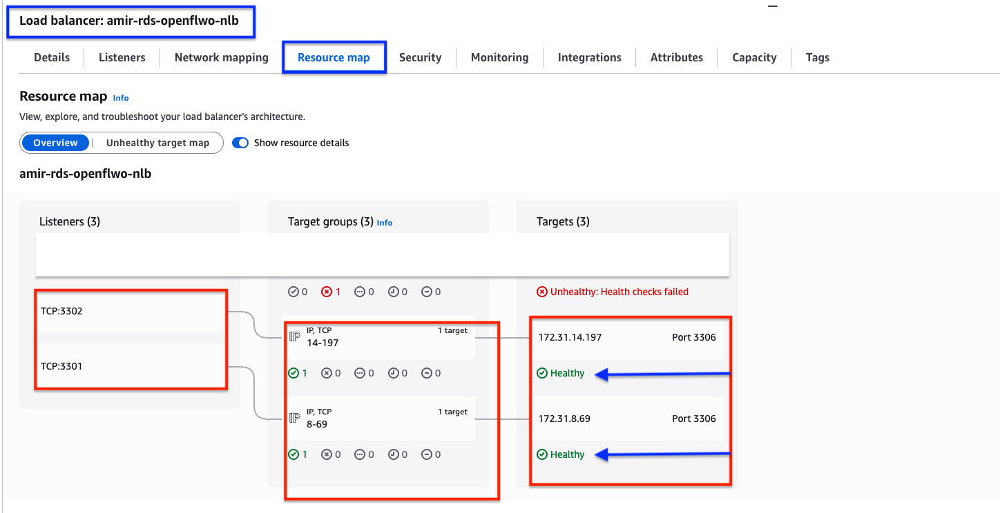
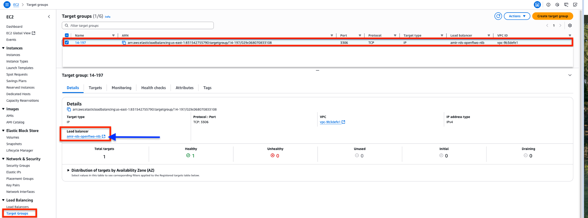
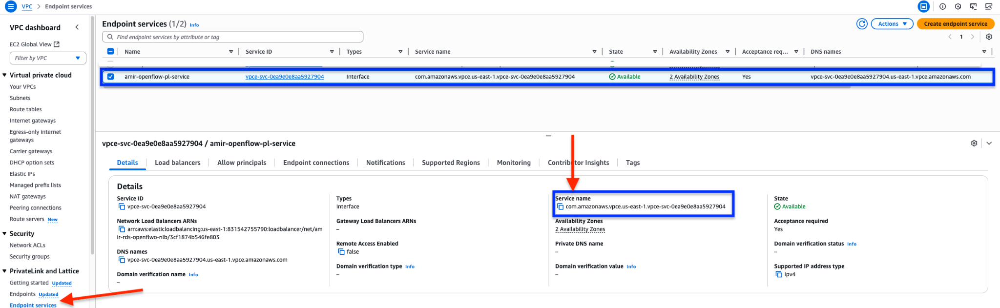
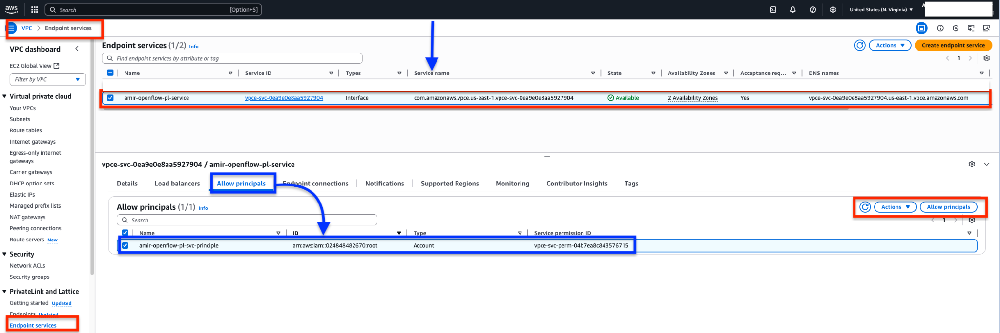
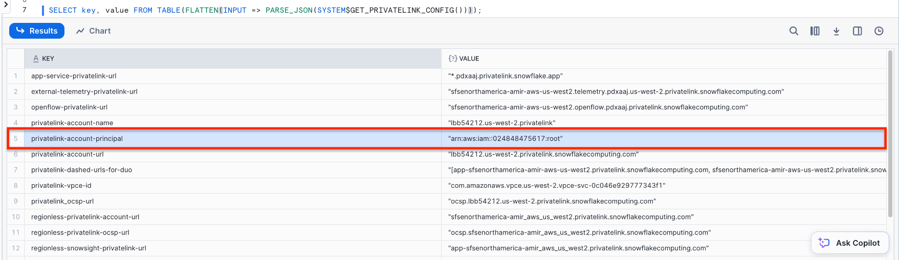
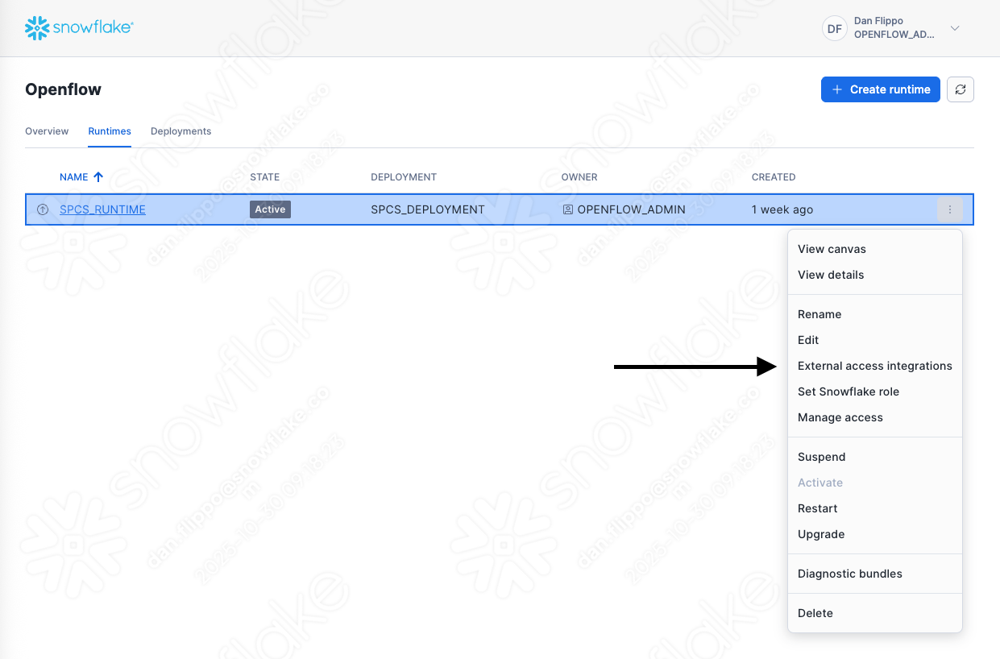
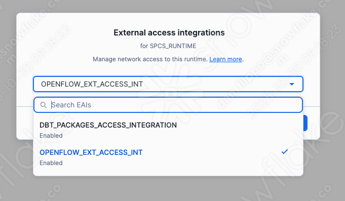

## Chapter 3: Solution Implementation for Snowflake on AWS

This guide details the sequential steps for implementing an end-to-end solution for Snowflake customers on AWS who need to connect to an on-premise data center using AWS networking services. The implementation involves three main phases: establishing the hybrid network foundation, configuring Snowflake and the private link connection, and integrating components with routing and security rules.

### Part 3.1: Establishing the AWS Hybrid Network Foundation

This initial phase establishes a private network connection, akin to a highway, between the customer's AWS Virtual Private Cloud (VPC) and their on-premise data center. This infrastructure is a prerequisite and must be fully operational before the Snowflake integration can be implemented. The architectural design is based on a "hub-and-spoke" model, which centralizes connectivity management within a dedicated networking VPC.

#### 3.1.1. Step-by-Step: Configuring AWS Direct Connect if not already in place

AWS Direct Connect provides the dedicated, private network connection between the on-premise data center and AWS[^8]. These are the high level steps to create these connections.

1. **Provision a Direct Connect Connection**: In the [AWS Console](https://console.aws.amazon.com/), navigate to the [Direct Connect service](https://console.aws.amazon.com/directconnect/v2/home) and create a new connection. This involves selecting a Direct Connect location (a colocation facility), a port speed, and a connectivity provider. The provider will work with you to establish the physical cross-connect from your on-premise router to the AWS router[^26]. There is also the option to use a VPN connection back to your network if you are not using Direct Connect.
2. **Create a Direct Connect Gateway (DXGW)**: A DXGW is a global resource that allows you to connect to any AWS Region (except AWS GovCloud and China regions) from your Direct Connect connection. Create a DXGW in the AWS console, providing a name and an Autonomous System Number (ASN) for the Amazon side of the Border Gateway Protocol (BGP) session[^27]
3. **Create a Transit Virtual Interface (VIF)**: A VIF is a logical interface on the Direct Connect connection. To connect to a Transit Gateway, a **Transit VIF** must be created. During VIF creation, specify the Direct Connect connection, the DXGW you created, a Virtual Local Area Network Identifier (VLAN ID), and the BGP peering information (your router's peer IP, Amazon's router peer IP, and a BGP authentication key)[^8]
4. **Configure On-Premise Router**: Configure the corresponding BGP session on your on-premise edge router. This session should be configured to advertise the CIDR block(s) of your on-premise network (e.g., the network where the SQL Server resides) to AWS via the Transit VIF[^29]. Once the BGP session is established, the VIF state will change to "available."

#### 3.1.2. Step-by-Step: Deploying and Configuring AWS Transit Gateway (TGW) if not already configured

The AWS Transit Gateway acts as a scalable cloud router between VPCs and on-premise networks[^9]
1. **Create a Transit Gateway**: In the VPC console, create a new Transit Gateway. Configure its options, such as providing a private ASN for its BGP sessions and disabling default route table association and propagation to allow for manual, explicit routing control[^29]
2. **Create TGW Attachments**:
   * **VPC Attachment**: Create an attachment from the TGW to the customer's "hub" VPC (the VPC where the Snowflake private endpoint will eventually be created). Select one or more subnets (for high availability, choose subnets in different Availability Zones) for the TGW to place its network interfaces in[^9]
   * **Direct Connect Gateway Attachment**: Create an attachment from the TGW to the DXGW created in the previous step. This links the TGW to the on-premise network via the Direct Connect connection[^27]
3. **Configure TGW Route Tables**: A precise routing configuration is essential.
   * Create a dedicated TGW route table for the VPC attachment. In this route table, create a static route for your on-premise CIDR block, with the target set to the Direct Connect Gateway attachment. Associate this route table with the VPC attachment[^26]
   * Create a dedicated TGW route table for the Direct Connect attachment. Configure this route table to propagate routes from the VPC attachment. This will automatically advertise the VPC's CIDR block to the on-premise network via BGP. Associate this route table with the DXGW attachment[^29]

#### 3.1.3. Step-by-Step: Setting Up Hybrid DNS with Amazon Route 53 Resolver

This component is responsible for forwarding DNS queries for on-premise resources from the VPC to the on-premise DNS servers. This step can be skipped if you want to use the IP address of the database[^13]
1. **Create a Route 53 Resolver Outbound Endpoint**: In the Route 53 console, create a new outbound endpoint. This endpoint will consist of at least two Elastic Network Interfaces (ENIs) placed in different Availability Zones for high availability. Select the customer's hub VPC and the private subnets for these ENIs. The security group associated with these ENIs must allow outbound UDP and TCP traffic on port 53 to the IP addresses of your on-premise DNS servers[^34]
2. **Create a Resolver Forwarding Rule**: Create a new Resolver rule of type "Forward".
   * **Domain Name**: Specify the private domain name of your on-premise network (e.g., corp.local.).
   * **Targets**: Enter the private IP addresses of your on-premise DNS servers[^34]
   * **Outbound Endpoint**: Select the outbound endpoint created in the previous step.
3. **Associate the Rule with the VPC**: Associate the newly created forwarding rule with your hub VPC. This action instructs the VPC's default resolver (at the .2 address of the VPC CIDR) to use this rule for any DNS queries matching the specified domain name.[^33] Any resource within this VPC, including the future Snowflake private endpoint, will now be able to resolve on-premise hostnames.

### Part 3.2: Configuring Snowflake for Outbound Private Connectivity to AWS

With the AWS hybrid network foundation in place, the next phase is to configure Snowflake and establish the private connection into the customer's VPC. This process requires a coordinated effort between the Snowflake administrator and the AWS cloud administrator.

#### 3.2.1. Architectural Prerequisite: The Network Load Balancer (NLB) Proxy

A critical, non-obvious requirement is that Snowflake's outbound private link feature must connect to a registered AWS service endpoint, not directly to an on-premise IP address[^6]. To bridge this gap, a proxy layer must be established within the customer's VPC. The standard and most effective pattern is to use an AWS Network Load Balancer (NLB).

1. **Create an NLB Target Group**: Create a new target group for the NLB with a target type of IP Addresses. In the targets list, register the private IP address of the on-premise database. This is possible because the Transit Gateway and Direct Connect have made the on-premise CIDR block routable from the VPC.
   * From AWS main console, access the **EC2** service console \> ‘**Target Groups**’\> select Create Target Group.
     * **Target type:** Select ‘**IP addresses**’
     * **VPC:** Choose the VPC where your service endpoint will be located.
     * **Protocol and Port:** Set protocol to TCP and port to your database port
   * Select the newly created target group.
   * Register the IP addresses of your on-premise database.
2. **Create a Network Load Balancer**: Deploy an internal NLB in your hub VPC. Create a listener for the database port (e.g., SQL Server default is TCP 1433\) and configure it to forward traffic to the target group created above.
   * From the AWS main console, access **EC2** service console \> ‘**Load Balancers**’\> select Create Load Balancer and choose ‘**Network Load Balancer**’.

**Set the following:**
***Name:*** NLB name e.g. rds-nlb or…
***Scheme:*** Internal.
***Subnets:*** At least two private subnets for high availability.
***Listeners:*** Add a listener for your database port (e.g., TCP:3301, 3302 respectively for each mysql rds instance).



**Availability Zone:** If granting access to RDS Databases, ensure it matches the subnets selected for the RDS instances to prevent a cross-az setup unless your rds instances are provisioned in different AZs. Otherwise ensure the NLB is set up in a VPS that can reach your on-premise DB.



***Note:** Record the '**DNS Name**' from the details section above as nlb\_dns\_name for use in the next section.*

* Attach the target group created earlier.



**Health checks:**

* TCP or MySQL checks.
* Make sure targets show healthy.


**Security:**
Backends allow inbound 3306 from the NLB path (SG/VPC ranges).

* NLB is internal and reachable from your data connectors/ports.
* If DB enforces TLS, keep listeners TCP (pass-through)


***NOTE:***

* It is highly recommended to allow traffic inbound to NLB only on specific ports.
* It is also highly recommended to allow all traffic inbound to the RDS instance/s from the SG applied to the NLB.
3. **Create a VPC Endpoint Service**: Navigate to the VPC Endpoint Services Chapter of the VPC console. Create a new endpoint service, selecting the NLB you just created. This action exposes your NLB as a service that other AWS accounts (like Snowflake's) can connect to via AWS PrivateLink. Note the service name (e.g., com.amazonaws.vpce.\<region\>.\<vpce-service-id\>) that is generated.
   * From the AWS main services console, access the **VPC** console \> ‘**Endpoint Service**’\>Create Endpoint Service.
   * Set Load Balancer Type to ‘**Network**’.
   * Select the NLB created in the previous step.
   * Ensure the IP address type is set to **IPv4**.

***Note:** Record the ‘**Service Name**’ from the details section as endpoint\_service\_name for use in a later section.*


*

#### 3.2.2. Step-by-Step: Provisioning and Approving the Private Endpoint

**Step1: Authorize Snowflake to Create Endpoints**

Run the following sql statement to retrieve the Snowflake account principal to allow the creation of endpoints:

```sql
SELECT key, value FROM TABLE(FLATTEN(INPUT => PARSE_JSON(SYSTEM$GET_PRIVATELINK_CONFIG()))
);
```



Locate the ***privatelink-account-principal*** key and its corresponding value. Then, in your AWS VPC\>Endpoint Services console, update the '***Allow principals***' section in the endpoint service to allow Snowflake account principal.



**Step2: Provision a private endpoint**

Provision Endpoint from Snowflake: As the Snowflake ACCOUNTADMIN, execute the SYSTEM$PROVISION\_PRIVATELINK\_ENDPOINT function. The first argument is the service name of the VPC Endpoint Service created in the previous step. The second argument is a DNS pattern that matches the VPCE endpoint's DNS name or the fully qualified service DNS. The full endpoint DNS will be "*endpoint\_id*.*service\_id*.*region*.vpce.amazonaws.com", such as endpoint\_id.vpce-svc-xxxxxxxxxxxxxxxxx.us-west-2.vpce.amazonaws.com for the wild card example below.

```sql
USE ROLE ACCOUNTADMIN;SELECT SYSTEM$PROVISION_PRIVATELINK_ENDPOINT(  'com.amazonaws.vpce.us-west-2.vpce-svc-xxxxxxxxxxxxxxxxx',  '*.vpce-svc-xxxxxxxxxxxxxxxxx.us-west-2.vpce.amazonaws.com' );
```

This command initiates the connection request[^6]
1. **Approve Connection in AWS**: The AWS administrator will now see a pending connection request on the VPC Endpoint Service. This request must be accepted. Once accepted, a VPC Interface Endpoint will be created in the customer's hub VPC. This endpoint will have ENIs in the specified subnets, each with a private IP address from that subnet's CIDR range. This endpoint is the entry point for all traffic from Snowflake.

#### 3.2.3. Step-by-Step: Creating Snowflake Security and Integration Objects

Create Snowflake Secret: Store the SQL Server credentials securely in Snowflake.

```sql
CREATE OR REPLACE SECRET sql_server_creds  TYPE = PASSWORD  USERNAME = 'your_sql_server_user'  PASSWORD = 'your_sql_server_password';
```

18
Create Snowflake Network Rule: Define the allowed private network destination. The VALUE\_LIST should include the DNS name of the NLB.  By using port 0, we are allowing any port and providing flexibility for adding additional databases to the VPCE/NLB on different port numbers. AWS will still block any ports that have not been specifically authorized.

```sql
CREATE NETWORK RULE IF NOT EXISTS onprem_sql_server_rule  MODE = EGRESS  TYPE = PRIVATE_HOST_PORT  VALUE_LIST = ('nlb-dns-name.elb.us-west-2.amazonaws.com:0',
'endpoint_id.service_id.region.vpce.amazonaws.com:0' );
```

6
Create External Access Integration: Bundle the secret and network rule into the final integration object.

```sql
CREATE EXTERNAL ACCESS INTEGRATION IF NOT EXISTS aws_onprem_eai  ALLOWED_NETWORK_RULES = (onprem_sql_server_rule)  ALLOWED_AUTHENTICATION_SECRETS = all
  ENABLED = TRUE;
```

5
You can grant usage on the EAI to any role with the following command. You will need to do this to the role that is creating the SPCS container or Openflow runtime.

```sql
GRANT USAGE ON INTEGRATION OPENFLOW_EXT_ACCESS_INT TO ROLE OPENFLOW_ADMIN;
```

### Next you can assign the EAI to Openflow through the UI or specify it when you create a custom SPCS service.




### Part 3.3: End-to-End Routing, Security, and Debugging / Validation on AWS

The final phase involves configuring the detailed security rules and verifying the entire data path.

#### 3.3.1. Configuring VPC Subnet Routing

Confirm that the route tables associated with the subnets hosting the VPC Interface Endpoint and the NLB have a route for the on-premise CIDR block that points to the Transit Gateway as the next hop. This ensures traffic arriving from Snowflake is correctly forwarded towards the on-premise network.

#### 3.3.2. Defining Security Group and Network ACL Rules

You can increase your security with inbound rules.

* **Security Groups (Stateful)**:
  * **VPC Endpoint SG**: The security group attached to the VPC Interface Endpoint ENIs must have an *inbound* rule allowing traffic on the database port (SQL Server TCP 1433\) from the source CIDR block of the Snowflake VNet. This CIDR block must be obtained from Snowflake documentation or support.
  * **NLB SG**: The security group for the NLB must have an *inbound* rule allowing traffic on TCP 1433 from the security group of the VPC Endpoint (or its subnet CIDR).
  * Since security groups are stateful, return traffic is automatically allowed[^22]
* **Network ACLs (Stateless)**:
  * It is a best practice to use a dedicated subnet for the Transit Gateway attachment and leave its associated NACL open (Allow ALL for both inbound and outbound) to avoid inadvertently blocking transit traffic[^24]
  * For the subnet hosting the VPC Interface Endpoint, the NACL must have:
    * An *inbound* rule allowing traffic on TCP 1433 from the Snowflake VNet CIDR.
    * An *outbound* rule allowing traffic on the ephemeral TCP port range (1024-65535) to the Snowflake VNet CIDR. This is critical for allowing the return traffic of the TCP session[^36]
  * Similar rules must be applied to the NACL for the NLB's subnet, allowing traffic to and from the VPC Endpoint's subnet and the on-premise CIDR block.

##

## References

[^2]: Snowpark Container Services 101: A Complete Overview (2025) - Chaos Genius, https://www.chaosgenius.io/blog/snowpark-container-services/
[^6]: External network access and private connectivity on AWS, https://docs.snowflake.com/en/developer-guide/external-network-access/creating-using-private-aws
[^8]: AWS Direct Connect - Building a Scalable and Secure Multi-VPC AWS Network Infrastructure, https://docs.aws.amazon.com/whitepapers/latest/building-scalable-secure-multi-vpc-network-infrastructure/direct-connect.html
[^9]: How AWS Transit Gateway works - Amazon VPC, https://docs.aws.amazon.com/vpc/latest/tgw/how-transit-gateways-work.html
[^13]: How to achieve DNS high availability with Route 53 Resolver endpoints, https://aws.amazon.com/blogs/networking-and-content-delivery/how-to-achieve-dns-high-availability-with-route-53-resolver-endpoints/
[^22]: AWS PrivateLink and Snowflake, https://docs.snowflake.com/en/user-guide/admin-security-privatelink
[^24]: Network ACLs for transit gateways in AWS Transit Gateway, https://docs.aws.amazon.com/vpc/latest/tgw/tgw-nacls.html
[^26]: How to manage the connections between your VPC and on-premises networks over a private connection using AWS Direct Connect and Transit Gateway, https://pierreraffa.medium.com/building-a-private-connectivity-using-aws-direct-connect-3d218d855873
[^27]: Connecting Direct Connect to Transit Gateway, https://docs.aws.amazon.com/managedservices/latest/onboardingguide/setup-net-connect-to-tg.html
[^29]: Use on-premises firewall with DC transit VIF to route VPC traffic, https://repost.aws/knowledge-center/route-vpc-traffic-with-dc-transit-vif
[^33]: Route 53 Resolver endpoints and forwarding rules, https://docs.aws.amazon.com/whitepapers/latest/hybrid-cloud-dns-options-for-vpc/route-53-resolver-endpoints-and-forwarding-rules.html
[^34]: Configure Route 53 Resolver outbound endpoint for VPC DNS, https://repost.aws/knowledge-center/route53-resolve-with-outbound-endpoint
[^36]: VPC with public and private subnets (NAT), https://docs.aws.amazon.com/vpc/latest/userguide/VPC_Scenario2.html

