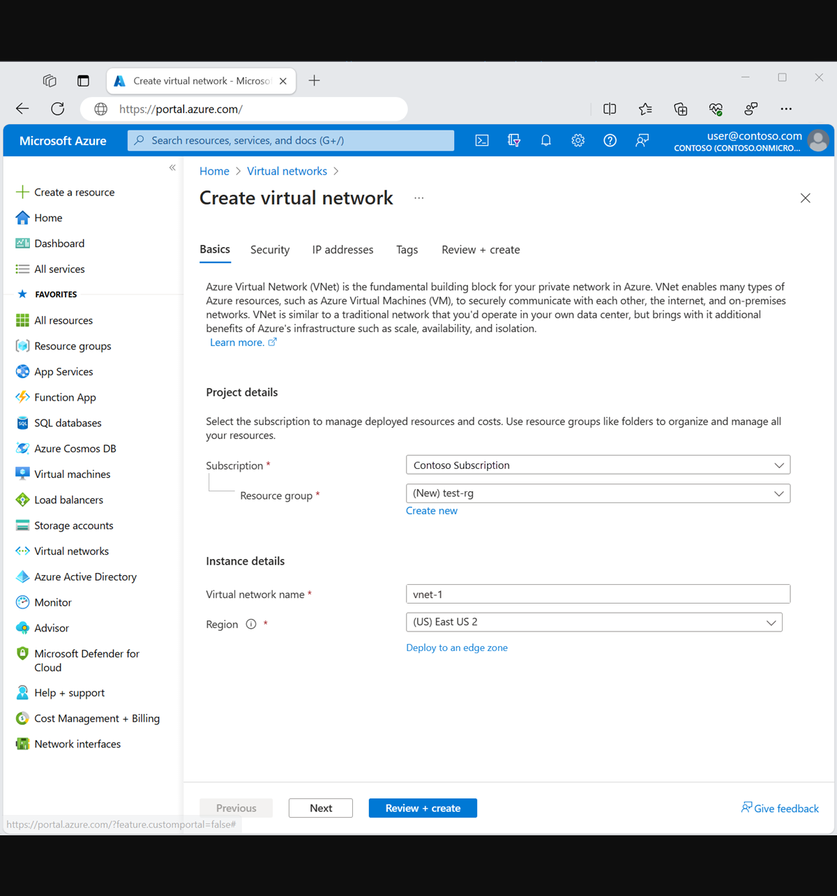
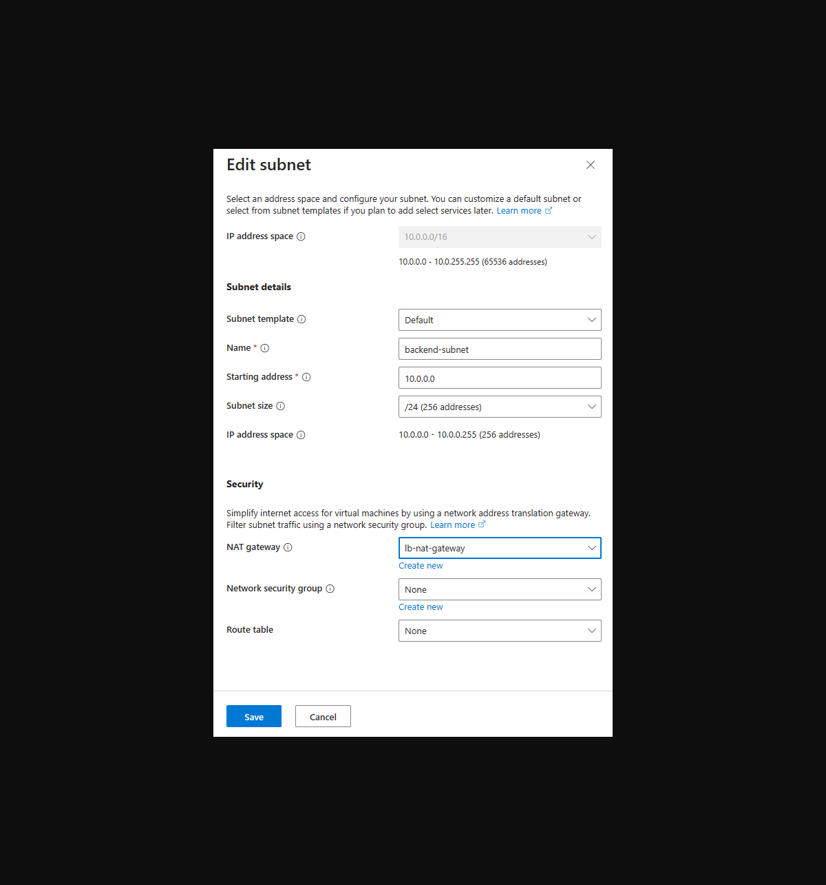
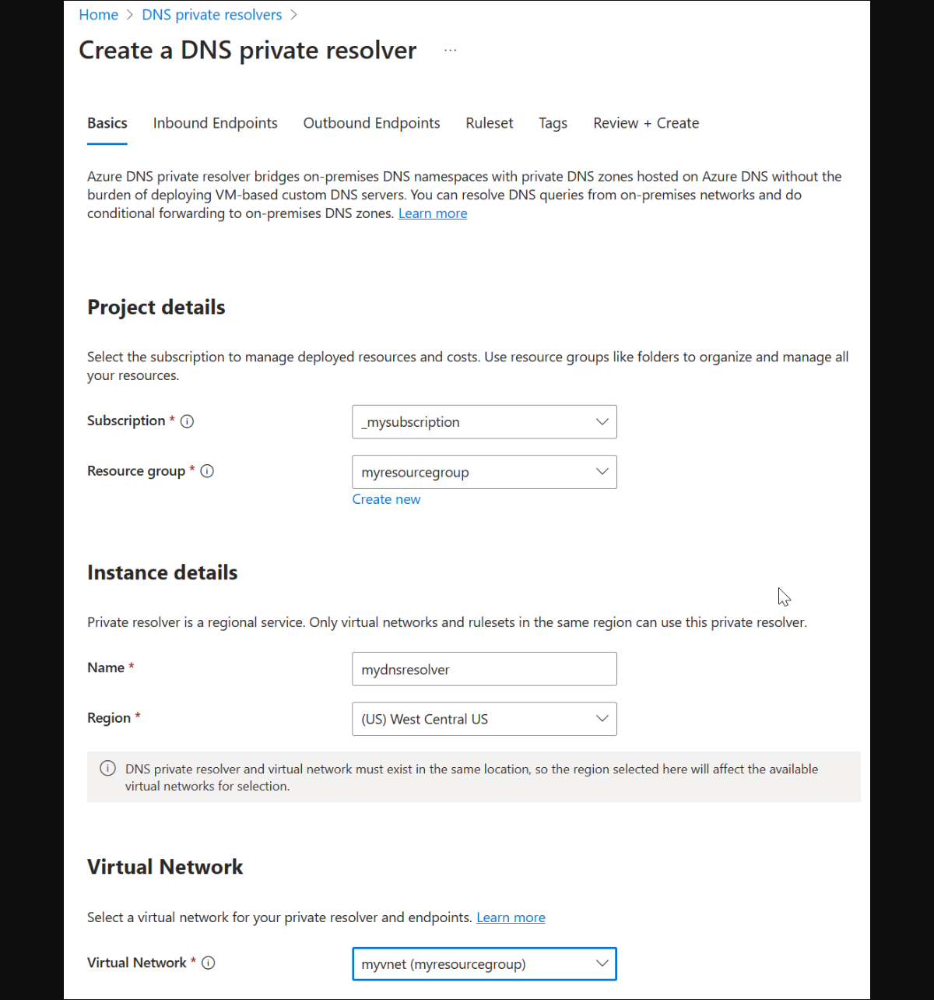
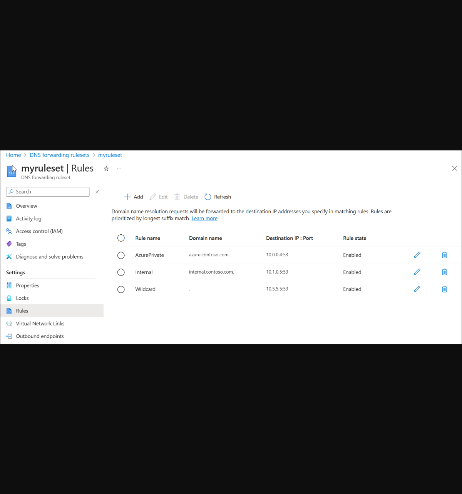
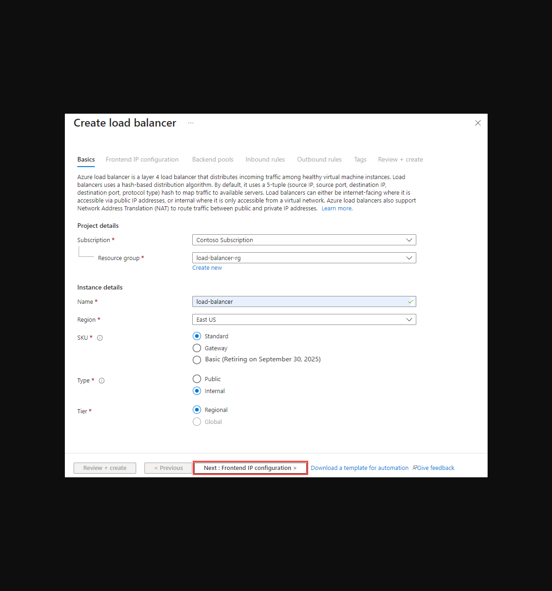
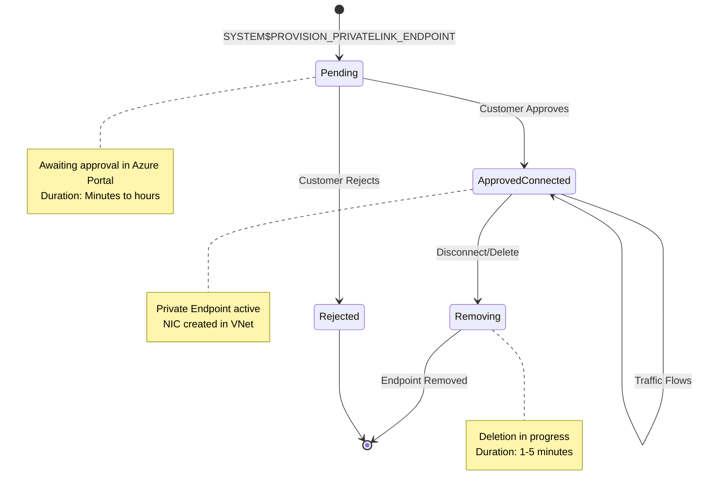

## Chapter 4: Solution Implementation for Snowflake on Azure

This Chapter provides a parallel, detailed guide for customers whose Snowflake account is hosted on Microsoft Azure and who are connecting to an on-premise data center via Azure networking services. The architectural principles are analogous to the AWS solution, but the specific service names and configurations differ.

### Part 4.1: Establishing the Azure Hybrid Network Foundation if not already configured

This phase builds the private connection from the customer's Azure Virtual Network (VNet) to their on-premise data center.

#### 4.1.1. Step-by-Step: Configuring Azure ExpressRoute if not already in place

Azure ExpressRoute provides the dedicated private connectivity from on-premise to the Azure cloud[^10]. For frequently asked questions about Azure ExpressRoute, see reference [^39].

ExpressRoute can coexist with site-to-site VPN connections for redundancy[^40]. For VPN gateway configuration as an alternative connectivity option, see reference [^42].

1. **Provision an ExpressRoute Circuit**: In the Azure Portal, create a new ExpressRoute circuit. This requires selecting a provider, a peering location, and a bandwidth SKU. The provider will then provision the Layer 2/Layer 3 connection between your on-premise network and the Microsoft Enterprise Edge (MSEE) routers[^10]
2. **Configure Azure Private Peering**: Once the circuit is provisioned, configure "Azure private peering." This involves setting up a Border Gateway Protocol (BGP) session between your on-premise edge routers and the MSEE routers. You will need to provide a primary and secondary /30 subnet for the peering links and your public BGP ASN[^11]

**WHY BGP IS USED**: Border Gateway Protocol (BGP) provides **dynamic routing** between your on-premise network and Azure. Key benefits include:
- **Automatic Route Exchange**: On-premise networks and Azure VNet address spaces are automatically advertised between peers
- **Redundancy and Failover**: BGP supports multiple peering sessions (primary and secondary); if one fails, traffic automatically fails over to the other
- **Simplified Management**: No manual static route configuration required; routes update automatically as network topology changes
- **Multi-VNet Support**: A single ExpressRoute circuit can connect to multiple Azure VNets, with BGP managing route distribution
Without BGP, hybrid connectivity would require complex manual route management and lack automatic failover capabilities.

3. **Create a Virtual Network Gateway**: In your designated "hub" VNet, you must create a special subnet named GatewaySubnet. This subnet must be /27 or larger[^21]. Then, create a new Virtual Network Gateway resource, specifying the Gateway type as
   ExpressRoute and selecting an appropriate SKU[^21]. Follow the Azure portal guide for creating and configuring ExpressRoute gateways[^41].
4. **Create a Connection**: Create a "Connection" resource in Azure that links your Virtual Network Gateway to your ExpressRoute circuit. This final step establishes the routing path between your VNet and the on-premise networks advertised over the ExpressRoute circuit's BGP session[^11]

#### 4.1.2. Step-by-Step: Deploying Azure Private DNS Resolver if not already configured

Azure Private DNS Resolver provides the necessary conditional forwarding capability to resolve on-premise DNS names from within Azure[^15]. For architecture details on how Azure DNS Private Resolver integrates with hybrid networks and private endpoint DNS infrastructure design patterns, see references [^16] and [^45].

**WHY AZURE DNS RESOLVER OUTBOUND ENDPOINT IS NECESSARY**: Similar to AWS, the Azure VNet's default DNS resolver **cannot directly forward queries to external IPs** over ExpressRoute. It only resolves public DNS names and Azure Private DNS zones. The Azure Private DNS Resolver Outbound Endpoint provides the **network path** for DNS queries to traverse the Virtual Network Gateway and ExpressRoute to reach on-premise DNS servers. Without it, DNS queries for on-premise domains would fail with "NXDOMAIN" responses.

**WHY BOTH UDP AND TCP PORT 53**: DNS primarily uses **UDP** for standard queries because it's faster and requires less overhead (no connection setup). However, DNS **falls back to TCP** when:
- Response size exceeds 512 bytes (common with DNSSEC or many records)
- Zone transfers are performed (AXFR/IXFR operations)
- Client explicitly requests TCP
Both protocols must be allowed or DNS queries may intermittently fail when responses are large or when zone transfers are needed.

**Step 1: Create Dedicated Subnets for DNS Resolver Endpoints**

Azure DNS Private Resolver requires dedicated, delegated subnets for its endpoints[^15]. For this hybrid connectivity scenario, we only need an **outbound endpoint** (for forwarding queries to on-premise DNS).

**Subnet Requirements:**
- **Minimum Size**: /28 (16 IP addresses) per endpoint subnet
- **Delegation**: Must be delegated to `Microsoft.Network/dnsResolvers`
- **Dedicated Use**: No other resources can be deployed in delegated subnets (Azure enforces this)
- **VNet Placement**: Must be in the hub VNet with ExpressRoute connectivity

**Create Outbound Endpoint Subnet:**

```bash
# Set DNS Resolver subnet variables
HUB_VNET_NAME="<your-hub-vnet>"                    # Hub VNet name
OUTBOUND_SUBNET_NAME="snet-dns-outbound"           # Outbound endpoint subnet name
OUTBOUND_SUBNET_PREFIX="10.0.10.0/28"              # Subnet address space (minimum /28)

# Create outbound endpoint subnet
az network vnet subnet create \
  --resource-group $RESOURCE_GROUP \
  --vnet-name $HUB_VNET_NAME \
  --name $OUTBOUND_SUBNET_NAME \
  --address-prefixes $OUTBOUND_SUBNET_PREFIX \
  --delegations Microsoft.Network/dnsResolvers
```

**Parameter Explanations:**
- `--address-prefixes`: Must be /28 or larger (minimum 16 IPs). Azure reserves 5 IPs per subnet, leaving 11 available for DNS resolver use.
- `--delegations Microsoft.Network/dnsResolvers`: **Critical** - This delegation:
  - Grants Azure DNS Resolver service permission to use this subnet
  - Prevents deployment of VMs, NICs, or other resources into this subnet
  - Is enforced by Azure platform - cannot be bypassed

**WHY SUBNET DELEGATION IS REQUIRED**: Delegation ensures that only the Azure DNS Resolver service can allocate network interfaces in this subnet. This prevents resource conflicts and ensures the resolver has guaranteed IP space for its internal operations.


*Figure 4.0: Creating a Virtual Network in Azure Portal showing subscription, resource group, and region selection*


*Figure 4.0.1: Editing subnet properties showing subnet delegation to Microsoft.Network/dnsResolvers and NAT gateway association*

**Step 2: Create the DNS Private Resolver Resource**

Deploy the DNS Private Resolver into your hub VNet[^15]:

```bash
# Set DNS Resolver variables
DNS_RESOLVER_NAME="dns-resolver-hub"               # DNS resolver resource name
LOCATION="eastus"                                  # Must match hub VNet location

# Create DNS Private Resolver
az dns-resolver create \
  --resource-group $RESOURCE_GROUP \
  --name $DNS_RESOLVER_NAME \
  --location $LOCATION \
  --id-virtual-network "/subscriptions/<your-subscription-id>/resourceGroups/$RESOURCE_GROUP/providers/Microsoft.Network/virtualNetworks/$HUB_VNET_NAME"
```

**Parameter Explanations:**
- `--name`: Unique name for the DNS resolver resource. Use a descriptive name that indicates hub VNet association.
- `--location`: Azure region where the resolver is deployed. **Must match the hub VNet's region** - cross-region resolvers are not supported.
- `--id-virtual-network`: Full resource ID of the hub VNet. This associates the resolver with the VNet where endpoints will be created.

**What This Resource Does:**
The DNS Private Resolver is a regional service that enables custom DNS resolution within your VNet. It acts as the control plane for inbound and outbound endpoints and manages DNS query routing based on forwarding rulesets.


*Figure 4.1: Creating a DNS Private Resolver in Azure Portal - Basics tab showing VNet selection and region configuration*

**Step 3: Configure the Outbound Endpoint**

Create an outbound endpoint for forwarding DNS queries to on-premise DNS servers[^15]:

```bash
# Set outbound endpoint variables
OUTBOUND_ENDPOINT_NAME="outbound-endpoint"         # Endpoint name

# Create outbound endpoint
az dns-resolver outbound-endpoint create \
  --resource-group $RESOURCE_GROUP \
  --dns-resolver-name $DNS_RESOLVER_NAME \
  --name $OUTBOUND_ENDPOINT_NAME \
  --location $LOCATION \
  --id-subnet "/subscriptions/<your-subscription-id>/resourceGroups/$RESOURCE_GROUP/providers/Microsoft.Network/virtualNetworks/$HUB_VNET_NAME/subnets/$OUTBOUND_SUBNET_NAME"
```

**Parameter Explanations:**
- `--dns-resolver-name`: Name of the DNS resolver created in step 2.
- `--name`: Name for this outbound endpoint. Use a descriptive name.
- `--id-subnet`: Full resource ID of the delegated outbound subnet created in step 1.

**How Outbound Endpoints Work:**
- Azure allocates private IP addresses from the subnet for the endpoint's network interfaces
- DNS queries matching forwarding rules are sent through this endpoint
- The endpoint forwards queries to target DNS servers (on-premise) via the VNet's routing (ExpressRoute)
- Responses return through the same path

**Step 4: Create a DNS Forwarding Ruleset**

Create a forwarding ruleset to define which domains should be forwarded to on-premise DNS[^44]:

```bash
# Set forwarding ruleset variables
RULESET_NAME="onprem-forwarding-ruleset"           # Ruleset name

# Create DNS forwarding ruleset
az dns-resolver forwarding-ruleset create \
  --resource-group $RESOURCE_GROUP \
  --name $RULESET_NAME \
  --location $LOCATION \
  --outbound-endpoints id="/subscriptions/<your-subscription-id>/resourceGroups/$RESOURCE_GROUP/providers/Microsoft.Network/dnsResolvers/$DNS_RESOLVER_NAME/outboundEndpoints/$OUTBOUND_ENDPOINT_NAME"
```

**Parameter Explanations:**
- `--name`: Descriptive name for the ruleset (e.g., "onprem-forwarding-ruleset", "corporate-dns-rules").
- `--location`: Must match the resolver and VNet location.
- `--outbound-endpoints`: Associates this ruleset with the outbound endpoint created in step 3. Queries matching rules will be sent via this endpoint.

**Step 5: Add Forwarding Rules for On-Premise Domains**

Define forwarding rules for specific on-premise domains:

```bash
# Set on-premise DNS server variables
ONPREM_DNS_SERVER_1="192.168.1.10"                 # Primary on-premise DNS server IP
ONPREM_DNS_SERVER_2="192.168.1.11"                 # Secondary on-premise DNS server IP
ONPREM_DOMAIN="corp.contoso.com"                   # On-premise domain to forward

# Create forwarding rule for on-premise domain
az dns-resolver forwarding-rule create \
  --resource-group $RESOURCE_GROUP \
  --ruleset-name $RULESET_NAME \
  --name rule-corp-domain \
  --domain-name "$ONPREM_DOMAIN." \
  --forwarding-rule-state Enabled \
  --target-dns-servers ip-address=$ONPREM_DNS_SERVER_1 port=53 ip-address=$ONPREM_DNS_SERVER_2 port=53
```

**Parameter Explanations:**
- `--name`: Descriptive name for this rule (e.g., "rule-corp-domain", "rule-internal-dns").
- `--domain-name`: The domain pattern to match. **IMPORTANT**: Must end with a dot (`.`) - this is the FQDN format.
  - Example: `corp.contoso.com.` (matches queries for *.corp.contoso.com)
  - Example: `internal.local.` (matches queries for *.internal.local)
- `--forwarding-rule-state`: Set to `Enabled` to activate the rule. Use `Disabled` to temporarily disable forwarding.
- `--target-dns-servers`: Space-separated list of DNS servers to forward queries to. Format: `ip-address=<IP> port=<port>`.
  - **Minimum 2 servers recommended** for redundancy
  - Port is typically 53 (standard DNS port)
  - Queries are sent to all target servers simultaneously; first valid response is used

**Domain Pattern Syntax Examples:**

```bash
# Forward all queries for corp.contoso.com and its subdomains
--domain-name "corp.contoso.com."

# Forward queries for a specific subdomain
--domain-name "app.corp.contoso.com."

# Forward queries for internal.local domain
--domain-name "internal.local."

# Forward queries for multiple on-premise domains (create separate rules):
# Rule 1: corp.contoso.com
# Rule 2: internal.local
# Rule 3: partners.contoso.com
```

**CRITICAL: Do NOT forward Azure service domains to on-premise DNS**
- Avoid patterns like `*.azure.com`, `*.windows.net`, `*.microsoft.com`
- These domains must resolve using Azure's public DNS
- Forwarding them to on-premise will cause Azure service connectivity failures


*Figure 4.2: DNS Forwarding Ruleset in Azure Portal showing multiple forwarding rules with domain patterns and target DNS servers*

**Step 6: Link the Forwarding Ruleset to the Hub VNet**

Associate the ruleset with the hub VNet to activate DNS forwarding[^43]:

```bash
# Create VNet link for the forwarding ruleset
az dns-resolver vnet-link create \
  --resource-group $RESOURCE_GROUP \
  --ruleset-name $RULESET_NAME \
  --name link-hub-vnet \
  --id-virtual-network "/subscriptions/<your-subscription-id>/resourceGroups/$RESOURCE_GROUP/providers/Microsoft.Network/virtualNetworks/$HUB_VNET_NAME"
```

**Parameter Explanations:**
- `--name`: Name for this VNet link (e.g., "link-hub-vnet", "vnet-association").
- `--id-virtual-network`: Full resource ID of the hub VNet.

**What VNet Linking Does:**
- Activates the forwarding rules for all resources in the linked VNet
- DNS queries from Azure VMs, containers, and PaaS services in this VNet are evaluated against the ruleset
- Matching queries are forwarded via the outbound endpoint; non-matching queries use Azure's default DNS resolution

**Multiple VNet Support:**
You can link the same ruleset to multiple VNets if they need the same forwarding rules:

```bash
# Link to spoke VNet (example)
az dns-resolver vnet-link create \
  --resource-group $RESOURCE_GROUP \
  --ruleset-name $RULESET_NAME \
  --name link-spoke-vnet \
  --id-virtual-network "/subscriptions/<your-subscription-id>/resourceGroups/$RESOURCE_GROUP/providers/Microsoft.Network/virtualNetworks/<spoke-vnet-name>"
```

**Step 7: Configure NSG Rules for DNS Traffic**

Ensure Network Security Groups allow DNS traffic from the outbound endpoint subnet to on-premise DNS servers:

```bash
# Set NSG variables
NSG_NAME="<nsg-for-dns-outbound-subnet>"           # NSG associated with outbound endpoint subnet

# Allow outbound DNS traffic to on-premise DNS servers (UDP)
az network nsg rule create \
  --resource-group $RESOURCE_GROUP \
  --nsg-name $NSG_NAME \
  --name AllowDNSToOnPremUDP \
  --priority 100 \
  --source-address-prefixes $OUTBOUND_SUBNET_PREFIX \
  --destination-address-prefixes $ONPREM_DNS_SERVER_1 $ONPREM_DNS_SERVER_2 \
  --destination-port-ranges 53 \
  --protocol Udp \
  --access Allow \
  --direction Outbound

# Allow outbound DNS traffic to on-premise DNS servers (TCP)
az network nsg rule create \
  --resource-group $RESOURCE_GROUP \
  --nsg-name $NSG_NAME \
  --name AllowDNSToOnPremTCP \
  --priority 110 \
  --source-address-prefixes $OUTBOUND_SUBNET_PREFIX \
  --destination-address-prefixes $ONPREM_DNS_SERVER_1 $ONPREM_DNS_SERVER_2 \
  --destination-port-ranges 53 \
  --protocol Tcp \
  --access Allow \
  --direction Outbound
```

**Parameter Explanations:**
- `--priority`: Lower numbers = higher priority. Ensure these rules have priority before any deny rules.
- `--source-address-prefixes`: The outbound endpoint subnet CIDR.
- `--destination-address-prefixes`: On-premise DNS server IP addresses (space-separated).
- `--protocol`: Create separate rules for both `Udp` and `Tcp` (both required for DNS).

**WHY BOTH UDP AND TCP**: As explained earlier, DNS primarily uses UDP but falls back to TCP for large responses or zone transfers. Both must be allowed.

### Part 4.2: Configuring Snowflake for Outbound Private Connectivity to Azure

This phase mirrors the AWS process, involving a consent-based handshake between Snowflake and the customer's Azure subscription. For comprehensive guidance on private connectivity patterns, see: Snowflake and Azure Storage private connectivity[^61] and Azure Private Link with Snowflake DNS configuration[^62].

#### 4.2.1. Architectural Prerequisite: The Azure Standard Load Balancer and Private Link Service

Similar to the AWS scenario, Snowflake's outbound private link must connect to a service within the customer's VNet, not directly to an on-premise IP. The Azure pattern for this involves an Azure Standard Load Balancer (SLB) and an Azure Private Link Service.

##### Prerequisites

Before configuring the Azure Standard Load Balancer, ensure you have:

**Required Azure Resources:**
- **Virtual Network (VNet)**: An existing hub VNet where the load balancer will be deployed
- **Subnet**: A dedicated subnet within the VNet for the load balancer's frontend IP configuration
- **Network Security Groups (NSGs)**: NSG rules allowing traffic from the load balancer subnet to on-premise networks over ExpressRoute
- **ExpressRoute Connection**: Active ExpressRoute circuit with private peering configured (completed in Part 4.1)
- **DNS Resolution**: Azure Private DNS Resolver configured to resolve on-premise hostnames (completed in Part 4.1)
- **On-Premise Target**: Network connectivity verified to the on-premise database (e.g., SQL Server on TCP 1433)

**Required Permissions (RBAC):**
- **Network Contributor** role (or equivalent custom role) on the resource group or subscription to:
  - Create and configure Standard Load Balancer resources
  - Create and configure Private Link Service resources
  - Modify Network Security Group rules
  - Create and manage frontend IP configurations

**Required Information:**
- On-premise database private IP address
- On-premise database port (e.g., 1433 for SQL Server)
- Target subnet ID where the load balancer will be deployed

##### Understanding Load Balancing in Hybrid Architecture

**What is Load Balancing?**

A load balancer distributes incoming network traffic across multiple backend targets to ensure high availability and reliability. In traditional architectures, load balancers spread traffic across multiple servers to prevent any single server from becoming overwhelmed.

**Why Load Balancing for a Single On-Premise Database?**

In this hybrid architecture, we use the Azure Standard Load Balancer even when connecting to a **single** on-premise database. This might seem counterintuitive, but it serves a critical architectural purpose:

1. **Azure Private Link Service Requirement**: Private Link Service can only attach to a Standard Load Balancer frontend IP. It cannot directly connect to a private endpoint or VM. The load balancer acts as the **mandatory entry point** for Private Link Service.

2. **Network Abstraction Layer**: The load balancer provides a stable Azure-native frontend IP that Private Link Service can reference, decoupling Snowflake's connection from the specific on-premise IP address.

3. **Future Scalability**: If you later add database replicas or multiple on-premise targets, the load balancer infrastructure is already in place to distribute traffic.

4. **Health Monitoring**: The load balancer's health probe continuously verifies that the on-premise database is reachable over ExpressRoute, providing visibility into connection health.

**How Traffic Flows:**

```
Snowflake SPCS Container
    ↓
Private Endpoint (in your Azure VNet)
    ↓
Private Link Service
    ↓
Standard Load Balancer (Frontend IP)
    ↓
Backend Pool (on-premise database IP via ExpressRoute)
    ↓
ExpressRoute Circuit
    ↓
On-Premise Database
```

##### Azure Load Balancer Terminology

Before proceeding with configuration, understand these key Azure concepts:

**Standard SKU vs Basic SKU:**
- **Standard SKU**: Required for Private Link Service integration. Supports zone redundancy, larger backend pools, and more advanced health probing. **This is what you must use.**
- **Basic SKU**: Legacy option that does not support Private Link Service and has limited features. Cannot be used in this architecture.

**Why Standard SKU is Required:**

Azure Private Link Service has a **hard dependency** on Standard Load Balancer. The Basic SKU lacks the necessary control plane integration and network isolation features that Private Link Service requires. If you attempt to attach a Private Link Service to a Basic Load Balancer, the Azure portal will reject the configuration with an error.

**Frontend IP Configuration:**
- The IP address on the load balancer that receives incoming traffic
- In this scenario, it's a private IP address from your VNet subnet
- This frontend IP is what the Private Link Service connects to

**Backend Pool:**
- A collection of target IP addresses that will receive traffic from the load balancer
- In this scenario, the backend pool contains a single entry: the on-premise database's private IP address (reachable via ExpressRoute)
- Backend pools support multiple targets for redundancy, but we're using it with a single target

**Health Probe:**
- A periodic check that the load balancer performs to determine if a backend target is healthy and can receive traffic
- If the health probe fails (e.g., on-premise database is unreachable), the load balancer marks the target as unhealthy
- For this scenario, the health probe verifies TCP connectivity to the database port over the ExpressRoute connection

**Load Balancing Rule:**
- Defines how incoming traffic on the frontend IP is distributed to the backend pool
- Specifies the frontend IP, frontend port, backend port, protocol (TCP), and which health probe to use
- In this scenario, a rule listening on TCP 1433 on the frontend forwards to TCP 1433 on the backend

##### Step-by-Step Configuration

**What This Step Does:**

This configuration creates the Azure network infrastructure required for Snowflake Private Link Service to connect to your on-premise database. The Standard Load Balancer acts as the Azure-native entry point that Private Link Service requires, and it forwards all traffic to the on-premise target via ExpressRoute.

**Why This is Necessary:**

Azure Private Link Service architecture requires a Standard Load Balancer as its attachment point. Without it, there's no supported mechanism for Snowflake's outbound private connectivity to reach your on-premise resources. The load balancer provides the mandatory network abstraction layer between Azure's private connectivity fabric and your hybrid network.

**1. Create a Standard Load Balancer**

Deploy an internal Standard Load Balancer in your hub VNet:

```bash
# Set variables for your environment
RESOURCE_GROUP="<your-resource-group>"          # Resource group name
LOCATION="eastus"                                # Azure region
LB_NAME="snowflake-onprem-lb"                   # Load balancer name
VNET_NAME="<your-hub-vnet>"                     # Hub VNet name
SUBNET_NAME="<your-lb-subnet>"                  # Subnet for load balancer frontend
FRONTEND_IP_NAME="lb-frontend"                  # Frontend IP configuration name
FRONTEND_IP="<your-private-ip>"                 # Private IP for frontend (e.g., 10.0.1.10)

# Create the Standard Load Balancer (internal, Standard SKU)
az network lb create \
  --resource-group $RESOURCE_GROUP \
  --name $LB_NAME \
  --sku Standard \
  --vnet-name $VNET_NAME \
  --subnet $SUBNET_NAME \
  --frontend-ip-name $FRONTEND_IP_NAME \
  --private-ip-address $FRONTEND_IP \
  --backend-pool-name backend-pool
```

**Parameter Explanations:**
- `--sku Standard`: **Required** for Private Link Service. Standard SKU provides zone redundancy and advanced features that Private Link Service requires.
- `--vnet-name` and `--subnet`: Specify where the frontend IP is allocated. This subnet must have connectivity to ExpressRoute.
- `--private-ip-address`: The static private IP that Private Link Service will connect to. Choose an available IP from your subnet range.
- `--backend-pool-name`: Creates the initial backend pool (we'll add the on-premise target next).


*Figure 4.3: Creating an Azure Standard Load Balancer in Azure Portal - Note the Standard SKU (required for Private Link Service) and Internal type selections*

**2. Configure Backend Pool**

Add the on-premise database IP address to the backend pool:

```bash
# Set on-premise database IP
ONPREM_DB_IP="<on-premise-database-ip>"         # e.g., 192.168.1.100

# Create backend address pool configuration
az network lb address-pool address add \
  --resource-group $RESOURCE_GROUP \
  --lb-name $LB_NAME \
  --pool-name backend-pool \
  --name onprem-db-backend \
  --ip-address $ONPREM_DB_IP
```

**Parameter Explanations:**
- `--ip-address`: The private IP address of your on-premise database. This IP must be reachable via ExpressRoute.
- `--name`: A descriptive name for this backend address entry.

**What Backend Pools Do:**
Backend pools are collections of target IP addresses that receive traffic from the load balancer. In traditional load balancing, you'd have multiple backend targets for redundancy. Here, we're using a single on-premise database IP, but the backend pool concept remains the same. The load balancer health probe continuously checks if this backend target is reachable, and the load balancing rule directs traffic from the frontend IP to this pool.

**3. Configure Health Probe**

Create a health probe to monitor on-premise database availability:

```bash
# Set database port
DB_PORT="1433"                                   # SQL Server default port

# Create TCP health probe
az network lb probe create \
  --resource-group $RESOURCE_GROUP \
  --lb-name $LB_NAME \
  --name db-health-probe \
  --protocol tcp \
  --port $DB_PORT \
  --interval 15 \
  --threshold 2
```

**Parameter Explanations:**
- `--protocol tcp`: Uses TCP connectivity checks (recommended for databases). TCP probes verify that the port is accepting connections without requiring an HTTP endpoint.
- `--port`: The database port to probe (1433 for SQL Server, 1521 for Oracle, 5432 for PostgreSQL, etc.).
- `--interval 15`: Probe frequency in seconds. The load balancer checks backend health every 15 seconds.
- `--threshold 2`: Number of consecutive failures required to mark the backend as unhealthy. With 15-second intervals and 2 failures, unhealthy detection takes approximately 30 seconds.

**How Health Probes Work:**
The load balancer periodically sends TCP connection attempts to the specified port on the backend IP. If the connection succeeds (SYN-ACK received), the backend is marked healthy. If consecutive probes fail (connection timeout or refused), the backend is marked unhealthy, and the load balancer stops sending traffic to it. This ensures traffic only flows when the on-premise database is reachable over ExpressRoute.

**4. Configure Load Balancing Rule**

Create a load balancing rule to forward traffic from the frontend to the backend pool:

```bash
# Create load balancing rule for database traffic
az network lb rule create \
  --resource-group $RESOURCE_GROUP \
  --lb-name $LB_NAME \
  --name db-forwarding-rule \
  --protocol tcp \
  --frontend-port $DB_PORT \
  --backend-port $DB_PORT \
  --frontend-ip-name $FRONTEND_IP_NAME \
  --backend-pool-name backend-pool \
  --probe-name db-health-probe \
  --disable-outbound-snat true \
  --idle-timeout 30
```

**Parameter Explanations:**
- `--protocol tcp`: Specifies TCP traffic forwarding.
- `--frontend-port` and `--backend-port`: Both set to the database port (1433). Traffic arriving on this port at the frontend is forwarded to the same port on the backend.
- `--frontend-ip-name`: References the frontend IP configuration created in step 1.
- `--backend-pool-name`: References the backend pool containing the on-premise database IP.
- `--probe-name`: Associates this rule with the health probe. Traffic is only forwarded if the health probe indicates the backend is healthy.
- `--disable-outbound-snat true`: Disables source NAT (not needed for internal load balancer forwarding to on-premise).
- `--idle-timeout 30`: TCP idle timeout in minutes. Database connections can remain idle; adjust based on your timeout requirements (4-30 minutes).

**Additional Health Probe Considerations:**

**When to Use TCP vs HTTP Probes:**
- **TCP**: Recommended for on-premise databases over ExpressRoute
  - Lower overhead, verifies port accepting connections
  - Suitable for high-latency hybrid paths
  - Does not require the database to serve an HTTP endpoint
- **HTTP/HTTPS**: For application-layer health verification
  - Requires database to serve an HTTP health check endpoint
  - Not typical for database targets but can provide deeper health validation

**Load Balancer Distribution:**
- Standard Load Balancer uses 5-tuple hash (source IP, source port, destination IP, destination port, protocol) by default
- This provides session affinity, ensuring stable connections to the database target
- For database connections, use default settings - no distribution mode configuration changes needed

**5. Create a Private Link Service**

Create a Private Link Service and associate it with the frontend IP configuration of the Standard Load Balancer[^47][^48]:

**Understanding Snowflake Subscription ID:**

Before creating the Private Link Service, you need Snowflake's Azure subscription ID. This is a **GUID** that uniquely identifies Snowflake's Azure subscription.

**Format:** `xxxxxxxx-xxxx-xxxx-xxxx-xxxxxxxxxxxx` (8-4-4-4-12 hexadecimal characters)

**Example:** `12345678-1234-1234-1234-123456789abc`

**How to Obtain:**
- Contact Snowflake Support or your Snowflake account team
- This subscription ID is required for visibility and auto-approval configuration
- Snowflake may provide different subscription IDs based on your Snowflake account region

**IMPORTANT:** The subscription ID must be an exact match. Incorrect or missing subscription IDs will cause connection failures.

```bash
# Set Private Link Service variables
PLS_NAME="snowflake-pls"                        # Private Link Service name
SNOWFLAKE_SUBSCRIPTION_ID="<snowflake-sub-id>"  # Snowflake's Azure subscription ID (GUID format)

# Create Private Link Service
az network private-link-service create \
  --resource-group $RESOURCE_GROUP \
  --name $PLS_NAME \
  --vnet-name $VNET_NAME \
  --subnet $SUBNET_NAME \
  --lb-frontend-ip-configs "/subscriptions/<your-subscription-id>/resourceGroups/$RESOURCE_GROUP/providers/Microsoft.Network/loadBalancers/$LB_NAME/frontendIPConfigurations/$FRONTEND_IP_NAME" \
  --location $LOCATION \
  --visibility-subscriptions $SNOWFLAKE_SUBSCRIPTION_ID \
  --auto-approval-subscriptions $SNOWFLAKE_SUBSCRIPTION_ID \
  --enable-proxy-protocol false
```

**Parameter Explanations:**

- `--name`: Name for your Private Link Service. Use a descriptive name that indicates purpose (e.g., "snowflake-onprem-pls").

- `--vnet-name` and `--subnet`: Specify where the Private Link Service network interface will be created. This subnet must:
  - Have sufficient available IP addresses (minimum 8 IPs recommended)
  - Allow connectivity to the load balancer
  - Not have conflicting network policies that block Private Link Service
  
- `--lb-frontend-ip-configs`: **Critical** - The full resource ID of the load balancer's frontend IP configuration. This connects Private Link Service to the load balancer.
  - **Format:** `/subscriptions/<your-sub-id>/resourceGroups/<rg-name>/providers/Microsoft.Network/loadBalancers/<lb-name>/frontendIPConfigurations/<frontend-ip-name>`
  - **Must match exactly** - case-sensitive
  - Associates this Private Link Service with the Standard Load Balancer created in previous steps
  
- `--location`: Azure region where the Private Link Service is deployed. Must match the load balancer's region.

- `--visibility-subscriptions`: **Security Control** - Restricts visibility of this service to only the specified subscription(s).
  - Setting this to Snowflake's subscription ID ensures **only Snowflake** can see and connect to this service
  - Other Azure subscriptions (including your own alternate subscriptions) cannot discover this Private Link Service
  - Multiple subscription IDs can be specified (space-separated) if needed
  
- `--auto-approval-subscriptions`: **Automation Control** - Automatically approves private endpoint connection requests from specified subscription(s).
  - Setting this to Snowflake's subscription ID means Snowflake's connection requests are **immediately approved** without manual intervention
  - Reduces provisioning time from minutes/hours to seconds
  - Recommended for production deployments to avoid manual approval bottlenecks
  
- `--enable-proxy-protocol false`: **Protocol Setting** - Disables PROXY protocol v2 for this service.
  - PROXY protocol adds source IP information to forwarded connections
  - **Set to false** for database connections - on-premise databases typically don't support PROXY protocol
  - Setting to true may cause connection failures with standard database listeners

**NAT IP Configuration:**

Private Link Service automatically allocates NAT (Network Address Translation) IP addresses from your subnet for outbound connections. These IPs are used when Private Link Service communicates with the load balancer backend.

**Automatic Allocation:**
- Azure automatically selects available IPs from the specified subnet
- Default: 1 NAT IP (sufficient for most scenarios)
- NAT IPs are drawn from the subnet's available address space
- You cannot manually specify NAT IPs in the create command (Azure manages allocation)

**Custom NAT IP Configuration (Optional):**

If you need to specify custom NAT IP addresses or allocate additional IPs for high-throughput scenarios, configure them after creation:

```bash
# Add custom NAT IP configuration (optional - advanced scenarios only)
az network private-link-service update \
  --resource-group $RESOURCE_GROUP \
  --name $PLS_NAME \
  --nat-settings '[{"name":"natConfig1","primary":true,"privateIpAddress":"10.0.1.15","privateIpAddressVersion":"IPv4","subnet":"/subscriptions/<your-sub-id>/resourceGroups/<rg-name>/providers/Microsoft.Network/virtualNetworks/<vnet-name>/subnets/<subnet-name>"}]'
```

**When to Configure Custom NAT IPs:**
- High connection volume scenarios (thousands of concurrent connections)
- When specific source IPs need to be allowlisted on on-premise firewalls
- Advanced networking requirements with multiple NAT IPs for load distribution

**For most hybrid database connectivity scenarios, the automatic NAT IP allocation is sufficient.**

**Retrieve Private Link Service Alias:**

After creating the Private Link Service, retrieve its alias for Snowflake configuration:

```bash
# Get the Private Link Service alias
az network private-link-service show \
  --resource-group $RESOURCE_GROUP \
  --name $PLS_NAME \
  --query "alias" \
  --output tsv
```

**What is the Service Alias:**
The alias is a unique, globally resolvable identifier for your Private Link Service. It follows the format `<service-name>.<guid>.azure.privatelinkservice`. This alias is what you'll provide to Snowflake when configuring the network rule in Section 4.2.3. Note the Resource ID and Alias of the Private Link Service for use in subsequent steps.

##### What Success Looks Like

After completing the Azure Standard Load Balancer and Private Link Service configuration, verify the following:

**1. Load Balancer Health Status:**
- Navigate to your Standard Load Balancer in the Azure Portal
- Go to "Health Probes" blade
- **Expected Result**: Health probe shows "Up" status for the on-premise database backend
- **If "Down"**: Verify ExpressRoute connectivity, NSG rules allowing traffic, and that the on-premise database is listening on the configured port

**2. Backend Pool Connectivity:**
- In the Load Balancer, go to "Backend pools"
- Click on your configured backend pool
- **Expected Result**: Backend instance shows as "Available" with a green checkmark
- **If "Unavailable"**: Check health probe configuration and verify network path to on-premise database

**3. Private Link Service Status:**
- Navigate to your Private Link Service in the Azure Portal
- Go to "Overview" blade
- **Expected Result**: Provisioning state shows "Succeeded"
- **Expected Result**: Resource ID and Alias are displayed (copy these for Snowflake configuration)

**4. Verify Resource IDs:**
You should have collected the following information for the next step:
- **Private Link Service Resource ID**: Format should be `/subscriptions/<subscription-id>/resourceGroups/<rg-name>/providers/Microsoft.Network/privateLinkServices/<pls-name>`
- **Private Link Service Alias**: Format should be `<pls-name>.<guid>.azure.privatelinkservice`

**5. End-to-End Connectivity Test (Optional but Recommended):**
- Deploy a test Azure VM in the same subnet as your load balancer frontend IP
- From that VM, attempt to connect to the load balancer's frontend IP on the database port (e.g., `telnet <frontend-ip> 1433`)
- **Expected Result**: Connection succeeds, confirming the load balancer can reach the on-premise database via ExpressRoute

Once all verification steps pass, you are ready to proceed to Section 4.2.2 to provision the Snowflake Private Endpoint connection.

**For troubleshooting load balancer configuration issues**, see **Chapter 7, Section 7.3.4** which provides detailed error messages, causes, diagnostic steps, and resolutions for common load balancer configuration problems.

#### 4.2.2. Step-by-Step: Provisioning and Approving the Private Endpoint

Provision Endpoint from Snowflake: As the Snowflake ACCOUNTADMIN, execute the SYSTEM$PROVISION\_PRIVATELINK\_ENDPOINT function. The first argument is the full Resource ID of the Azure Private Link Service you created. The second is the FQDN of the private link service, and the third is the sub-resource[^3]. For a custom service, such as an on-premise Oracle database, the sub-resource is a groupId you configured when you set up the private link service.

```sql
USE ROLE ACCOUNTADMIN;SELECT SYSTEM$PROVISION_PRIVATELINK_ENDPOINT(    '/subscriptions/<subscription-id>/resourceGroups/<rg-name>/providers/Microsoft.Network/privateLinkServices/<private-link-service-name>', -- Resource ID    'private-link-service-dns',    'groupId');
```

**Private Link Connection Lifecycle States (Azure):**

After running `SYSTEM$PROVISION_PRIVATELINK_ENDPOINT`, the connection progresses through similar states as AWS:

| State | Description | Duration | Next Step |
|-------|-------------|----------|-----------|
| **Pending** | Connection request sent to Private Link Service, awaiting approval | Minutes to hours | Customer must approve in Azure Portal |
| **Approved/Connected** | Connection approved, Private Endpoint created with network interface, active and ready | Permanent (until deleted) | Configure Snowflake Network Rule with endpoint DNS |
| **Disconnected** | Connection manually disconnected or deleted | N/A | Can be reconnected or endpoint deleted |
| **Rejected** | Customer rejected the connection request | Permanent (until new request made) | Must re-run `SYSTEM$PROVISION_PRIVATELINK_ENDPOINT` |
| **Removing** | Endpoint deletion in progress | 1-5 minutes | Endpoint and NIC removed |

**Monitoring in Azure:**
Check connection status in Azure Portal:
- Navigate to Private Link Service
- Select "Private endpoint connections"
- View connection state and request details

**State Transition:**



1. **Approve Connection in Azure**: In the Azure Portal, navigate to your Private Link Service. Under "Private endpoint connections," you will find the pending connection request from Snowflake. Approve this request. This action creates a private endpoint network interface in the designated subnet of your hub VNet and establishes the secure link[^7]

#### 4.2.3. Step-by-Step: Creating Snowflake Security and Integration Objects

This process is identical to the AWS scenario from a Snowflake SQL perspective.

##### When Are Secrets Needed?

Secrets are only required for **Custom Snowpark Container Services (SPCS)** where your container code needs to authenticate to external databases or APIs.

**For Custom SPCS (Section 5.2)**: If you're building custom containerized applications that will connect to databases or external services, create secrets before proceeding to EAI configuration. The secret stores credentials that your container code will retrieve at runtime.

**For Openflow (Section 5.1)**: Secrets are typically **NOT needed** in the initial EAI setup for Openflow. Openflow manages its own authentication internally. **If you're setting up Openflow, you can skip secret creation and proceed directly to the network rule and EAI creation below.**

If your specific Openflow use case requires external API access with authentication, you can return to create secrets later as needed.

---

Create Snowflake Secret (for Custom SPCS only):

```sql
CREATE OR REPLACE SECRET sql_server_creds  TYPE = PASSWORD  USERNAME = 'your_sql_server_user'  PASSWORD = 'your_sql_server_password';
```

Create Snowflake Network Rule: For Azure, you must use the Azure Private Link Service **alias** (not the Standard Load Balancer DNS). The Azure Private Link Service acts as the direct entry point and abstraction layer. The alias is in the format `<service-identifier>.<region>.azure.privatelinkservice`. 

**Important**: Azure network rules use the `AZURELINKID` type (not `PRIVATE_HOST_PORT` which is AWS-specific) and do not include port specifications in the VALUE_LIST.

**To obtain your Private Link Service alias:**
- Azure Portal: Navigate to your Private Link Service → Properties → Copy the "Alias" value
- Azure CLI: `az network private-link-service show --name <pls-name> --resource-group <rg-name> --query "alias" -o tsv`

```sql
CREATE NETWORK RULE IF NOT EXISTS onprem_sql_server_rule_azure  
  MODE = EGRESS  
  TYPE = AZURELINKID  
  VALUE_LIST = ('<your-service-alias>.<region>.azure.privatelinkservice');
  
-- Example with actual values:
-- VALUE_LIST = ('onprem-db-service.eastus.azure.privatelinkservice');
```

Create External Access Integration: Bundle the network rule (and optionally the secret for Custom SPCS) into the final integration object.

**For Custom SPCS (if you created secrets above):**
```sql
CREATE EXTERNAL ACCESS INTEGRATION IF NOT EXISTS azure_onprem_eai
  ALLOWED_NETWORK_RULES = (onprem_sql_server_rule_azure)
  ALLOWED_AUTHENTICATION_SECRETS = (sql_server_creds)
  ENABLED = TRUE;
```

**For Openflow (no secrets needed):**
```sql
CREATE EXTERNAL ACCESS INTEGRATION IF NOT EXISTS azure_onprem_eai
  ALLOWED_NETWORK_RULES = (onprem_sql_server_rule_azure)
  ENABLED = TRUE;
```

### Part 4.3: End-to-End Routing, Security, and Validation on Azure

The final steps involve configuring Azure's network routing and security to permit the traffic flow.

#### 4.3.1. Configuring Azure User-Defined Routes (UDRs)

Azure automatically learns routes from the ExpressRoute gateway. However, it is a best practice to create a Route Table and associate it with the subnet hosting the private endpoint. This route table should have a route for the on-premise CIDR block with the next hop type set to Virtual network gateway. This explicitly directs traffic destined for on-premise to the ExpressRoute connection, ensuring predictable routing behavior[^46]

#### 4.3.2. Defining Network Security Group (NSG) Rules

Network Security Groups are Azure's primary mechanism for stateful packet filtering[^23]
1. Create or modify the NSG associated with the subnet hosting the private endpoint from Snowflake.
2. Add a new **inbound security rule** with the following properties:
   * **Source**: IP Addresses
   * **Source IP addresses/CIDR ranges**: The source IP address range of the Snowflake VNet (obtainable from Snowflake documentation or support).
   * **Source port ranges**: \*
   * **Destination**: IP Addresses
   * **Destination IP addresses/CIDR ranges**: The private IP address of the private endpoint's network interface.
   * **Destination port ranges**: The port for SQL Server (e.g., 1433).
   * **Protocol**: TCP
   * **Action**: Allow
   * **Priority**: A number lower than the default deny rule (e.g., 100).
3. Since NSGs are stateful, a corresponding outbound rule for the return traffic is not required. The platform automatically allows it.

## References

[^3]: Secure Connections with New Outbound Private Link with Snowflake Support in Preview, https://www.snowflake.com/en/engineering-blog/secure-communications-outbound-private-link/
[^7]: External network access and private connectivity on Microsoft Azure, https://docs.snowflake.com/en/developer-guide/external-network-access/creating-using-private-azure
[^10]: Connect an On-Premises Network to Azure using ExpressRoute, https://learn.microsoft.com/en-us/azure/architecture/reference-architectures/hybrid-networking/expressroute-vpn-failover
[^11]: Link a virtual network to ExpressRoute circuits, https://learn.microsoft.com/en-us/azure/expressroute/expressroute-howto-linkvnet-portal-resource-manager
[^15]: What is Azure DNS Private Resolver?, https://learn.microsoft.com/en-us/azure/dns/dns-private-resolver-overview
[^21]: About ExpressRoute Virtual Network Gateways, https://learn.microsoft.com/en-us/azure/expressroute/expressroute-about-virtual-network-gateways
[^23]: Azure Private Link and Snowflake, https://docs.snowflake.com/en/user-guide/privatelink-azure
[^43]: Azure DNS Private Resolver endpoints and rulesets, https://learn.microsoft.com/en-us/azure/dns/private-resolver-endpoints-rulesets
[^44]: DNS forwarding ruleset for Azure DNS Private Resolver, https://learn.microsoft.com/en-us/azure/dns/dns-private-resolver-get-started-portal
[^46]: User-defined routes overview, https://learn.microsoft.com/en-us/azure/virtual-network/virtual-networks-udr-overview
[^47]: What is Azure Private Link Service?, https://learn.microsoft.com/en-us/azure/private-link/private-link-service-overview
[^48]: Create a Private Link Service using Azure CLI, https://learn.microsoft.com/en-us/azure/private-link/create-private-link-service-cli
