# Network Flow Diagrams

This document contains all network flow diagrams for the SPCS to On-Premise connectivity architecture. These diagrams use Mermaid syntax and render automatically in GitHub.

## Diagram 1: SPCS Egress Flow

This diagram shows the complete egress path from an SPCS container through the Snowflake environment to the customer VPC/VNet.

```mermaid
%%{init: {'theme':'base', 'themeVariables': { 'primaryColor':'#FF6B35','primaryTextColor':'#fff','primaryBorderColor':'#7C0000','lineColor':'#F8B229','secondaryColor':'#004E89','tertiaryColor':'#fff'}}}%%
flowchart TB
    subgraph Snowflake["Snowflake Environment<br/>(Snowflake-Managed)"]
        Container["SPCS Container<br/>Application Code"]
        Pool["Compute Pool<br/>VM Infrastructure"]
        SVPC["Snowflake VPC/VNet<br/>Snowflake's Network"]
        EAI{"External Access<br/>Integration (EAI)<br/>Policy Check"}
    end
    
    subgraph Customer["Customer Environment<br/>(Customer-Managed)"]
        PL["PrivateLink<br/>Connection"]
        CVPC["Customer VPC/VNet<br/>Private Endpoint"]
    end
    
    Container -->|"1. SQL Query Initiated"| Pool
    Pool -->|"2. Network Request"| SVPC
    SVPC -->|"3. Egress Attempt"| EAI
    EAI -->|"4. ALLOWED<br/>(Private Host Port)"| PL
    EAI -.->|"DENIED<br/>(No EAI/Wrong Type)"| Blocked["❌ Connection Blocked"]
    PL -->|"5. Private Connection"| CVPC
    
    style Snowflake fill:#FF6B35,stroke:#7C0000,color:#fff
    style Customer fill:#004E89,stroke:#003D73,color:#fff
    style EAI fill:#FFD700,stroke:#B8860B,color:#000
    style Blocked fill:#DC143C,stroke:#8B0000,color:#fff
    style PL fill:#32CD32,stroke:#228B22,color:#fff
    
    note1["🔒 Security Boundary:<br/>EAI enforces explicit<br/>egress control"]
    EAI -.-> note1
    style note1 fill:#FFF9E6,stroke:#FFD700,color:#000
```

**Key Points:**
- **Security Boundary**: EAI acts as the critical policy enforcement point
- **Explicit Allow**: Containers have no outbound access by default
- **Private Only**: TYPE=PRIVATE_HOST_PORT required for this architecture
- **Consent-Based**: Customer must approve PrivateLink connection

---

## Diagram 2: PrivateLink Handshake (Administrative Setup)

This state diagram shows the 8-step administrative process to establish a PrivateLink connection between Snowflake and the customer account.

```mermaid
%%{init: {'theme':'base', 'themeVariables': { 'primaryColor':'#FF6B35','primaryTextColor':'#fff','secondaryColor':'#004E89','tertiaryColor':'#fff'}}}%%
stateDiagram-v2
    [*] --> NLB_Created: 1. Customer creates NLB<br/>with on-premise DB IP in target group
    
    NLB_Created --> EndpointService_Created: 2. Customer creates<br/>VPC Endpoint Service<br/>(AWS) or Private Link Service (Azure)
    
    EndpointService_Created --> Principal_Authorized: 3. Customer authorizes<br/>Snowflake account principal<br/>in allowed principals list
    
    Principal_Authorized --> Connection_Requested: 4. Snowflake calls<br/>SYSTEM$PROVISION_PRIVATELINK_ENDPOINT<br/>(initiates connection request)
    
    Connection_Requested --> Approval_Pending: 5. Connection appears as<br/>"Pending" in customer console
    
    state Approval_Pending {
        [*] --> Waiting
        Waiting --> Approved: Customer approves
        Waiting --> Rejected: Customer rejects
    }
    
    Approval_Pending --> Endpoint_Creating: Connection approved
    Approval_Pending --> [*]: Connection rejected ❌
    
    Endpoint_Creating --> Endpoint_Available: 6. VPC Endpoint/Private Endpoint<br/>created with ENIs in customer VPC
    
    Endpoint_Available --> DNS_Configured: 7. Customer adds endpoint DNS<br/>to Snowflake Network Rule
    
    DNS_Configured --> Connection_Ready: 8. End-to-end connectivity<br/>established ✅
    
    Connection_Ready --> [*]: Ready for traffic
    
    note right of Connection_Requested
        Snowflake initiates request
        but customer retains control
        via approval workflow
    end note
    
    note right of Endpoint_Available
        Private IP assigned from
        customer VPC CIDR range
    end note
```

**Key Points:**
- **Bidirectional Consent**: Both Snowflake and customer must take explicit actions
- **Customer Control**: Customer approval required at step 5, retaining network sovereignty
- **Private IPs**: Endpoint gets IP from customer's VPC CIDR, not public IP
- **Failure Points**: Connection can fail at authorization (step 3) or approval (step 5)

---

## Diagram 3: PrivateLink Runtime Connection Flow

This diagram shows how traffic flows through the PrivateLink connection during runtime, including health checks and load balancing.

**Key Points:**
- **Stateful Connection**: Return path automatically allowed by stateful security groups/NSGs
- **Health Monitoring**: Load balancer continuously checks target health (default 30 sec interval)
- **Flow Hash**: 5-tuple (source IP, source port, dest IP, dest port, protocol) determines target selection
- **Session Persistence**: Same 5-tuple always routes to same target (stickiness)
- **Failover**: If health check fails, target removed from pool within ~90 seconds (3 failed checks)

---

## Diagram 4: Complete DNS Query Resolution Flow

This sequence diagram shows the detailed 15-step DNS resolution process for resolving on-premise hostnames from Snowflake.

```mermaid
%%{init: {'theme':'base', 'themeVariables': { 'primaryColor':'#FF6B35','secondaryColor':'#004E89','tertiaryColor':'#fff'}}}%%
sequenceDiagram
    autonumber
    
    participant Container as SPCS Container
    participant SnowflakeDNS as Snowflake DNS Resolver
    participant PrivateLink as PrivateLink Connection
    participant VPCDNS as Customer VPC DNS<br/>(.2 Address)
    participant R53 as Route 53 Outbound /<br/>Azure DNS Outbound
    participant TGW as Transit Gateway /<br/>VNet Gateway
    participant DC as Direct Connect /<br/>ExpressRoute
    participant OnPremDNS as On-Premise<br/>DNS Server
    
    rect rgb(255, 245, 230)
    Note over Container,OnPremDNS: DNS Query Phase (Steps 1-13)
    Container->>SnowflakeDNS: DNS Query: sql-prod.corp.local<br/>(UDP port 53)
    SnowflakeDNS->>SnowflakeDNS: Check: Not public domain
    SnowflakeDNS->>PrivateLink: Forward query to customer VPC<br/>(via PrivateLink network path)
    PrivateLink->>VPCDNS: Query arrives at VPC DNS resolver
    VPCDNS->>VPCDNS: Evaluate domain: *.corp.local
    VPCDNS->>VPCDNS: Match forwarding rule for corp.local
    VPCDNS->>R53: Forward to outbound endpoint<br/>(UDP 53 to on-prem DNS IPs)
    R53->>TGW: Query routed to Transit Gateway
    TGW->>DC: Query traverses hybrid connection
    DC->>OnPremDNS: Query reaches on-premise network<br/>On-prem DNS: 192.168.1.10
    OnPremDNS->>OnPremDNS: Resolve sql-prod.corp.local<br/>→ 10.50.100.25 (A record)
    end
    
    rect rgb(230, 245, 255)
    Note over Container,OnPremDNS: DNS Response Phase (Steps 11-15)
    OnPremDNS-->>DC: Response: 10.50.100.25<br/>(UDP 53, TTL: 3600 sec)
    DC-->>TGW: Response via hybrid connection
    TGW-->>R53: Response to outbound endpoint
    R53-->>VPCDNS: Response to VPC DNS
    VPCDNS-->>VPCDNS: Cache response (TTL: 3600 sec)
    VPCDNS-->>PrivateLink: Response via PrivateLink
    PrivateLink-->>SnowflakeDNS: Response to Snowflake DNS
    SnowflakeDNS-->>Container: DNS Response: 10.50.100.25
    end
    
    rect rgb(245, 255, 230)
    Note over Container,OnPremDNS: Connection Initiation (Step 15)
    Container->>Container: Initiate TCP connection<br/>to 10.50.100.25:1433
    end
    
    Note right of VPCDNS: If response > 512 bytes,<br/>DNS retries over TCP port 53
    Note right of OnPremDNS: Authoritative for<br/>*.corp.local domain
    Note right of SnowflakeDNS: Caching occurs at<br/>multiple layers
```

**Key Points:**
- **UDP to TCP Fallback**: DNS starts with UDP (fast), falls back to TCP if response exceeds 512 bytes
- **Caching**: Responses cached at VPC DNS and Snowflake DNS layers (respects TTL)
- **TTL Impact**: Low TTL (e.g., 60 sec) means frequent re-queries; high TTL (e.g., 3600 sec) reduces query load
- **Critical Dependency**: PrivateLink must be active for DNS forwarding to work
- **Authoritative Requirement**: On-premise DNS must be authoritative for the private domain

---

## Diagram 5: Load Balancer Traffic and Health Check Flow

This diagram shows the internal logic of the Network/Standard Load Balancer, including health checks and routing decisions.

**Key Points:**
- **Flow Hash**: 5-tuple hash ensures same client connection always routes to same target (session affinity)
- **Health Check Frequency**: Every 30 seconds by default (configurable 10-300 seconds)
- **Failure Detection**: 3 consecutive failures = ~90 seconds until target removed
- **Recovery**: 3 consecutive successes required to mark target healthy again
- **High Availability**: Multiple targets provide automatic failover if one fails

---

## Diagram 6: Direct Connect / ExpressRoute Packet Traversal

This diagram shows packet traversal over the hybrid connection, including BGP routing and the encryption layer (or lack thereof).

**Key Points:**
- **Private, Not Public**: Traffic never traverses public internet, uses provider backbone
- **NOT Encrypted by Default**: Data sent in cleartext over provider network (security gap)
- **BGP Dynamic Routing**: Routes automatically exchanged, enables failover and redundancy
- **Autonomous Systems (AS)**: BGP uses AS numbers to identify routers and prevent loops
- **Encryption Options**: VPN over DC/ER (more flexible) or MACsec (faster, limited availability)
- **Performance**: Direct Connect/ExpressRoute provides consistent latency and high bandwidth

---

## Diagram 7: On-Premise Network Ingress Flow

This diagram shows the detailed path a packet takes through the on-premise network, including all security layers.

```mermaid
%%{init: {'theme':'base', 'themeVariables': { 'primaryColor':'#FF6B35','secondaryColor':'#004E89','tertiaryColor':'#fff'}}}%%
flowchart TB
    subgraph Entry["From Hybrid Connection"]
        Incoming["Packet from Cloud<br/>Src: 172.16.10.50<br/>Dst: 10.50.100.25:1433"]
    end
    
    subgraph OnPrem["On-Premise Network"]
        EdgeRouter["1. Edge Router<br/>Routing table lookup<br/>Route to DB subnet"]
        
        PerimeterFW["2. Perimeter Firewall<br/>(Next-Gen Firewall/NGFW)"]
        
        subgraph FirewallRules["Firewall Rules"]
            Rule1["✅ Allow: 172.16.0.0/16<br/>→ 10.50.100.25:1433<br/>Protocol: TCP"]
            Rule2["❌ Deny: All other traffic<br/>(Default Deny)"]
        end
        
        DMZ["3. DMZ / Transit Network<br/>(Optional)<br/>172.20.10.0/24"]
        
        InternalFW["4. Internal Firewall<br/>(Database Tier Protection)"]
        
        subgraph NetworkSeg["Network Segmentation"]
            WebTier["Web Tier<br/>172.20.0.0/24"]
            AppTier["App Tier<br/>172.20.5.0/24"]
            DBTier["5. Database Tier<br/>10.50.100.0/24<br/>(Most Restricted)"]
        end
        
        subgraph DBServer["6. Database Server"]
            NIC["Server NIC<br/>10.50.100.25"]
            HostFW["OS Firewall<br/>(Windows Firewall /<br/>iptables)"]
            Listener["7. Database Listener<br/>SQL Server: Port 1433<br/>Oracle: Port 1521<br/>MySQL: Port 3306<br/>PostgreSQL: Port 5432"]
        end
    end
    
    Incoming --> EdgeRouter
    EdgeRouter -->|"Route exists:<br/>10.50.100.0/24<br/>via internal gateway"| PerimeterFW
    
    PerimeterFW --> Rule1
    PerimeterFW -.-> Rule2
    
    Rule1 -->|"Pass"| DMZ
    Rule2 -.->|"Block"| Blocked["❌ Traffic Blocked<br/>Connection Timeout"]
    
    DMZ --> InternalFW
    InternalFW -->|"Pass to DB tier only"| DBTier
    InternalFW -.->|"Block lateral movement"| Blocked2["❌ Blocked to<br/>Web/App Tiers"]
    
    DBTier --> NIC
    NIC --> HostFW
    
    HostFW -->|"Allow TCP 1433<br/>from 172.16.0.0/16"| Listener
    HostFW -.->|"Block other sources"| Blocked3["❌ Host-level block"]
    
    Listener -->|"Accept connection<br/>Authenticate user"| DBProcess["Database Process<br/>SQL query execution"]
    
    style OnPrem fill:#4B0082,stroke:#2F0052,color:#fff
    style FirewallRules fill:#FFD700,stroke:#B8860B,color:#000
    style NetworkSeg fill:#004E89,stroke:#003D73,color:#fff
    style DBServer fill:#4B0082,stroke:#2F0052,color:#fff
    style Blocked fill:#DC143C,stroke:#8B0000,color:#fff
    style Blocked2 fill:#DC143C,stroke:#8B0000,color:#fff
    style Blocked3 fill:#DC143C,stroke:#8B0000,color:#fff
    style Rule1 fill:#32CD32,stroke:#228B22,color:#fff
    style Rule2 fill:#DC143C,stroke:#8B0000,color:#fff
    
    security["🔒 Defense-in-Depth:<br/>Multiple security layers<br/>protect the database:<br/>• Perimeter Firewall<br/>• Internal Firewall<br/>• Network Segmentation<br/>• Host Firewall<br/>• Listener Authentication"]
    DBServer -.-> security
    style security fill:#FFF9E6,stroke:#FFD700,color:#000
```

**Key Points:**
- **Defense-in-Depth**: Multiple security layers, not single point of failure
- **Default Deny**: Firewalls configured to deny all except explicit allow rules
- **Network Segmentation**: Database tier isolated from other tiers (web, app)
- **Least Privilege**: Only specific source CIDRs allowed, only specific database port open
- **Host-Based Security**: OS firewall provides additional protection at server level
- **Common Failure Point**: Perimeter firewall blocking (most common issue during initial setup)

---

## Diagram 8: End-to-End Integration (Complete Flow)

This comprehensive diagram shows the complete path from SPCS to on-premise database with both SQL data path (solid lines) and DNS resolution path (dashed lines) shown simultaneously.

**Key Points:**
- **Dual Paths**: SQL data (solid) and DNS (dashed) paths shown simultaneously
- **Critical Dependencies**: DNS must resolve before SQL connection can be initiated
- **8 Troubleshooting Checkpoints**: Common failure points numbered for diagnostics
- **Ownership Boundaries**: Clear visual separation of Snowflake-managed vs customer-managed components
- **Bidirectional Flow**: Forward (request) and return (response) paths both critical
- **Security Layers**: Multiple security boundaries crossed (EAI, PrivateLink, firewall, listener)

---

## Diagram Usage Notes

### Color Coding Convention
- **Orange (#FF6B35)**: Snowflake-managed components
- **Blue (#004E89)**: Customer-managed cloud components
- **Green (#32CD32)**: PrivateLink/secure connections
- **Purple (#4B0082)**: On-premise components
- **Gold (#FFD700)**: Policy/security decision points
- **Red (#DC143C)**: Blocked/failed paths

### Diagram Maintenance
These diagrams are text-based (Mermaid syntax) and version-controlled alongside the documentation. When architecture changes occur:
1. Update the relevant diagram(s) in this file
2. Ensure color coding remains consistent
3. Update any cross-references in main documentation chapters
4. Test rendering in GitHub preview before committing

### Viewing Diagrams
- **In GitHub**: Diagrams render automatically in markdown preview and published pages
- **In VS Code**: Install "Markdown Preview Mermaid Support" extension
- **In Other Editors**: Most modern markdown editors support Mermaid natively or via plugin

### Exporting Diagrams
To export diagrams as images (PNG/SVG) for use in presentations or other documents:
1. Use [Mermaid Live Editor](https://mermaid.live/)
2. Copy diagram code from this file
3. Export as PNG or SVG from the editor
4. Alternatively, use `mermaid-cli` tool for batch export

---

*Last Updated: 2025-11-07*  
*Diagram Count: 8*  
*Style: Mermaid (GitHub-native)*

